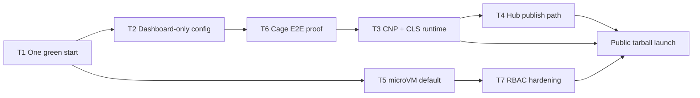

# Connector OS — remaining work until it feels like “real software” (one setup)

> **Audience:** Product and engineering — the **single inventory** of what is **shipped**, **partial**, and **still open** before Connector OS is honest “real software” (one tarball, one node, dashboard-first ops).  
> **When finished:** stories in **`CONNECTOR_OS_WHEN_DONE_HOW_PEOPLE_USE_IT.md`**; verification in **`CONNECTOR_OS_PUBLIC_LAUNCH_CHECKLIST.md`**.  
> **Engineering order:** **`CONNECTOR_OS_ROADMAP.md`** §7 (phases) · §10 (Definition of Done) · §8 (hygiene).  
> **Try-before-buy (separate track):** **`CONNECTOR_OS_PLAYGROUND_AND_DOCS_SITE_PLAN.md`** (hosted playground + public docs site — does not replace self-hosted finish line).

### How to use this document

| If you need… | Go to… |
|--------------|--------|
| **What’s left and why** | §5 (open work by track) + §6 (critical path) |
| **What we already built** | §4 (shipped / partial inventory) |
| **Why the product is “heavy”** | §2 |
| **Track owners / sequencing** | §3 blueprint + §6 |
| **Checkbox go/no-go for launch** | **`CONNECTOR_OS_PUBLIC_LAUNCH_CHECKLIST.md`** (Parts A–G) |

**Status legend:** ✅ **Shipped** (in repo, usable) · 🟡 **Partial** (API/UI exists; product bar not met) · ❌ **Open** (not done or not productized) · 🔜 **Polish** (nice-to-have after bar met)

---

## 1. The bar (Ollama‑lite install, OS‑grade depth)

| Dimension | **Ollama‑like** (surface UX) | **Connector OS** (actual scope) | Status |
|-----------|------------------------------|----------------------------------|--------|
| **Install** | One download | `make package` → `dist/connector-os-<ver>-<arch>-linux.tar.gz` | ✅ |
| **First run** | Run → UI | `connectorctl start` + embedded dashboard; dev preset §3 | 🟡 (kernel+UI yes; **full stack** one-start §10 still open) |
| **Apps** | List of models | Plugins + CLS workflows + TraceTramp / WitnessCtl / DevGuard on one substrate | 🟡 (list split across APIs; **unified catalog** ❌) |
| **Connect** | Local API | Gateway, `/plugin/<slug>/*`, `*.cnktros`, Service Map | 🟡 (proxy/DNS ✅; **§10 cage E2E** ❌) |
| **Depth** | Inference | Policy, agents, memory, audit, isolation, billing hooks | 🟡 (kernel rich; **microVM default + CNP workflows** incomplete) |

**Ollama** = **UX contract only**. Under the hood we are closer to a **compressed control plane + data plane** (§2).

---

## 2. Engineering complexity vs nearest market software (why we are “heavy”)

Connector OS **collapses verticals** enterprises usually buy separately (gateway, workflow engine, plugin registry, sandbox runtime, vault, audit, fleet license). That is intentional; §5 is about **finishing the collapse** so operators see **one setup**, not seven integrations.

### 2.1 Complexity axes

| Axis | Typical market slice | Connector OS home |
|------|----------------------|-------------------|
| LLM routing & cost | LiteLLM + FinOps | Settings → LLMs, gateway, `monitor/cost-chain` |
| Governed gateway | API gateway + WAF | `/v1/chat/completions`, admission |
| Agent lifecycle | Custom K8s ops | `/api/v1/agents*`, caps, quarantine |
| Durable workflows | Temporal-class | CLS + CNP (**execution fabric incomplete**) |
| Plugin economy | Registry + platform team | `.cpkg`, Hub, AGOS (**verify/publish hardening open**) |
| Strong isolation | Firecracker / gVisor | `platform/plugin-runtime`, microVM (**partial**) |
| Internal routing | Mesh + DNS + TLS | `internal_dns`, `/plugin/*`, custom domains API |
| Secrets & settings | Vault + admin UI | Settings → Secrets, vault APIs |
| Observability | Prom/Grafana | Native monitor (**no mandatory Prom** ✅) |
| Audit / compliance | SIEM + GRC | WitnessCtl, proof routes |
| Commercial plane | SaaS control | `connector-license-server`, `connector-www` |

### 2.2 Nearest analogues (none is a full substitute)

| Neighbour | Gap vs Connector OS |
|-----------|---------------------|
| **Ollama** | No governed multi-agent kernel, plugin OS, CLS/CNP, enterprise RBAC/audit as product |
| **OpenFang / OpenClaw** | Different enterprise bar; uniform cage + Hub + workflow plane |
| **Temporal** | Not an LLM governance kernel |
| **OpenFaaS / Lambda** | LLM-blind; cluster tax |
| **Composable stack** | Integration tax — we absorb it in one node |

---

## 3. Blueprint tracks (T1–T8) — status at a glance

| Track | “Real software” means… | Phase / doc | Status |
|-------|------------------------|-------------|--------|
| **T1** Substrate boot | One start boots kernel + UI; clear upgrade path | 0–1, §10 | 🟡 |
| **T2** Operator shell | Dashboard owns settings/secrets/LLMs; no env archaeology | 2, §2C, §10 | 🟡 |
| **T3** Workflow engine | CLS executes via CNP; catalog scales; real dry-run | 3 | 🟡 |
| **T4** Extension economy | Hub install, verify, third-party publish | 4, 6 | 🟡 |
| **T5** Isolation & scale | microVM default; egress; 100 idle plugins cheap | 5 | 🟡 |
| **T6** Cage & naming | `*.cnktros`, proxy, custom domains E2E | 2E, §10 | 🟡 |
| **T7** Trust plane | REST + UI-RPC RBAC; profile/billing UX | assessment doc | ❌ |
| **T8** Commercial split | Customer tarball vs license/portal deploy clear | `ARCHITECTURE.md` | 🟡 |

**Rule:** Changes touching **T5 + T7** need integration tests (roadmap §8).

---

## 4. What already lands the “single product” story (shipped inventory)

### 4.1 Foundation & packaging (Phase 0–1) — largely ✅

| Item | Evidence |
|------|----------|
| Single tarball | `scripts/package-connector-os.sh`, `make package`, CI kernel gate |
| `connectorctl` supervisor | `start \| stop \| status`; `connector-supervisor` process groups |
| Embedded dashboard | `dashboard_embed.rs`, `CONNECTOR_UI_DIR` override |
| API ≠ SPA HTML | Router fallthrough tests |
| Dev first-run | Preset local, SuperAdmin bootstrap, runtime mode API |
| Plugin contract | `plugin-manifest`, `plugin-handshake`, `PLUGIN_CONTRACT.md` |
| Cage DNS + `/plugin/*` proxy | `internal_dns`, `plugin_cage_proxy` |
| Unified health rollup | `unified_health.rs` |
| Native observability | `monitor/native`, optional Prom |
| Hygiene / lab cleanup | Compose only under `lab/`; `make doctor` |

### 4.2 Operator UI & settings (Phase 2) — largely ✅

| Item | Evidence |
|------|----------|
| **Unified apps catalog API** | `GET /api/v1/apps`, `GET /api/v1/apps/:id`; `connectorctl app list\|show` |
| Plugins hub lifecycle | install / enable / disable / uninstall + badges |
| Manifest-driven configure | `/plugins/:id/configure` |
| Service Map + health pill | `service-map`, `header-health` |
| Settings → Secrets, LLMs, system | `/api/v1/settings/*` |
| Custom domains API | `settings/networking/custom-domains` |

**Gap:** Settings APIs exist; **§10 “no shell exports after first boot”** not fully proven in UX/runbooks.

### 4.3 Hub & packages (Phase 4) — largely ✅

| Item | Evidence |
|------|----------|
| `.cpkg` format + signing | `platform/cpkg/` |
| Hub MVP + `connectorctl hub` | `platform/hub/` |
| Install rollout + health rollback | `plugin_cpkg`, rollout.json |
| Author portal APIs | `author_portal.rs` |

**Gap:** Public Hub with live community plugins; **`connectorctl plugin publish`** product path; verify **2A.9** full cert.

### 4.4 AGOS author tooling (Phase 6) — largely ✅

| Item | Evidence |
|------|----------|
| `agos-abi`, `agos-sdk` | crates + kernel `agos_abi` on `/api/v1` |
| `cargo connector new` | `cargo-connector/` |
| `connectorctl plugin run --dev` | subprocess watch reload |
| `connectorctl plugin verify` | MVP subset |
| Reference plugins | `examples/agos-reference-plugins/` |

### 4.5 Workflows (Phase 3) — 🟡 control plane, ❌ execution fabric

| Shipped | Not yet product bar |
|---------|---------------------|
| Dashboard workflows tab, builder polish **3.12** | **3.1** CLS as **only** runtime |
| `/api/v1/workflows*`, lifecycle, dry-run API | **3.7** CNP-only fabric |
| `connectorctl workflow *` verbs | **3.6** real CNP replay + action diff |
| Reference templates **3.11** | **3.4** full builder ⇄ CLS round-trip |
| CCL compile on register/dry-run | **3.9** workflow `.cpkg` on Hub |
| Version fingerprints, rollback API **partial** | **Kernel catalog** auto-discovery |
| Plugin workflow-contract registration **started** | **3.2** manifest actions/events on CNP bus |

### 4.6 Isolation (Phase 5) — 🟡 substantial code, ❌ production default story

| Shipped (partial) | Open |
|-------------------|------|
| Subprocess + Docker lab + microVM host path | **microVM default** for all plugins (§10) |
| Tier scheduler, idle demotion slice | Condo **vm-agent** multi-tenant (**5.5.2**) |
| Linux egress iptables (Docker + microVM slices) | Wasm backend (**5.6**) |
| Subprocess cgroups + seccomp modes | Full cgroup I/O bandwidth (**5.8**) |
| Crash recovery + Service Map topology | Guest coordinated suspend (**5.4.3** remainder) |
| Supervisor inventory API | Service Map interactive graph remainder (**5.10.7**) |

---

## 5. Remaining work — actionable checklist (by track)

Use **`CONNECTOR_OS_PUBLIC_LAUNCH_CHECKLIST.md`** for story-level acceptance (Jordan/Sam/Riley/Alex). This section is **engineering-facing** with roadmap IDs.

### T1 — Substrate boot ❌🟡

- [ ] **§10** One `connectorctl start` boots **kernel + first-party plugins + UI** on default profile (no lab compose ritual).
- [ ] First-party TraceTramp / WitnessCtl / DevGuard **enable from dashboard** on clean VM within documented time budget.
- [ ] **Product upgrade:** reinstall tarball + migration notes (today `upgrade` = billing tier).
- [ ] 🔜 `connector` / `connector up` thin wrapper (optional).

**Roadmap:** §10 operator items; Phase **1.2** semantics for binary upgrade.

---

### T2 — Operator shell 🟡

- [ ] **§10** All post-bootstrap config via dashboard (secrets, LLMs, networking, identity, backup, telemetry, license) — dogfood on fresh install without `.env` exports.
- [ ] Documented **`connectorctl bootstrap --apply`** runbook for migrations.
- [ ] **§10** LLM fallback + cost cap E2E test from UI (kill primary → fallback; cap stops runaway).
- [x] **Unified catalog API:** `GET /api/v1/apps` + `connectorctl app list|show` (plugins + workflows, port/URI/cage/actions).
- [ ] **Unified catalog UI:** dashboard Apps hub consumes `/api/v1/apps` (not only split pages).
- [ ] **Auto-discovery:** new workflow packages appear in catalog without manual register CLI — **`ARCHITECTURE.md`** operator story.

**Roadmap:** §10 No-chaos; Phase **2** (APIs largely ✅).

---

### T3 — Workflow engine 🟡❌ (highest product risk)

- [ ] **3.1** CLS engine = **single** workflow execution path (not parallel ad-hoc YAML).
- [ ] **3.7** All workflow→plugin calls via **CNP** + scoped tokens; audit logged.
- [ ] **3.6** Dry-run replays **CNP-correlated** traffic; diff vs static blueprint.
- [ ] **3.2** `[workflow.actions]` / `[workflow.events]` registered on enable.
- [ ] **3.4** Builder ⇄ CLS round-trip per §10 (or documented code-block fallback).
- [ ] **3.8** Semantic CCL diff in UI; **3.9** workflow `.cpkg` publish to Hub.
- [ ] **Catalog:** watch/register new workflow packages → named row → **enable from catalog** (no per-WF CLI treadmill).

**Roadmap:** Phase **3** open items; **`CONNECTOR_OS_WHEN_DONE_HOW_PEOPLE_USE_IT.md`** Stories B, C.

---

### T4 — Extension economy 🟡

- [ ] **6.5** `connectorctl plugin verify` = full **2A.9** certification (not MVP subset).
- [ ] **6.5 / Hub** `connectorctl plugin publish` signs + pushes; documented for third parties.
- [ ] **§10** Three **live** community plugins on public Hub, installable from dashboard.
- [ ] **§10** Hub UI installs TraceTramp / WitnessCtl / DevGuard **<30s** each on reference hardware.

**Roadmap:** Phase **4** ✅ APIs; Phase **6** remainder; §10 B.5.

---

### T5 — Isolation & scale 🟡❌

- [ ] **§10** Plugins run in **microVMs by default**; `connectorctl plugin status` shows VM IDs.
- [ ] **5.5.2** Condo guest vm-agent + real placement (not registry-only).
- [ ] **5.6** Wasm path for community tier (if v1 public claim includes it — else defer and document).
- [ ] **5.7.2** Egress enforce remainder (macOS sidecar, WSL polish, nftables/CNI as needed).
- [ ] **5.8–5.9** Cgroup I/O + seccomp profiles tuned for production claim.
- [ ] **5.4.3** Coordinated microVM guest suspend on tier cold (beyond cmdline hint).
- [ ] **§10** 100 plugins / 80 idle laptop test; p95 cold-start within `cold_start_budget_ms`.
- [ ] **§10** Condo ≥50 small plugins with health probes.
- [ ] **§10** `agos.v1` + `agos.v2` side-by-side (**6.9** remainder).

**Roadmap:** Phase **5** header + §10 B.4.

---

### T6 — Cage & naming 🟡❌

- [ ] **§10** No hard-coded public URLs in plugin manifests; `cage_host` everywhere.
- [ ] **§10** `*.cnktros` not resolvable on public internet.
- [ ] **§10** `/plugin/<slug>/*` + backend swap (subprocess→microVM) does not break workflows.
- [ ] **§10** Custom domains + TLS E2E (`tracetramp.acme.corp` → cage).

**Roadmap:** §2E; §10 B.3; Phase **1.4a** ✅ proxy — **E2E proof** open.

---

### T7 — Trust plane ❌

- [ ] Global **REST RBAC** on sensitive `/api/v1/*` from JWT `permissions`.
- [ ] **UI-RPC** per-method RBAC; lock down `system.*`.
- [ ] **`/auth/me`** or aggregate profile for billing/tier (or narrow dashboard scope + docs).
- [ ] 🔜 Workspace / `org_id` model for workflows and stores (teams — post–v1 unless required).

**Source:** **`platform/docs/arch/CONNECTOR_PROFILE_UI_RPC_RBAC_ASSESSMENT.md`**.

---

### T8 — Distribution & commercial split 🟡

- [ ] **§10** CI release: signed tarball, `SHA256SUMS`, release notes, upgrade guide.
- [ ] Public quickstart + production hardening + platform matrix (**launch checklist D.2**).
- [ ] `SECURITY.md`, license, privacy (portal/playground if applicable).
- [ ] **`connector-license-server`** + portal deploy documented separately from customer node.
- [ ] 🔜 Author portal dashboard polish (**6.8**).

**Roadmap:** **`README.md`**, **`platform/deploy/install.sh`**, **`CONNECTOR_OS_PUBLIC_LAUNCH_CHECKLIST.md`** Part D.

---

### Cross-cutting (roadmap §8) — launch blockers

- [ ] Integration test: boot kernel + affected plugin via supervisor (per PR discipline).
- [ ] No new operator env vars beyond bootstrap allowlist.
- [ ] Secret grep CI; no compose/Prom/k8s creep outside `lab/`.
- [ ] `make doctor` green on release branch.

---

## 6. Critical path (recommended finish order)

Order minimizes “demo that breaks in production” and unblocks **`CONNECTOR_OS_WHEN_DONE_HOW_PEOPLE_USE_IT.md`**.

| Priority | Track / theme | Why first |
|----------|---------------|-----------|
| **P0** | T1 one-start + T2 no-env | Without this, nothing feels like “software” |
| **P0** | T3 CNP + CLS execution + catalog | Blocks Stories B, C and §10 workflow items |
| **P1** | T6 cage E2E | Blocks stable URIs for TraceTramp/WitnessCtl (Stories A, B) |
| **P1** | T5 microVM default + egress | Matches public security story |
| **P1** | T7 RBAC | Required before wide public exposure |
| **P2** | T4 verify/publish + live Hub plugins | Ecosystem and §10 B.5 |
| **P2** | T8 release mechanics + docs | **`CONNECTOR_OS_PUBLIC_LAUNCH_CHECKLIST.md`** |
| **P3** | Playground + docs site | **`CONNECTOR_OS_PLAYGROUND_AND_DOCS_SITE_PLAN.md`** (parallel after P0 demo path) |

---

## 7. Explicitly out of scope for “self-hosted v1” (document, don’t block tarball)

| Item | Where it lives |
|------|----------------|
| Hosted try-in-browser playground | **`CONNECTOR_OS_PLAYGROUND_AND_DOCS_SITE_PLAN.md`** |
| 100-plugin laptop proof at public launch | §10 B.4 — may ship post-v1 with clear limits |
| Full multi-tenant workspaces | T7 longer arc |
| `agos.v2` dual-run | **6.9** remainder |
| Wasm community default | Phase **5.6** — defer or flag “beta” |

---

## 8. Traceability matrix

| This doc §5 | Blueprint | Public checklist | Roadmap |
|-------------|-----------|------------------|---------|
| T1 | T1 | A.1, B.1 | §10, Phase 1 |
| T2 | T2 | B.2, A.1 catalog | Phase 2, §2C |
| T3 | T3 | A.2–A.4, B.1 workflows | Phase 3 |
| T4 | T4 | B.5 | Phase 4, 6 |
| T5 | T5 | B.1 microVM, B.4 | Phase 5 |
| T6 | T6 | B.3 | §2E |
| T7 | T7 | A.6 | RBAC assessment |
| T8 | T8 | Part D | deploy, README |
| Playground | — | Part G | playground plan |

---

## 9. “Done” definition (three layers)

| Layer | Criterion | Doc |
|-------|-----------|-----|
| **Engineering** | Roadmap §7 phases for T1–T6 meet product bar; §8 hygiene green | **`CONNECTOR_OS_ROADMAP.md`** |
| **Product story** | Stories A–D reproducible on fresh install | **`CONNECTOR_OS_WHEN_DONE_HOW_PEOPLE_USE_IT.md`** |
| **Public launch** | Parts A–E (+ G if marketing launch) checked | **`CONNECTOR_OS_PUBLIC_LAUNCH_CHECKLIST.md`** |

**One sentence:** We are **done** when a new operator can **`connectorctl start`**, operate **only from the dashboard**, wire **agents to the gateway**, enable **TraceTramp / WitnessCtl / workflows / DevGuard** from a **catalog**, trust **cage URIs and microVM isolation**, and **third parties** can publish plugins — without lab-only rituals — and that matches the stories we promised in **`CONNECTOR_OS_WHEN_DONE_HOW_PEOPLE_USE_IT.md`**.

---

## 10. Related documents

| Document | Role |
|----------|------|
| **`CONNECTOR_OS_WHEN_DONE_HOW_PEOPLE_USE_IT.md`** | Target user stories (Jordan, Sam, Riley, Alex) |
| **`CONNECTOR_OS_PUBLIC_LAUNCH_CHECKLIST.md`** | Master go/no-go checkboxes |
| **`CONNECTOR_OS_PLAYGROUND_AND_DOCS_SITE_PLAN.md`** | Hosted try + docs + calendar funnel |
| **`CONNECTOR_OS_ROADMAP.md`** | Phased engineering + §10 Definition of Done |
| **`ARCHITECTURE.md`** | Node vs vendor plane, operator loop |
| **`platform/docs/arch/CONNECTOR_PROFILE_UI_RPC_RBAC_ASSESSMENT.md`** | T7 gaps |
| **`PLUGIN_CONTRACT.md`** | Wire contract for plugins |
