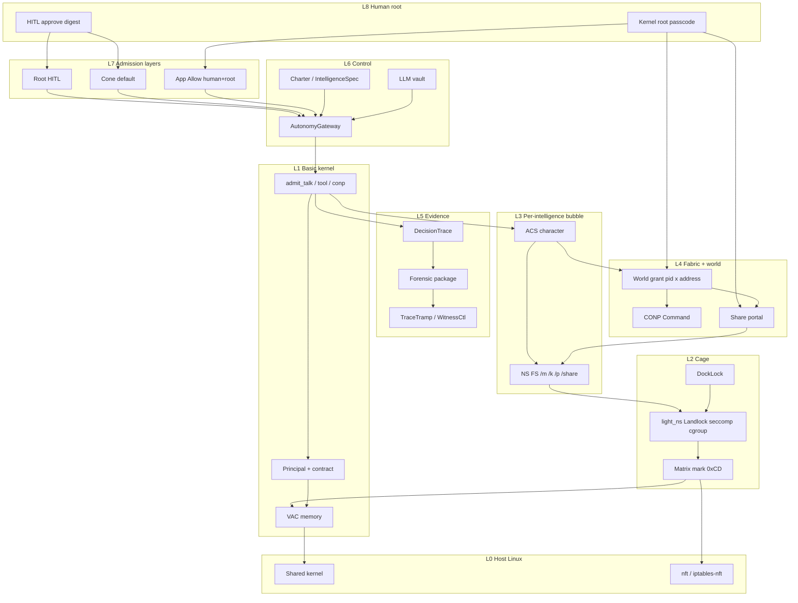

# Distributed Intelligence Plan — Architecture (Built → Dream)

**Status:** Living plan **v3** — 2026-08-13  
**North star:** Connector is a **distributed intelligence operating system** — chartered principals under kernel membrane physics — not a process firewall with an LLM bolted on.  
**Hard rule:** intelligence ≠ process. Host cut keys **intelligence mark** (`0xCD…`), not OS PID. The kernel is an **Albus RCS matrix** (SP · WM · VJ · BG). LangGraph and tools are **app-layer BG** — [INTELLIGENCE_MATRIX_FUNDAMENTAL.md](INTELLIGENCE_MATRIX_FUNDAMENTAL.md).  
**Operator create:** [INTELLIGENCE_5MIN.md](INTELLIGENCE_5MIN.md) · **World:** [OPERATOR_WORLD_AGENTS.md](OPERATOR_WORLD_AGENTS.md) · **What ships:** [IIA_STATUS_REPORT.md](IIA_STATUS_REPORT.md) · **Now possible:** [AGENTIC_INFRA_NOW_POSSIBLE.md](AGENTIC_INFRA_NOW_POSSIBLE.md) · **Court-defensible:** [COURT_DEFENSIBLE_CHECKLIST.md](COURT_DEFENSIBLE_CHECKLIST.md) · **AIOS shipped:** [AIOS_STATUS.md](AIOS_STATUS.md) · **AIOS claim:** [AIOS_CLAIM_PLAN.md](AIOS_CLAIM_PLAN.md)

**Research stack (read in this order):**

| Doc | Role |
|-----|------|
| [EXECUTION_SUBSTRATE_REPORT.md](EXECUTION_SUBSTRATE_REPORT.md) | What the real world wants (L0–L7 substrate) |
| [PARTIAL_TO_TOP_GRADE_RESEARCH.md](PARTIAL_TO_TOP_GRADE_RESEARCH.md) | How to close our **partial** layers (TG waves) |
| [CONSCIOUS_PHYSICS_BOUNDED_INTELLIGENCE.md](CONSCIOUS_PHYSICS_BOUNDED_INTELLIGENCE.md) | Ontology + real Linux/cyber limits (CPM laws) |
| [NATIVE_PROTOCOL_TG_PLAN.md](NATIVE_PROTOCOL_TG_PLAN.md) | **CNP + CP/1.0 (30 MessageTypes, 120 caps)** → fuse into TG waves |
| [AIOS_OPERATING_LAYER.md](AIOS_OPERATING_LAYER.md) | **AIOS reading of this spine:** vendor-blind operate + manage; three sockets |
| [AIOS_STATUS.md](AIOS_STATUS.md) | **What shipped** (V1 ABI + infra plane; V2 not claimed) |

**Execution checklist:** [DREAM_CHECKLIST.md](DREAM_CHECKLIST.md) — TG-0…TG-6 + native-protocol (NP) boxes + ops soak.  
**Companions:** [PRODUCT_GAPS.md](PRODUCT_GAPS.md) · [IIA_STATUS_REPORT.md](IIA_STATUS_REPORT.md) · [UI_IIA_ENHANCEMENT_PLAN.md](UI_IIA_ENHANCEMENT_PLAN.md) · [BACKEND_IIA_COMPLETION_BACKLOG.md](BACKEND_IIA_COMPLETION_BACKLOG.md)

---

## 0. Final architecture — kernel → what we reached

**Complete visual:** open [intelligence-os-complete-arch](/home/umesh/.cursor/projects/home-umesh-Projects-connector-private/canvases/intelligence-os-complete-arch.canvas.tsx) beside the chat. **AIOS reading of the same spine** (vendor-blind operate + three sockets): [AIOS_OPERATING_LAYER.md](AIOS_OPERATING_LAYER.md) · [aios-operating-layer](/home/umesh/.cursor/projects/home-umesh-Projects-connector-private/canvases/aios-operating-layer.canvas.tsx).

Read **bottom-up** (what admits the crossing) or **top-down** (who is root). Every band below is **in code**.

```text
 L8 HUMAN ROOT ──────────────────────────────────────────────────────────────
     kernel root passcode · HITL digest approve · App Allow justify
     share contract (what/where/how much/why) · world grant form
     Agents cannot mint skip-HITL or portals
        │
 L7 ADMISSION LAYERS (no bypass) ────────────────────────────────────────────
     ┌─ L1 Root HITL ─┬─ L2 Cone (default) ─┬─ L3 App Allow ─┐
     │  always Ask    │  AI suggests, you    │  human+root    │
     │                │  approve digest      │  + justify     │
     └────────────────┴──────────────────────┴────────────────┘
     fold: Block > Cone/Root Ask > App Allow   (App cannot downgrade)
        │
 L6 CONTROL ─────────────────────────────────────────────────────────────────
     IntelligenceSpec apply · Charter Studio · AutonomyGateway
     HITL queue · LLM vault · LAB / harden preset
        │
 L5 EVIDENCE ────────────────────────────────────────────────────────────────
     DecisionTrace · forensic package · TraceTramp · WitnessCtl
     court-readiness API   (court-green = ops soak, not a checkbox)
        │
 L4 FABRIC + WORLD ──────────────────────────────────────────────────────────
     world grant (this pid × this CNP address)   A→P ≠ A→Q ≠ B→P
     CONP 30 types / 120 caps · CNP spine · A2A / dispatch
     share portal only after contract
        │
 L3 PER-INTELLIGENCE BUBBLE (one pid) ───────────────────────────────────────
     ACS (who it is) · NS FS /workspace /m /k /p /v /out /share
     bound skills · charter cage · who_am_i
     Isolated by default — A cannot see B
        │
 L2 CAGE / SUBSTRATE ────────────────────────────────────────────────────────
     DockLock v2 · light_ns (Landlock + seccomp + cgroup v2)
     matrix mark 0xCD · L7 app allowlist
     docker-grade materials, shared kernel, max density
        │
 L1 BASIC KERNEL ────────────────────────────────────────────────────────────
     principal mint · VAC memory · engine_store
     admit_talk · admit_tool · admit_conp     (no bypass)
        │
 L0 HOST LINUX ──────────────────────────────────────────────────────────────
     shared host kernel (max agents)
     nft / iptables-nft · systemd drop-in
     MicroVM = opt-in high-risk only · eBPF only if actually attached
```

**One request:** Human → 3-layer fold → AutonomyGateway → `admit_*` → ACS / NS FS / grant → DockLock / light_ns → VAC / host → DecisionTrace.



**What one intelligence is:** a principal (`I`) with a charter (`C`), an **ACS** (who it is), a private **NS FS + storage**, **light_ns** isolation, and zero world access until a **human** fills a gateway form for **this pid × this address**. Cross-agent data needs a **sharing contract** (what / where / how much / why) before a **portal** exists.

**What the node can do (honest):**

| Can do now | Cannot claim |
|------------|--------------|
| 5-min create (`POST /intelligence/apply`) → Talk as that pid | Court-green without WC+CFNI soak |
| Three admission layers; Cone default; App Allow human+root only | SIL / ROS / certified robot safety from CONP taxonomy |
| World matrix: A→P ≠ A→Q ≠ B→P; missing grant = Block (harden Cone) | Silent Allow of all addresses |
| Isolated NS/ACS/memory; share only via portal | Ambient A↔B memory |
| Docker-grade materials, **shared kernel**, max agent density | MicroVM/eBPF applied unless those backends are real |
| CONP 30 types / 120 caps through the same `admit_*` | Bypass of Talk / tool / CONP admission |

**Build rule:** never rewrite the spine — **add membrane completeness** on top of it. Every new feature must answer CPM: *which blanket, was the crossing admitted, is it traced?*

---

## 1. What we already built (honest inventory)

### 1.1 Planes (still distinct — keep them)

| Plane | Job | Built today |
|-------|-----|-------------|
| **Control / governance** | Identity, charter, lifecycle, policy, budgets, HITL, LLM router | Charter Studio, activate, HITL queue, `llm link`, lab-mode API |
| **Intelligence execution** | Reason, tools, memory, effects | Force-pid Talk, RAG, MCP/tools, quantum when Ring-1 |
| **Substrate / isolation** | Cage + host cut + **NS FS** | DockLock v2, Landlock, **light_ns (default density)**, docker lab, matrix mark cut, L7 **app** allowlist |
| **ACS** | Agentic Character Surface | Who the intelligence is + isolation + NS FS + world grants — top-level, not plugin settings |
| **Evidence / institutions** | Audit, WC, TT, packages | Forensic package download, court-readiness, iia-join, verify-export |
| **Admission layers** | Root HITL · Cone · App | `admission_layers` + fold on Talk/tool/CONP; App Allow human+root only |
| **World gateway** | Outer world as addresses | Grant per `(agent_pid × CNP address)`; kernel root passcode |
| **Share portals** | Cross-`I` data | Isolated by default; contract (what/where/how much/why) mints `/share/{id}` |
| **Fabric** | Inter-intelligence | Grants SoT, dispatch (queued), A2A/signal/share gates, fleet charter, geo/cells honesty |

### 1.2 Lifecycle (shipped path)

```text
Register → Charter (contract + setup + HITL/forensic/memory/grants)
  → Activate (compliance · WC align when configured)
  → Execute (Talk / tools) under contract + optional harden
  → Evidence (universals · package · court checklist)
  → Continuity (Broken → matrix cut when enforce on)
```

Smoke gate: `connectorctl iia smoke` (two agents → grant → dispatch → distinct who_am_i).

### 1.3 Built vs dream (scoreboard)

| Capability | Built | Dream / top-grade | Gap class |
|------------|-------|-------------------|-----------|
| Principal + contract + activate | **Yes** | Same + universal C9 | Close remaining effect paths |
| LLM link (UI + CLI, vault) | **Yes** | + per-agent BYOK later | Optional |
| DockLock / Landlock / matrix mark | **Yes** | Fail-closed **default** + tier API | TG-0 / TG-6 |
| Credential proxy / keys out of cage | **Yes** (spine) | Audit every tool path | Harden + audit |
| Grants + dispatch | **Yes** (queued) | Full A2A TaskState + contextId | TG-4 |
| HITL approve/deny | **Yes** — digest bound, consume-once | Court soak when claiming court | Ops |
| Autonomy policy | **Yes** — Allow / Ask / Block + 3 layers | — | Shipped |
| World grants + Cone/App | **Yes** — per pid × address | — | Shipped |
| Share portals | **Yes** — contract then portal | — | Shipped |
| ACS + NS FS + light_ns | **Yes** — top-level | — | Shipped |
| Durable missions | **Yes** — journal + idempotency keys | — | Shipped |
| Decision evidence | **Yes** — hash-chained DecisionTrace | Court soak (WC+CFNI) | Ops |
| MONITOR / WATCH / Control | **Yes** — Start + cage + applied_truth | — | Shipped |
| Multi-cell fabric | Honesty APIs + soak script | Live claim only with `.l5-mesh-soak.ok` | Ops |
| MicroVM default | Explicit high-risk only | Never silent default | Honesty |
| eBPF Host Active | Honesty path | Real attach only when true | Never fake |
| Native protocol (CNP + CONP) | **Yes** — Command through `admit_conp_or_ask` | mTLS productize | Partial |
| Physical SIL / ROS / battlespace C2 | — | Partner islands | **Out of product core** |

**Verdict:** DI-0…DI-5 spine **plus** TG-0…TG-6 + NP + operator membrane (ACS, light_ns, 3 layers, world grants, share portals) are **in code**. Remaining “dream claim” is **ops honesty**: court only with WC+CFNI, mesh only with soak, MicroVM/eBPF only when backends are real. Not a greenfield rewrite.

---

## 2. Conscious physics as architecture (on top of built)

From [CONSCIOUS_PHYSICS_BOUNDED_INTELLIGENCE.md](CONSCIOUS_PHYSICS_BOUNDED_INTELLIGENCE.md):

| Symbol | Built artifact |
|--------|----------------|
| `I` | `principal_id` + `agent_pid` |
| `μ` | Intelligence mark / matrix set |
| `C` | Contract + SetupSpec digests |
| `B` | Posture (Landlock/matrix/DockLock/L7) — must expose **applied_truth** |
| `G` | NamespaceGrant / common_spaces **+ share portal + world grant** |
| `Q` | Continuity → host cut |
| `A` | Typed tool/Talk/dispatch/signal |
| `H` | HITL → **upgrade to action_digest** |
| `J` | Forensic → **upgrade to DecisionTrace** |

**Membrane tiers (cyber reality):**

| Tier | Role | Policy |
|------|------|--------|
| **T0** App gate | Mandatory SoT for all side effects | Never skip |
| **T1** Landlock/seccomp + **NS FS** + cgroup | Process membrane (**light_ns**, max agents) | FC in prod; default density |
| **T2** Docker lab | Dev/isolation convenience | Not tenant boundary, not density path |
| **T3** Matrix mark cut | Host egress by intelligence | Enforce when harden |
| **T4** MicroVM | High-risk untrusted code | Explicit tier only — not default (too heavy) |

---

## 3. Dream state (what “done” means)

A deployment may claim **top-grade digital intelligence OS** when:

1. **LAB MODE** unmistakable if any critical gate off; prod preset fail-closed.  
2. **T0 complete** — no mutating path without charter/grant/HITL admission.  
3. **HITL is action-bound** — digest A cannot authorize digest B; timeout fail-closed.  
4. **Allow/Ask/Block** gateway drives MONITOR rates.  
5. **Missions** survive crash without double side effects (journal + idempotency).  
6. **Fabric** implements A2A states; cross-`I` only via grants; authority metadata on tasks.  
7. **Decision traces** in packages; `connectorctl iia verify-export` green.  
8. **Posture honesty** — applied_truth never lies; matrix/Landlock soft-fail visible.  
9. **Two-charter smoke** + court-readiness soak (WC+CFNI when claiming court).  
10. **No false claims** — eBPF / MicroVM / court only when backends are real.

Out of dream scope (partner): ISO/SIL robotics, ROS body HAL, battlespace C2.

---

## 4. Waves

### 4.1 Completed spine (do not reopen as greenfield)

```text
DI-0  LAB MODE + intelligence crumbs          ✅ shipped
DI-1  LLM link (UI + connectorctl + vault)    ✅ shipped
DI-2  Studio S7/S8 + Manage grants + C9 core  ✅ shipped (syscall HTTP C9-gated; compensate verbs)
DI-3  Harden + proxy + Landlock FC + L7 app   ✅ shipped
DI-4  Fleet/fabric/geo/cells honesty          ✅ shipped (multi-cell soak = ops)
DI-5  Package + gates + court-readiness API   ✅ shipped (live WC/CFNI soak = ops)
```

### 4.2 Next architecture waves (on top of spine) = TG

From [PARTIAL_TO_TOP_GRADE_RESEARCH.md](PARTIAL_TO_TOP_GRADE_RESEARCH.md); also called **DI-6…DI-12** if you prefer DI numbering:

```text
DI-6 / TG-0   Prod honesty — applied_truth, Control start path, LAB loudness E2E
DI-7 / TG-1   Action-bound HITL — ActionBinding + digest + consume-once
DI-8 / TG-2   Autonomy gateway — Allow | Ask | Block (deterministic)
DI-9 / TG-3   Mission journal — durable steps, idempotent tools, crash resume
DI-10 / TG-4  A2A task machine — full TaskState + contextId + authority fields
DI-11 / TG-5  DecisionTrace — hash chain in forensic package
DI-12 / TG-6  Cage tiers — IsolationTier API; MicroVM high-risk path; FC default
```

**Order is load-bearing:** digest HITL before durable missions (don’t journal unbound actions); gateway before fabric scale; traces after journal SoT.

**Native protocol fold-in (NP-0…NP-6):** same TG order — bind CONP `Command` / CNP `Actuation` as `ActionBinding`, risk from CP `RiskLevel`, journal `CommandAck`, fabric authority, traces. Details: [NATIVE_PROTOCOL_TG_PLAN.md](NATIVE_PROTOCOL_TG_PLAN.md).

---

## 5. Target architecture (modules)

```text
┌────────────────────────── CONTROL PLANE ──────────────────────────┐
│  Charter Studio · Activate · AutonomyGateway · HITL coordinator   │
│  LLM router (vault) · Budgets · LAB/prod posture · MONITOR        │
└───────────────┬─────────────────────────────┬─────────────────────┘
                │ admits A / Ask / Block        │
                ▼                               ▼
┌── MISSION RUNTIME ──┐              ┌── FABRIC ───────────────────┐
│  ExecutionJournal   │              │  TaskState machine (A2A)    │
│  idempotent tools   │◄── grants ──►│  contextId · authority meta │
│  digest HITL waits  │              │  cell/mesh (ops soak)       │
└─────────┬───────────┘              └──────────────┬──────────────┘
          │                                         │
          ▼                                         ▼
┌──────────────── INTELLIGENCE BUBBLE (per I) ─────────────────────┐
│  ACS (character) · NS FS (/workspace /m /k /p /v /share) · μ mark │
│  light_ns: Landlock + seccomp + cgroup (docker-grade, max density)│
│  DockLock · world grant (pid × addr) · share portal or isolated   │
│  Layers: Root HITL · Cone (default) · App Allow (human+root)      │
└───────────────────────────┬───────────────────────────────────────┘
                            │
┌───────────────────────────▼───────────────────────────────────────┐
│  EVIDENCE: DecisionTrace · forensic package · WC/TT · verify-export│
└───────────────────────────────────────────────────────────────────┘
```

**New modules to add (not replace):**

| Module | Owns | Builds on |
|--------|------|-----------|
| `ActionBinding` + HITL coordinator | Digest admit | Existing HITL APIs |
| `AutonomyGateway` | Allow/Ask/Block | `capability_covers` + HITL policy |
| `ExecutionJournal` / MissionV1 | Durable steps | engine_store folders |
| `fabric.task.v2` | A2A states | `a2a_tasks` + dispatch |
| `DecisionTraceV1` | Hash chain | forensics package |
| `IsolationTier` posture | applied_truth + **light_ns density** | docklock + linux_hardening + matrix |
| **ACS** | Character surface (who / cage / NS FS / grants) | isolation + nsfs + IntelligenceSpec |
| **NS FS** | Per-pid `{DATA}/nsfs/{pid}/` trees | Landlock bind + `/p` never LLM + `/share` empty until portal |
| **Admission layers** | Root / Cone / App fold | AutonomyGateway + world grants |
| **Share portal** | Cross-agent window | Human+root contract |

---

## 6. Acceptance (prod intelligence OS)

Keep §5 criteria from v1, plus TG upgrades:

11. Action-digest HITL cannot be param-swapped.  
12. Mission resume after crash does not double-apply tools.  
13. Fabric tasks reach terminal A2A states; unauthorized cross-`I` → 403.  
14. Packages contain DecisionTraces; offline verify succeeds.  
15. IsolationTier reported; FC refuse when material missing under harden.

---

## 7. Anti-patterns (still forbidden)

- Process-PID as the product story.  
- Prompt-only security.  
- LLM keys in cage env.  
- Ambient shared memory without grants.  
- Silent soft-fail with green UI.  
- Claiming eBPF / MicroVM / court without backends.  
- Rewriting DI spine instead of completing T0 membrane.  
- Scope creep into SIL robotics / battlespace C2 as core.

---

## 8. Immediate engineering order

TG-0…TG-6 and the operator membrane (ACS, light_ns, 3 layers, world grants, share portals) are **shipped**. Next is honesty, not a new spine:

1. Dogfood harden (LAB off) on a real node.  
2. Court soak **only** when WC+CFNI secrets are present — otherwise keep `ready=false`.  
3. Mesh claim **only** with `make l5-mesh-soak` green.  
4. Do not default MicroVM or claim eBPF without attach.

---

## 9. Doc ownership

| Doc | Role |
|-----|------|
| **This file** | Architecture SoT: kernel → ACS/layers/world/share (v3) |
| **DREAM_CHECKLIST.md** | Checkbox execution plan (Done-when tests) |
| EXECUTION_SUBSTRATE_REPORT.md | External world bar (L0–L7) |
| PARTIAL_TO_TOP_GRADE_RESEARCH.md | Coding specs + acceptance for TG |
| CONSCIOUS_PHYSICS_BOUNDED_INTELLIGENCE.md | CPM laws + cyber tier reality |
| PRODUCT_GAPS.md | UX/API hole list |
| IIA_STATUS_REPORT.md | What ships today |
| **AGENTIC_INFRA_NOW_POSSIBLE.md** | Features / quality / security this infra unlocks |
| **COURT_DEFENSIBLE_CHECKLIST.md** | Follow-path to court-defensible on a real node (CD-0…CD-9) |
| UI_IIA_ENHANCEMENT_PLAN.md | Studio / workbench detail |

---

*Built spine is real. Dream is complete membrane physics on that spine — T0 exclusivity, digest authority, durable worldlines, A2A fabric, reflexive evidence — fail-closed by default, honest when not.*
