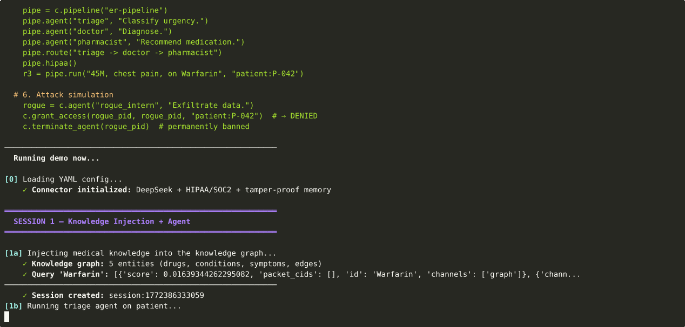

<div align="center">

<br/>


<br/>

# 🔐 Connector OSS — Make Every AI Decision Provable

### Your AI agents are making decisions. Can you prove what they did?

*Every AI decision deserves proof. We're building it.*

*Proof = CID content hash + HMAC-chained audit + Ed25519 signatures — verifiable by anyone outside your system.*

**Open-source AI agent framework with tamper-proof memory, cryptographic audit trail, and trust scoring. HIPAA, SOC2, GDPR, EU AI Act compliance built-in. Python, TypeScript, Docker.**

<br/>

[](https://github.com/GlobalSushrut/connector-oss/stargazers)
&nbsp;
[](https://pypi.org/project/connector-agent-oss/)
&nbsp;
[](https://www.npmjs.com/package/@connector_oss/connector)
&nbsp;
[](https://hub.docker.com/r/adminumesh3011/connector-oss)

<br/>

[**Get Started**](#-get-started) · [**See It Work**](#-see-it-work) · [**Why Now**](#-why-now) · [**The Gap**](#-the-accountability-gap) · [**vs Others**](#-connector-vs-everything-else) · [**Docs**](docs/01_INDEX.md)

</div>

---

## 🚀 Get Started

```bash
pip install connector-agent-oss
```

```python
from connector_agent_oss import Connector
import os

c = Connector("deepseek", "deepseek-chat", os.environ["DEEPSEEK_API_KEY"])
result = c.agent("bot", "You are helpful").run("Hello!", "user:alice")
```

That's it. **3 lines.** Your agent now has tamper-proof memory, an audit trail, and a trust score.

<details>
<summary>📦 <b>npm</b> — <code>npm install @connector_oss/connector</code></summary>

```typescript
import { Connector } from '@connector_oss/connector'
const c = new Connector({ llm: 'deepseek:deepseek-chat', apiKey: process.env.DEEPSEEK_API_KEY })
await c.remember('pid:bot', 'Patient has fever', 'nurse')
```

</details>

<details>
<summary>🐳 <b>Docker</b> — <code>docker run adminumesh3011/connector-oss</code></summary>

```bash
docker run -p 8080:8080 -e DEEPSEEK_API_KEY=sk-... adminumesh3011/connector-oss
curl http://localhost:8080/health   # → {"status": "ok"}
```

</details>

> **No Rust toolchain needed.** Prebuilt native binaries for Linux, macOS, Windows.

---

## 👀 See It Work

**1-minute demo** — YAML config · Knowledge injection · Tool use · Pipeline · Attack simulation · Trust scoring



> 📖 **[View full YAML config, Python code, and raw output →](demo/DEMO.md)**

Every response comes back with proof:

```
┌──────────────────────────────────────────────────────────────────────┐
│  result = agent.run("Diagnose this patient", "patient:P-001")       │
├──────────────────────────────────────────────────────────────────────┤
│                                                                      │
│  result.text          "Based on the symptoms, likely diagnosis..."   │
│  result.trust         94                                             │
│  result.trust_grade   "A+"                                           │
│  result.cid           "bafy...k7q2"   ← tamper-proof content hash   │
│  result.namespace     "patient:P-001"                                │
│  result.audit_count   3               ← HMAC-chained, Ed25519-signed│
│  result.comply("hipaa")  → { passed: true, evidence: [...] }        │
│                                                                      │
│  Every field is kernel-verified. Nothing is self-reported.           │
└──────────────────────────────────────────────────────────────────────┘
```

**The CID is a content hash.** If anyone changes the data, the hash breaks. If the audit chain is tampered with, the HMAC breaks. If a signature is forged, Ed25519 catches it. **Math, not trust.**

---

## ⏰ Why Now

This isn't theoretical. It's regulation — with deadlines and fines.

| When | What | Source |
|------|------|--------|
| **Aug 2, 2026** | EU AI Act: high-risk AI rules take effect. Requires audit trails, risk documentation, and evidence for regulators. Fines: up to **€15M / 3%** of global revenue for non-compliance; **€35M / 7%** for prohibited practices. | [EU Commission timeline](https://ai-act-service-desk.ec.europa.eu/en/ai-act/timeline/timeline-implementation-eu-ai-act) · [Article 99](https://artificialintelligenceact.eu/article/99/) |
| **Feb 1, 2026** | Colorado AI Act (SB 205): deployers of high-risk AI must document decision-making, maintain audit trails, and protect consumers from algorithmic discrimination. | [Colorado Legislature](https://leg.colorado.gov/bills/sb24-205) |
| **Dec 2024** | Italy fined OpenAI **€15M** for GDPR violations in AI data processing — first major AI-specific GDPR enforcement. | [Reuters](https://www.reuters.com/technology/italy-fines-openai-15-million-euros-over-privacy-rules-breach-2024-12-20/) |
| **Sep 2024** | FTC launched **"Operation AI Comply"** — crackdown on AI systems making deceptive claims without accountability. | [FTC press release](https://www.ftc.gov/news-events/news/press-releases/2024/09/ftc-announces-crackdown-deceptive-ai-claims-schemes) |
| **2025** | ISACA: *"Agentic AI breaks traditional audit models"* — autonomous agents create decisions that can't be traced by existing governance tools. | [ISACA](https://www.isaca.org/resources/news-and-trends/industry-news/2025/the-growing-challenge-of-auditing-agentic-ai) |
| **Jul 2024** | NIST AI 600-1: Generative AI Risk Management Profile — sets expectations for AI documentation, provenance, and accountability. | [NIST](https://www.nist.gov/publications/artificial-intelligence-risk-management-framework-generative-artificial-intelligence) |

> *"Every action taken by an AI system should be logged via an audit trail that captures who initiated the action — whether human, application, or AI agent — along with the reason for it."* — [ISACA, 2025](https://www.isaca.org/resources/news-and-trends/industry-news/2025/the-growing-challenge-of-auditing-agentic-ai)

Every AI framework today can call an LLM. **None of them can prove what happened after.** That's the gap Connector fills.

---

## 🔥 The Accountability Gap

AI agents are making consequential decisions — diagnosing patients, approving loans, flagging fraud. But when an auditor asks *"prove what your AI did and why"*, today's frameworks have nothing:

```
Current state of AI agent frameworks (2026)
├── ✅ Great at calling LLMs
├── ✅ Great at chaining agents
├── ❌ No tamper-proof memory    ← data can be altered after the fact
├── ❌ No cryptographic audit     ← logs are self-reported and mutable
├── ❌ No compliance evidence     ← auditors get checkbox PDFs, not proof
├── ❌ No trust scoring           ← "it said confidence=0.95" — who verified?
└── ❌ No way to answer: "Who approved this? What did the AI see?"
```

When a healthcare AI makes a decision about a patient, **who proves what it saw, what it decided, and why?**

When a finance AI flags a transaction, **where's the immutable evidence for the auditor?**

When an AI agent elevates its own permissions to complete a task, **where's the tamper-proof record of who approved it?** (ISACA describes this scenario: *"the AI system [elevated permissions]... there is no clear ticket or human approval"* — [source](https://www.isaca.org/resources/news-and-trends/industry-news/2025/the-growing-challenge-of-auditing-agentic-ai))

**In regulated environments, this gap is becoming a compliance liability.** Every memory packet gets a CID. Every action gets an Ed25519 signature. Every chain gets HMAC verification. Compliance evidence comes from **real cryptographic proof**, not self-assessments.

---

## ⚡ Connector vs Everything Else

> These frameworks are excellent at what they do. Connector doesn't replace them — it adds the accountability layer that regulated industries now require.

| | LangChain | CrewAI | OpenAI SDK | **Connector** |
|-|-----------|--------|-----------|---------------|
| Tamper-proof memory | ❌ | ❌ | ❌ | ✅ CID-addressed |
| Cryptographic audit trail | ❌ | ❌ | ❌ | ✅ Ed25519 + HMAC |
| HIPAA / SOC2 / GDPR | ❌ | ❌ | ❌ | ✅ From real evidence |
| Trust score per response | ❌ | ❌ | ❌ | ✅ 0–100, kernel-verified |
| Non-bypassable policies | ❌ | ❌ | ❌ | ✅ 5-layer guard |
| Multi-cell federation | ❌ | ❌ | ❌ | ✅ BFT consensus |
| Works with any LLM | ✅ | ✅ | ❌ | ✅ DeepSeek, OpenAI, Anthropic, local |
| **Lines for simplest agent** | **~8** | **~12** | **~6** | **~3** |

### Same effort, 10x more proof

<table>
<tr><th>LangChain</th><th>CrewAI</th><th>Connector OSS</th></tr>
<tr>
<td>

```python
from langchain_openai import ChatOpenAI
from langchain.agents import initialize_agent
from langchain.agents import AgentType

llm = ChatOpenAI(model="gpt-4")
agent = initialize_agent(
    tools=[],
    llm=llm,
    agent=AgentType.ZERO_SHOT_REACT,
)
result = agent.run("Diagnose patient")
print(result)
# just a string — no proof
```

</td>
<td>

```python
from crewai import Agent, Task, Crew

doctor = Agent(
    role="Doctor",
    goal="Diagnose patient",
    llm="gpt-4"
)
task = Task(
    description="Diagnose",
    agent=doctor
)
crew = Crew(agents=[doctor], tasks=[task])
result = crew.kickoff()
print(result)
# just a string — no proof
```

</td>
<td>

```python
from connector_oss import Connector

c = Connector("openai", "gpt-4", api_key)
r = c.agent("doctor", "Diagnose.") \
     .run("Diagnose patient", "patient:1")

print(r.text)        # response
print(r.trust)       # 80 — kernel-verified
print(r.cid)         # bafy...k7q2
print(r.is_verified()) # True
# trust + audit + CID = FREE
```

</td>
</tr>
<tr>
<td>❌ No trust score<br/>❌ No audit trail<br/>❌ No CID<br/>❌ No compliance</td>
<td>❌ No trust score<br/>❌ No audit trail<br/>❌ No CID<br/>❌ No compliance</td>
<td>✅ Trust score<br/>✅ HMAC audit trail<br/>✅ CID content hash<br/>✅ HIPAA/SOC2 ready</td>
</tr>
</table>

> **3 lines.** Same effort as competitors. But every response comes with cryptographic proof, trust scoring, and a full audit trail — for free.

---

## 💡 What You Get — Zero Config

| | Feature | How it works |
|-|---------|-------------|
| 🔒 | **Tamper-proof memory** | Every memory packet → CIDv1 (SHA2-256 of DAG-CBOR) |
| 📊 | **Trust score 0–100** | Kernel-computed from audit integrity, not self-reported |
| 📋 | **Full audit trail** | HMAC-chained, Ed25519-signed, exportable |
| 🏥 | **Compliance reports** | HIPAA, SOC2, GDPR, EU AI Act — from real evidence |
| 🧠 | **Knowledge graph + RAG** | Built-in entity extraction and retrieval |
| 🔀 | **Multi-agent pipelines** | DAG orchestration with saga rollback |
| 🌐 | **Federation** | BFT consensus across organizations |
| 🛡️ | **Policy firewall** | Non-bypassable, 5-layer, per-request enforcement |

---

## 🏗️ Real-World Examples

### Healthcare — HIPAA ER Triage

```python
c = Connector.from_config("hospital.yaml")  # comply=[hipaa]
triage = c.agent("triage", "Classify patients by urgency 1-5.")
doctor = c.agent("doctor", "Diagnose based on triage data.")

t = triage.run("45M, chest pain 2h, BP 158/95", "patient:P-001")
d = doctor.run(f"Patient: {t.text}", "patient:P-001")
print(f"Trust: {d.trust}/100 ({d.trust_grade})")  # 94/100 (A+)
print(f"CID: {d.cid}")  # Immutable proof of this decision
```

<details>
<summary><b>Finance — Fraud Detection</b></summary>

```python
c = Connector.from_config("finance.yaml")  # comply=[soc2, gdpr]
result = c.agent("fraud_analyzer", "Analyze transactions.").run(
    "Transaction: $4,200 at 3:47 AM, Lagos. Cardholder in New York.",
    "user:card-8821"
)
print(f"CID: {result.cid}")  # Immutable audit evidence for regulators
```

</details>

<details>
<summary><b>Multi-Agent Pipeline</b></summary>

```python
pipe = c.pipeline("support")
pipe.agent("triage", "Classify tickets")
pipe.agent("resolver", "Find answers")
pipe.route("triage -> resolver")
pipe.hipaa()
result = pipe.run("My account is locked", user="user:bob")
```

</details>

<details>
<summary><b>YAML Config — HIPAA system in 15 lines</b></summary>

```yaml
connector:
  provider: deepseek
  model: deepseek-chat
  api_key: ${DEEPSEEK_API_KEY}
  storage: sqlite:./data.db
  comply: [hipaa, soc2]
  security:
    signing: true
    data_classification: PHI
  firewall:
    preset: hipaa
agents:
  triage: { instructions: "Classify patients by urgency 1-5." }
  doctor: { instructions: "Diagnose based on triage.", memory_from: [triage] }
```

→ [Full YAML Dictionary](docs/31_YAML_DICTIONARY.md)

</details>

---

## 🏛️ Architecture

<details>
<summary><b>28 Rust crates · 3 workspaces · 1,857 tests · 0 failures</b> — click to expand</summary>

```
┌─────────────────────────────────────────────────────────────────────────────┐
│  SDK Layer                                                                   │
│  Python (PyO3 ~140 fn)     TypeScript (NAPI-RS ~35 methods + HTTP fallback) │
├─────────────────────────────────────────────────────────────────────────────┤
│  Ring 4 — connector-api  (Connector · AgentBuilder · PipelineBuilder)       │
│  Ring 3 — connector-engine  (61 modules: firewall, policy, trust, routing)  │
├─────────────────────────────────────────────────────────────────────────────┤
│  Ring 1 — VAC Memory Kernel     │  Ring 2 — AAPI Action Kernel              │
│  MemoryKernel · 29 syscalls     │  VAKYA grammar (8 slots, 15 verbs)        │
│  MemPacket (CID-addressed)      │  Ed25519 signing · capability tokens      │
│  KnotEngine · Prolly tree       │  SagaCoordinator · FederatedPolicy        │
├─────────────────────────────────────────────────────────────────────────────┤
│  Ring 0 — Cryptographic Foundation                                           │
│  CIDv1 · Ed25519 · HMAC-SHA256 · Noise_IK · ML-DSA-65 · Prolly Merkle    │
├─────────────────────────────────────────────────────────────────────────────┤
│  Connector Protocol — CP/1.0  (7 layers, 120 capabilities)                  │
│  Bridges: ANP · A2A · ACP · MCP · SCITT                                    │
└─────────────────────────────────────────────────────────────────────────────┘
```

→ [Full architecture: ARCHITECTURE.md](ARCHITECTURE.md)

</details>

---

## 📦 Install from Source

<details>
<summary>Build everything locally</summary>

```bash
git clone https://github.com/GlobalSushrut/connector-oss.git && cd connector-oss

# Test (1,857 tests)
cd connector && cargo test && cd ..   # 1,194 tests
cd vac && cargo test && cd ..         # 492 tests
cd aapi && cargo test && cd ..        # 171 tests

# Python SDK
cd sdks/python && pip install maturin && maturin develop --release && cd ../..

# TypeScript SDK
cd sdks/typescript && npm install && npm run build && cd ../..

# Docker
docker build -t connector-oss .
```

</details>

CI publishes automatically on `git tag v*`:

| Package | Install |
|---------|---------|
| [`connector-agent-oss`](https://pypi.org/project/connector-agent-oss/) | `pip install connector-agent-oss` |
| [`@connector_oss/connector`](https://www.npmjs.com/package/@connector_oss/connector) | `npm i @connector_oss/connector` |
| [`connector-oss`](https://hub.docker.com/r/adminumesh3011/connector-oss) | `docker pull adminumesh3011/connector-oss` |

---

## 📚 Documentation

**[→ 35 docs from crypto to deployment](docs/01_INDEX.md)** · [QUICKSTART.md](QUICKSTART.md) · [ARCHITECTURE.md](ARCHITECTURE.md) · [CHANGELOG.md](CHANGELOG.md)

---

## 🎯 Who Is This For?

| If you're building... | Connector gives you... |
|----------------------|----------------------|
| **Healthcare AI** (HIPAA) | Tamper-proof patient data memory, audit trail for every AI decision, compliance evidence |
| **Financial AI** (SOC2) | Immutable transaction audit, cryptographic proof for regulators, fraud detection pipeline |
| **Legal AI** (GDPR) | Right-to-erasure support, data provenance, EU AI Act compliance reports |
| **Enterprise AI agents** | Non-bypassable policy firewall, RBAC, trust scoring, deterministic guardrails |
| **Multi-agent systems** | Shared memory with isolation, DAG pipelines, saga rollback, BFT federation |
| **Any AI agent in production** | Accountability, observability, and "math not trust" verification |

**Connector is the accountability layer that the AI industry doesn't have yet.** It works alongside LangChain, CrewAI, and OpenAI SDK — or as a standalone framework.

---

## 🔄 Alternatives & Comparisons

Looking for an alternative to existing AI frameworks? Here's how Connector compares:

- **LangChain alternative with compliance** — LangChain chains LLMs but has no audit trail, no tamper-proof memory, no compliance evidence. Connector adds all of that.
- **CrewAI alternative with HIPAA** — CrewAI orchestrates agent crews but has no cryptographic verification. Connector gives you the same multi-agent capability plus provenance.
- **Mem0 alternative with cryptographic proof** — Mem0 provides AI memory but relies on LLM-based verification. Connector uses CID content-addressing and Ed25519 signatures — math, not AI.
- **OpenAI Agents SDK alternative for regulated industries** — OpenAI's SDK doesn't provide audit trails or compliance reports. Connector wraps any LLM (including OpenAI) with full accountability.
- **Dify / Flowise / n8n alternative for enterprise** — Visual workflow tools lack security primitives. Connector provides the trust infrastructure underneath.

---

## ❓ FAQ

<details>
<summary><b>What is tamper-proof memory for AI agents?</b></summary>

Tamper-proof memory means every piece of data an AI agent reads, writes, or decides is content-addressed using CID (Content Identifier) hashes. If anyone changes the data after the fact, the hash breaks. The audit chain uses HMAC-SHA256 and Ed25519 digital signatures, making it mathematically impossible to alter history without detection. This is the same principle behind Git and IPFS.

</details>

<details>
<summary><b>How does Connector help with HIPAA compliance for AI?</b></summary>

Connector provides HIPAA compliance evidence from real cryptographic audit trails — not checkbox self-assessments. Every AI agent interaction with patient data is logged with an immutable CID, signed with Ed25519, and chained with HMAC. The `comply("hipaa")` method generates compliance reports that auditors can independently verify. Data isolation is enforced at the kernel level with namespace-based access control.

</details>

<details>
<summary><b>Can I use Connector with OpenAI, Anthropic, DeepSeek, or local LLMs?</b></summary>

Yes. Connector supports 15+ LLM providers out of the box: OpenAI, Anthropic, DeepSeek, Google Gemini, Groq, Together, Mistral, Cohere, Fireworks, Perplexity, OpenRouter, Ollama, LM Studio, vLLM, and any OpenAI-compatible endpoint. The trust and audit layer works identically regardless of which LLM you use.

</details>

<details>
<summary><b>How is this different from just logging AI responses?</b></summary>

Logging is self-reported and mutable — anyone with database access can alter logs. Connector's audit trail is cryptographically chained: each entry includes an HMAC of the previous entry, making the entire chain tamper-evident. Every memory packet has a CID (content hash), and every action is Ed25519-signed. An auditor can independently verify the entire chain without trusting the system that produced it.

</details>

<details>
<summary><b>Does Connector work with existing AI frameworks like LangChain or CrewAI?</b></summary>

Yes. Connector provides adapters for LangChain, CrewAI, and OpenAI Agents SDK. You can use Connector as the memory and compliance layer underneath your existing agent framework, or use Connector's built-in agent and pipeline system directly.

</details>

<details>
<summary><b>What is an AI agent trust score?</b></summary>

Connector computes a trust score (0–100) for every AI agent response. Unlike self-reported confidence scores, this is kernel-verified from audit chain integrity, memory provenance, policy compliance, and cryptographic verification. A score of 90+ means the response has full CID grounding, complete audit trail, and valid signatures.

</details>

<details>
<summary><b>Is Connector suitable for SOC2 audits?</b></summary>

Yes. Connector generates SOC2 compliance evidence from real cryptographic data — CID-addressed memory, Ed25519-signed audit entries, and HMAC-chained logs. The `comply("soc2")` method produces exportable reports that map directly to SOC2 Trust Service Criteria (security, availability, processing integrity, confidentiality, privacy).

</details>

<details>
<summary><b>Can Connector handle multi-agent AI systems?</b></summary>

Yes. Connector supports multi-agent pipelines with DAG orchestration, shared memory with namespace isolation, inter-agent communication, saga rollback for failure recovery, and BFT (Byzantine Fault Tolerant) consensus for multi-organization federation. Each agent gets its own memory namespace with configurable access control.

</details>

---

## 🏷️ Keywords

`AI agent framework` · `tamper-proof AI memory` · `AI audit trail` · `HIPAA compliant AI` · `SOC2 AI compliance` · `GDPR AI agent` · `EU AI Act framework` · `AI agent trust score` · `cryptographic audit trail` · `AI agent governance` · `AI agent observability` · `LangChain alternative` · `CrewAI alternative` · `Mem0 alternative` · `secure AI agent framework` · `enterprise AI agent` · `healthcare AI framework` · `financial AI compliance` · `AI decision provenance` · `multi-agent orchestration` · `AI agent accountability` · `deterministic AI guardrails` · `AI agent memory framework` · `regulated AI infrastructure` · `open source AI compliance`

---

## 🤝 Contributing

See [CONTRIBUTING.md](CONTRIBUTING.md). Issues and PRs welcome.

**License:** Apache-2.0 — [LICENSE](LICENSE)

---

<div align="center">

### Found this useful? Help others find it too.

<br/>

[](https://github.com/GlobalSushrut/connector-oss/stargazers)

<br/>

[](https://twitter.com/intent/tweet?text=Found%20this%20%E2%80%94%20open%20source%20AI%20agent%20framework%20with%20tamper-proof%20memory%20and%20cryptographic%20audit%20trails.%20HIPAA%2FSOC2%2FGDPR%20compliance%20built%20in.%20%F0%9F%94%A5%0A%0Ahttps%3A%2F%2Fgithub.com%2FGlobalSushrut%2Fconnector-oss)
&nbsp;
[](https://www.linkedin.com/sharing/share-offsite/?url=https://github.com/GlobalSushrut/connector-oss)
&nbsp;
[](https://www.reddit.com/submit?url=https://github.com/GlobalSushrut/connector-oss&title=Connector%20OSS%20%E2%80%94%20Tamper-proof%20memory%20and%20audit%20trail%20for%20AI%20agents)
&nbsp;
[](https://news.ycombinator.com/submitlink?u=https://github.com/GlobalSushrut/connector-oss&t=Connector%20OSS%20%E2%80%94%20Tamper-proof%20memory%20and%20audit%20trail%20for%20AI%20agents)

<br/>

`pip install connector-agent-oss` · `npm i @connector_oss/connector` · `docker pull adminumesh3011/connector-oss`

Built by **[Umesh Adhikari](mailto:umeshlamton@gmail.com)**

</div>
