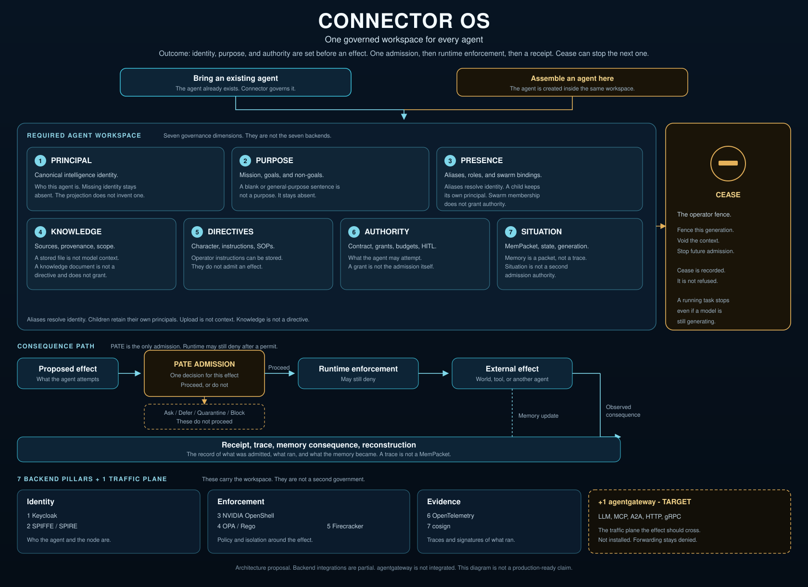

<p align="center">
  <a href="https://cnktros.com"></a>
</p>

<h1 align="center">Connector</h1>

<p align="center"><strong>Control what AI agents can do—not only what they can say.</strong></p>

<p align="center">
  <a href="https://cnktros.com">Website</a> ·
  <a href="#quick-start">Quick start</a> ·
  <a href="#architecture">Architecture</a> ·
  <a href="oss/SECURITY.md">Security</a>
</p>

Connector is an open-source control plane for AI agents that take real actions.
It gives every agent an identity, explicit authority, per-action admission,
runtime enforcement, operator stop controls, and an evidence trail.

Use your existing agent or assemble one in Connector. Before it sends a request,
changes data, calls a tool, spends money, or contacts another agent, Connector
decides whether that specific action may proceed.

## Why Connector?

Agent frameworks help agents reason and use tools. API gateways route traffic.
Policy engines evaluate rules. Observability systems record events. None of
these alone answers the whole operational question:

> **Should this agent be allowed to perform this action, in this situation,
> right now—and can an operator stop the next action?**

Connector joins that decision to identity, grants, runtime enforcement, and the
resulting receipt.

| Without Connector | With Connector |
| --- | --- |
| A tool credential often authorizes the whole process | Authority is scoped to the agent and action |
| Instructions and permissions are mixed in prompts | Knowledge, directives, memory, and authority remain separate |
| Approval may happen outside the execution record | Ask stays open until an operator decides it |
| Logs explain activity after the fact | Admission and observed consequence share an evidence trail |
| Stopping depends on model cooperation | **Cease** fences the generation and stops future admission |
| Each backend has a separate operator workflow | Connector presents one workspace and manages the backends |

## Who is it for?

Connector is for teams whose agents can affect real systems:

- platform teams operating internal or customer-facing agents;
- AI product teams adding tool use, MCP, A2A, browser, or API access;
- security and governance teams that need explicit authority and evidence;
- operators who need to pause or cease an agent without waiting for the model.

If an agent only produces text in a disposable sandbox, Connector may be more
infrastructure than you need.

## Quick start

```bash
git clone https://github.com/GlobalSushrut/connector-oss.git
cd connector-oss
./up.sh
```

Open <http://127.0.0.1:9091/> and choose **Open on this machine**.
The local development token stays on your computer.

Then:

1. Open **Run → Demo** to see the governed action path.
2. Use **Bring your agent** to connect an existing agent.
3. Resolve actions waiting for a person in **Approve**.
4. Resolve TraceTramp runtime holds in **Fix**.
5. Inspect decisions and receipts in **Watch**.

### Requirements

- Linux
- Docker
- Rust
- Node.js
- [Trunk](https://trunkrs.dev/) and the WASM target:
  `rustup target add wasm32-unknown-unknown`

A smaller library server without the operator UI is documented in
[docs/quickstart.md](oss/docs/quickstart.md).

## What you get

- **Governed workspace:** principal, purpose, presence, knowledge, directives,
  authority, and situation stay distinct.
- **Per-action admission:** PATE returns Proceed, Ask, Defer, Quarantine, or
  Block for a proposed effect.
- **Runtime enforcement:** a PATE permit does not bypass downstream policy or
  isolation.
- **Operator control:** pause, stop, and Cease do not depend on model agreement.
- **Memory with provenance:** memory is stored as a MemPacket, separate from
  traces and instructions.
- **Evidence:** receipts connect admission, execution, and observed consequence.
- **Agent-to-agent control:** different addresses can carry different grants and
  situation ranges without granting the entire swarm.
- **One operator surface:** Connector manages the supporting identity,
  enforcement, and evidence systems.

## Architecture

<p align="center">
  
</p>

The action path is:

```text
agent → proposed effect → PATE admission → runtime enforcement
      → external effect → receipt and observed consequence
```

The seven workspace dimensions describe how an agent is governed; they are not
the seven external backends. PATE is the admission authority. A permit can still
be denied at runtime. Cease fences the current generation, voids its context,
and stops future admission.

## Managed infrastructure

`./up.sh` downloads pinned components, starts them with local defaults, and keeps
their operation behind Connector.

| Role | Components |
| --- | --- |
| Identity | Keycloak, SPIFFE/SPIRE |
| Enforcement | NVIDIA OpenShell, OPA/Rego, Firecracker |
| Evidence | OpenTelemetry, Sigstore cosign |
| Traffic-plane target | agentgateway for LLM, MCP, A2A, HTTP, and gRPC |

Connector also supports MCP, A2A, and OpenAI-compatible agent interfaces.
Pasting an address never creates a grant.

## Current status

The workspace, PATE admission, receipts, Cease, TraceTramp, WitnessCtl, and
seven-backend boot path are present.

Important limits:

- Firecracker boot currently downloads the binary and jailer; it does not
  create a microVM kernel or root filesystem.
- The agentgateway image starts, but end-to-end forwarding has not been proven
  and remains denied.
- Downloading or starting a backend does not prove that every admitted effect
  passed through it.
- Backend integrations are still partial.

This repository does not claim production readiness, security, correctness,
safety, or compliance.

## Contributing

Read [CONTRIBUTING.md](oss/CONTRIBUTING.md) before opening a pull request.

## Security

Report exploitable findings privately through [SECURITY.md](oss/SECURITY.md).

## License

Libraries under `oss/` use the [Apache License 2.0](oss/LICENSE). The node under
`platform/` uses the [Business Source License 1.1](platform/LICENSE).
