# AAPI in an Agentic Pipeline

This document illustrates how AAPI integrates into a real-world agentic AI pipeline. It bridges the gap between an LLM's **intent** and the **execution** of that intent on real systems.

## 🏗️ High-Level Architecture

In a typical agentic system (e.g., using LangChain, AutoGen, or custom loops), the "Tool Execution" step is replaced or wrapped by the AAPI Client.

```mermaid
graph TD
    User[User] -->|Goal| Agent[AI Agent / LLM]
    
    subgraph "Agent Runtime"
        Agent -->|Reasoning| Plan[Plan / Thought]
        Plan -->|Tool Call| SDK[AAPI SDK]
    end
    
    subgraph "AAPI Trust Layer"
        SDK -->|VĀKYA Request| Gateway[AAPI Gateway]
        Gateway -->|1. Authenticate| Crypto[Crypto Engine]
        Gateway -->|2. Authorize| Policy[MetaRules Engine]
        Gateway -->|3. Audit Log| IndexDB[Evidence Log]
    end
    
    subgraph "Execution Plane"
        Gateway -->|4. Dispatch| Adapters[Adapters]
        Adapters -->|Execute| FileSys[File System]
        Adapters -->|Execute| API[External APIs]
        Adapters -->|Execute| DB[Database]
    end
    
    Adapters -->|Result + Effect| Gateway
    Gateway -->|Receipt| SDK
    SDK -->|Observation| Agent
```



---

## 🔄 The VĀKYA Lifecycle

Every action an agent takes follows this rigorous lifecycle to ensure accountability.


---

## 💡 Use Case 1: Safe File Operations

**Scenario**: An agent is asked to "Refactor the config file". It needs to read, modify, and write a file. AAPI ensures it doesn't delete important files or access outside its sandbox.

### 1. The Diagram



```mermaid
flowchart LR
    Agent[Agent] -->|1. VĀKYA: file.read| Gateway
    Gateway -->|2. Policy Check| Policy{Access?}
    Policy -->|Yes| FS[File System]
    Policy -->|No| Block[Block Action]
    
    FS -->|3. Content| Gateway
    Gateway -->|4. Receipt| Agent
    
    Agent -->|5. Logic| Agent
    
    Agent -->|6. VĀKYA: file.write| Gateway
    Gateway -->|7. Capture Effect| Diff[Compute Diff]
    Gateway -->|8. Execute| FS
```

### 2. The Code (Rust SDK)

How the agent (or the tool wrapper) uses the AAPI SDK:

```rust
use aapi_sdk::{AapiClient, ClientConfig, VakyaRequestBuilder};

async fn refactor_config(agent_id: &str, file_path: &str) -> Result<(), Box<dyn std::error::Error>> {
    let client = AapiClient::new(ClientConfig::default())?;

    // Step 1: Read the file
    // The agent constructs a VĀKYA expressing intent to READ
    let read_req = VakyaRequestBuilder::new()
        .actor(agent_id)
        .resource(format!("file:{}", file_path))
        .action("file.read")
        .reason("Need to analyze config for refactoring")
        .build()?;

    let read_resp = client.submit(read_req).await?;
    let content = read_resp.receipt.unwrap().result["content"].as_str().unwrap().to_string();

    // ... LLM processes content and generates new config ...
    let new_content = process_config(&content);

    // Step 2: Write the file
    // The agent constructs a VĀKYA expressing intent to WRITE
    let write_req = VakyaRequestBuilder::new()
        .actor(agent_id)
        .resource(format!("file:{}", file_path))
        .action("file.write")
        .body(serde_json::json!({ "content": new_content }))
        .reason("Applying configuration optimizations")
        .build()?;

    // AAPI automatically captures the 'before' and 'after' state for rollback
    let write_resp = client.submit(write_req).await?;
    
    println!("Refactor complete. Receipt: {}", write_resp.vakya_hash);
    Ok(())
}
```

---

## 💡 Use Case 2: Human-in-the-Loop Approval

**Scenario**: An agent wants to "Deploy to Production". This is a sensitive action defined in `MetaRules` as requiring human approval.

### 1. The Diagram


### 2. The Code (Handling Approval)

```rust
use aapi_sdk::{AapiClient, VakyaRequestBuilder};

async fn deploy_agent(client: &AapiClient) {
    let req = VakyaRequestBuilder::new()
        .actor("agent:deployer")
        .resource("env:production")
        .action("system.deploy")
        .build()
        .unwrap();

    let response = client.submit(req).await.unwrap();

    match response.status.as_str() {
        "success" => println!("Deployed immediately!"),
        "pending_approval" => {
            println!("Approval required. Waiting...");
            let vakya_id = response.vakya_id;
            
            // Poll for completion (or use webhook in real system)
            loop {
                let status = client.get_vakya(&vakya_id).await.unwrap();
                if status.status == "completed" {
                    println!("Approval granted! Deployment finished.");
                    break;
                } else if status.status == "rejected" {
                    println!("Deployment rejected by admin.");
                    break;
                }
                tokio::time::sleep(std::time::Duration::from_secs(5)).await;
            }
        }
        _ => println!("Request failed: {}", response.status),
    }
}
```

---

## 💡 Use Case 3: Audit & Rollback

**Scenario**: An agent makes a mistake and deletes the wrong data. Because AAPI uses an append-only IndexDB with effect capture, we can audit exactly what happened and roll it back.

### 1. The Diagram



```mermaid
graph TD
    subgraph "Incident Response"
        Admin[Admin] -->|1. Query Log| IndexDB[AAPI IndexDB]
        IndexDB -->|2. Trace History| Admin
        Admin -->|3. Identify Bad Action| Vakya[VĀKYA ID: 123]
        
        Admin -->|4. Request Rollback| Gateway
    end
    
    subgraph "Recovery"
        Gateway -->|5. Lookup Effect| IndexDB
        IndexDB -->|6. Inverse Action| Gateway
        Gateway -->|7. Execute Repair| System
    end
```

### 2. The Code (Auditing)

```rust
// Verify the integrity of the action log using Merkle Proofs
async fn audit_action(client: &AapiClient, vakya_id: &str) {
    // 1. Get the action record
    let vakya = client.get_vakya(vakya_id).await.unwrap();
    
    // 2. Get the Merkle inclusion proof
    let proof = client.get_inclusion_proof("vakya", vakya.leaf_index.unwrap())
        .await
        .unwrap();
        
    // 3. Verify against the trusted root hash
    let root = client.get_merkle_root("vakya").await.unwrap();
    
    if verify_proof(proof, root.root_hash) {
        println!("Action {} is cryptographically verified in the log.", vakya_id);
        println!("Actor: {}", vakya.karta_pid);
        println!("Reason: {}", vakya.vakya_json["hetu"]["reason"]);
    } else {
        println!("WARNING: Log tampering detected!");
    }
}
```

---

## 🔑 Key Benefits for Agentic Systems

1.  **Identity & Attribution**: No more "The AI did it". Every action is signed by a specific key (`pid: "agent:researcher"`).
2.  **Sandboxing**: The agent can only call `file.read` if the `MetaRules` policy allows it for that specific resource path.
3.  **Resilience**: If the agent hallucinates a destructive command, the Policy Engine catches it before execution.
4.  **Observability**: You get a structured log of *Intent* (VĀKYA) vs *Outcome* (Receipt), perfect for debugging agent behavior.
