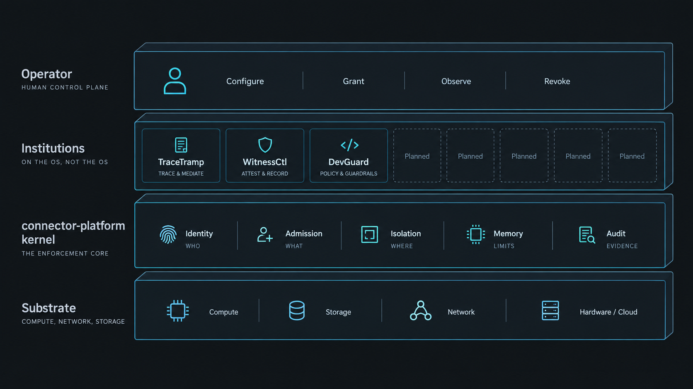

# Connector OS — Truth Story (0 → Today → Future)

**Audience:** operators, builders, investors, and anyone who will market or evaluate Connector.  
**Rule:** every “can do” below is true in code *or* explicitly labeled **not yet**.  
**Engineering proof today:** `make final-reach-light-gate` (laptop-safe).  
**Market claims L4/+2 or L5/mesh/court-grade:** only after human Final GO — see [FINAL_REACH.md](../FINAL_REACH.md).

---

## One sentence (safe to say today)

**Connector OS is a self-hosted AI operating substrate:** one installable node where agents, models, tools, workflows, and plugins run under shared identity, admission, isolation, durable memory, audit, and usage truth — TraceTramp, WitnessCtl, and DevGuard are institutions on that substrate, not a second kernel.

**Not safe to say yet:** “global multi-master mesh,” “automatic failover,” or “court-grade custody” as a finished product. Those are **L5 targets** with engineering foundations already in tree; honesty APIs still report `single_node` / `mesh_fabric: false` / `automatic_failover: false`.

---

## 0 — Why it exists

Before Connector, teams bolted agents onto chat APIs and frameworks (LangGraph, Crew, custom tool loops). Each agent invented its own:

- identity and secrets  
- memory (often just RAG)  
- policy and “HITL”  
- logs that look like audit but are not independently verifiable  
- cost numbers that look like dollars but are guesses  

When agents start acting on the world (tools, code, money, customers), **missing substrate** becomes outages, leaks, and fake green dashboards. Connector exists to be the **OS underneath agents**, not a better agent.

Constitutional framing: [docs/00-constitutional-preamble.md](00-constitutional-preamble.md).

---

## What it is made of (architecture in plain language)



*Institutions sit on the OS. They are not the OS.*

```text
┌─────────────────────────────────────────────────────────────┐
│  Operator: dashboard + connectorctl                         │
├─────────────────────────────────────────────────────────────┤
│  Institutions (apps on the OS)                              │
│    TraceTramp · WitnessCtl · DevGuard · Hub /.cpkg plugins  │
├─────────────────────────────────────────────────────────────┤
│  Programs: CLS workflows on CNP (syscall-like bus)          │
├─────────────────────────────────────────────────────────────┤
│  Kernel plane (connector-platform)                          │
│    Admission · Gateway/LLM · Agents · Memory/Moments        │
│    Cages/plugins · Books/Usage · Forensics/CFNI · Settings  │
├─────────────────────────────────────────────────────────────┤
│  Substrate libraries                                        │
│    vac-core (MemPackets) · connector-trust · CNP · VAC…     │
└─────────────────────────────────────────────────────────────┘
         ▲
         │  Agents / SDKs / OpenAI-compatible clients
         │  point here — they do not own the OS
```

| Layer | What ships | Role |
|-------|------------|------|
| **Node** | `connector-platform` + `connectorctl` + embedded dashboard | One sovereign install |
| **Primitives** | Identity, authority, memory, isolation, causality, usage… | Shared contracts in `connector-trust` |
| **Institutions** | TraceTramp, WitnessCtl, DevGuard | Control, custody, host cage — projections of substrate |
| **Programs** | CLS workflows + CNP tokens | Operator-authored automation on the OS |
| **Extensions** | AGOS / `.cpkg` / Hub MVP | Signed plugins into cages |
| **Mesh (partial)** | Cell boot (`--features cluster`), SPIFFE-ish IDs, CRDT membership *local*, custody quorum logic | Foundations for L5 — **not** product multi-node SoT yet |

Maturity ladder (do not skip): **L0** model → **L1** agent app → **L2** governed platform → **L3** AIOS → **L4** DI substrate → **L5** global intelligence mesh.  
**Today’s honest product bar:** strong **single-node L3 with much of L4 physiology coded**; L5 **engineering started**, market L5 **not signed**.

---

## From zero to today (timeline of meaning)

| Era | What was built | What that means for people |
|-----|----------------|----------------------------|
| **Years of substrate** | Constitutional primitives, VAC memory, gateway, agents, cages, TT/WC/DG, dashboard, Hub direction | A real OS *shape*, not a demo chatbot |
| **Hardening / honesty** | Prod fail-closed secrets, CFNI enforce, keyed audit HMAC, usage-first books, microVM default, no fake `$0` / decorative `verified` | Pilots can run without lying to themselves |
| **Final Reach coding (now)** | Trust-domain backup, node-upgrade, admission matrix, Object Fabric fs CAS, moments, SGKE gate, policy lineage, mesh honesty APIs, local cell boot, light green gate | Engineering green for laptop proof; human Final GO still open |
| **Next (signed Final)** | Clean-VM stories, `prod-readiness-gate`, signed release, 2–3 node mesh soak | Marketable **L4/+2**, then **L5/+3** when soaks pass |

---

## What you can do **today** (truthful marketing)

### Operators

- Install and run **one Connector OS node** (`connectorctl start` → dashboard).  
- Point LLM/agent traffic at the **governed gateway** (admission, routing, cost-cap hard-stop posture). World dials can run in dest-pinned Landlock children; unmarked clients can have vendor HTTPS cut except the LLM cage — [WORLD_CAGE_AND_BROWSER.md](WORLD_CAGE_AND_BROWSER.md).  
- Enable **TraceTramp / WitnessCtl / DevGuard** from the catalog and use stable plugin URIs.  
- Author and **ENABLE CLS workflows** that mint **CNP dispatch tokens** (CLS-only product path).  
- Back up / restore a **trust domain** (`connectorctl backup` + manifest; secrets restored out-of-band).  
- See **usage-first books** (unavailable ≠ $0); forensics with FNI / moment honesty; isolation badges.  
- Configure production presets (`CONNECTOR_PRESET=production`) with fail-closed secrets / CFNI / microVM defaults.

### Builders / agent authors

- Treat Connector as the **runtime**: register agents, call the OpenAI-compatible gateway, use tools under admission.  
- Persist memory as **MemPackets / moments** (content-addressed), not “hope the chat context remembers.”  
- Ship capabilities as **signed `.cpkg` plugins** into cages (Hub MVP; workflow Hub publish still honesty-stub).  
- Read **policy lineage** and substrate status APIs — same node truth for institutions.

### Security / FinOps / auditors (honest depth)

- **Keyed** audit integrity + recompute paths; CFNI stamps on transit when enforced.  
- Custody **quorum logic** and honesty strips exist; **do not** call issuer-only HMAC “court-grade” yet.  
- Cost panels show **meters and sources**; company dollars only with a rate card — never fake exact provider invoices.

### Prove engineering green (laptop)

```bash
make final-reach-light-gate
```

---

## How agents **change** when they use Connector

| Without Connector (typical agent) | With Connector (agent as OS process) |
|-----------------------------------|--------------------------------------|
| Owns its own memory (RAG / files) | Memory is **namespaced substrate** (packets, moments, Object Fabric) |
| Tools fire if the framework allows | **Admission** sits in front of effects; deny has a reason |
| “Policy” is app code | Policy / HITL / institutions share **principal lineage** on the node |
| Logs in the agent process | **Audit + CFNI + forensics** join traces, captures, moments |
| Cost is a guess in a sidebar | **UsageEvent / UsageReceipt**; unavailable ≠ $0 |
| Isolation = “run in Docker maybe” | Declared **cage / microVM** with honesty badges; no silent downgrade in prod posture |
| Multi-agent = orchestration library | Multi-agent is **PIDs on one kernel SoT** (plus future mesh placement) |
| Scale-out = another k8s deployment story | Future scale = **intelligence × geo/hardware placement** on cells — not “k8s is the product” |

**Mental model for builders:** your agent becomes a **tenant process**. Connector is the OS. TraceTramp judges live traffic; WitnessCtl seals evidence; DevGuard cages the host IDE — all reporting into the same primitives.

Stories operators should feel (when Final GO is signed): [CONNECTOR_OS_WHEN_DONE_HOW_PEOPLE_USE_IT.md](../CONNECTOR_OS_WHEN_DONE_HOW_PEOPLE_USE_IT.md) (A–D).

---

## What is **left** (do not market as done)

Automation is ready — **run and sign** on a capable machine / clean VM.

### Before you market **L4 / “+2 above agents”**

| Left | Command / path |
|------|----------------|
| Engineering claim gate | `make l4-claim-gate` then `L4_HEAVY=1 make l4-claim-gate` |
| Full release gate | `make prod-readiness-gate` (≥32 GiB / CI) |
| Clean-VM signed tar + Stories A–D (T7) | [FINAL_GO_RUNBOOK.md](FINAL_GO_RUNBOOK.md) § L4 |
| Checklist sign-off | PRODUCTION_READINESS Final GO #6/#7b |

### Before you market **L5 / global mesh / court-grade**

| Left | Command / path |
|------|----------------|
| Two-node soak T13+T15 | **PASS** — `platform/scripts/.l5-mesh-soak.ok` (`make l5-mesh-soak ARGS=--start-local`) |
| Claim fabric | Restart with `CONNECTOR_MESH_FABRIC=1` only after `.l5-mesh-soak.ok` |
| Peer QUIC mTLS | Still fail_closed — HMAC channel ≠ market “mutual_auth fabric” |
| Custody N-of-M | **PASS (live 3-node)** — `platform/scripts/.custody-multinode-soak.ok` |
| Sign P9 | [FINAL_GO_RUNBOOK.md](FINAL_GO_RUNBOOK.md) § L5 |

### Deepenings (product quality, not the whole claim)

- Full CNP topic-bus dry-run (retire audit-tail entirely)  
- Builder visual ↔ package round-trip complete  
- Hub workflow `.cpkg` publish/install as real registry  
- Assembled multi-GB Object Fabric blob path  
- Glue as non-stub SDK (or keep de-claimed)

Full checklist: [FINAL_REACH.md](../FINAL_REACH.md) · gaps list: [KNOWN_LIMITATIONS.md](KNOWN_LIMITATIONS.md).

---

## Future (what we are building toward)

1. **Signed single-node Final (L4 market)** — forensic-grade transit, moments, usage truth, fail-closed cages; agents cannot forge green on one sovereign node.  
2. **Global intelligence mesh (L5 market)** — many nodes, geo-identity × hardware placement, vac-cluster CRDT membership, CNP channels, N-of-M custody — **+3 above agent stacks**.  
3. **IIA court-grade intelligence identity (P10)** — N4 → QPR → DockLock → Ed25519 receipts on top of L3–L5; see **[CONNECTOR_WHEN_IIA_COMPLETE.md](../CONNECTOR_WHEN_IIA_COMPLETE.md)**.  
4. **Still never the product definition:** Kubernetes-as-OS, automatic multi-master without soak, or “we know your provider invoice.”

---

## Copy blocks (reuse carefully)

### Website / one-pager (today — allowed)

> Connector OS is a self-hosted operating substrate for AI agents. Run one governed node: admission, isolation, durable memory, workflows, and audit — with TraceTramp, WitnessCtl, and DevGuard as institutions on the same kernel. Agents become processes on the OS, not the control plane.

### Do not use until Final GO / mesh soak

> ~~Fully automatic global failover~~ · ~~Court-admissible custody out of the box~~ · ~~Multi-region memory mesh as default SoT~~ · ~~We replace Kubernetes~~

### Ladder claim (only after P7 / P9 signed)

> After L4 sign-off: *two levels above agent frameworks — AIOS + DI substrate.*  
> After L5 sign-off: *three levels — plus global intelligence mesh and multi-party custody.*

---

## Where to go next

| Need | Doc / command |
|------|----------------|
| Coding queue | [FINAL_REACH.md](../FINAL_REACH.md) |
| IIA capability vision (on top of today) | [CONNECTOR_WHEN_IIA_COMPLETE.md](../CONNECTOR_WHEN_IIA_COMPLETE.md) |
| IIA coding checklist | [IIA_CORE_UPGRADE_CHECKLIST.md](../IIA_CORE_UPGRADE_CHECKLIST.md) |
| Full product promise | [FINAL_OUTCOME.md](../FINAL_OUTCOME.md) |
| Operator stories | [CONNECTOR_OS_WHEN_DONE_HOW_PEOPLE_USE_IT.md](../CONNECTOR_OS_WHEN_DONE_HOW_PEOPLE_USE_IT.md) |
| Hardening | [PRODUCTION_HARDENING.md](PRODUCTION_HARDENING.md) |
| World cage / vendor cut / browser | [WORLD_CAGE_AND_BROWSER.md](WORLD_CAGE_AND_BROWSER.md) |
| Limitations | [KNOWN_LIMITATIONS.md](KNOWN_LIMITATIONS.md) |
| Laptop proof | `make final-reach-light-gate` · `make engineering-reach-gate` |
| Architecture map | [ARCHITECTURE.md](../ARCHITECTURE.md) |

---

*If this document ever claims mesh failover or court-grade while honesty APIs still say `single_node` / `automatic_failover: false`, it is wrong — fix the doc, not the flag.*
