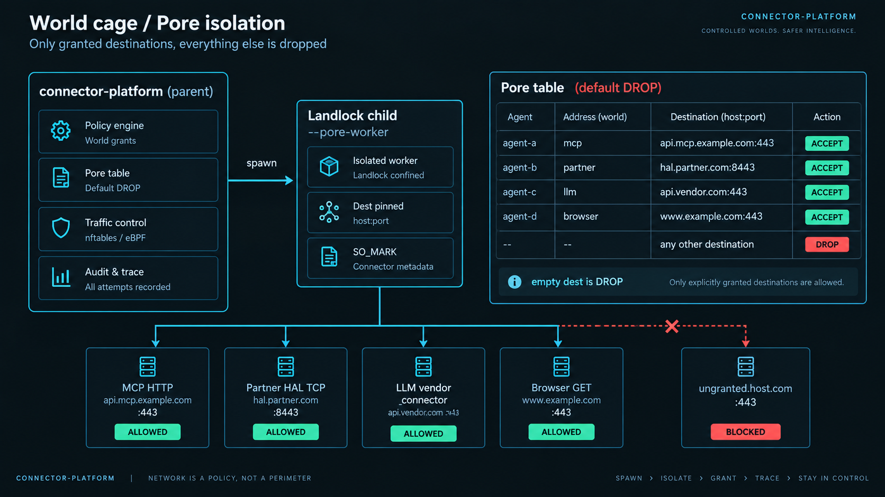
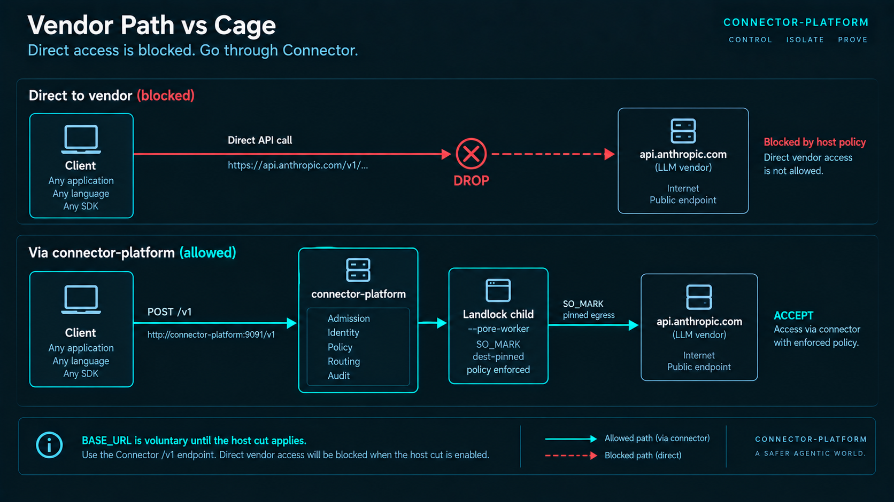

# World cage, vendor cut, and native browser explorer

**Audience:** operators and reviewers of a Connector node — any agent, any world address.  
**Status:** shipped in `connector-platform` (Landlock child + pore table + LLM vendor cut + browser world).  
**Honesty rule:** this document describes what the code does. It does not claim Firecracker-by-default, TLS MITM of the host, or Chromium computer-use.

Connector is a **generic operating substrate** for intelligence: identity, admission, isolation, memory, audit. Coding assistants (Cursor, Claude Code, …) are one class of *client* of `/v1` and of DevGuard. They are not the product. The same cage covers Talk, MCP, partner HAL, HTTP APIs, robots, and the browser world.

Related: [Effect exclusivity](../platform/docs/arch/EFFECT_EXCLUSIVITY.md) · [Agent isolation architecture](../platform/docs/arch/CONNECTOR_AGENT_ISOLATION.md) · [Known limitations](KNOWN_LIMITATIONS.md) · [Production hardening](PRODUCTION_HARDENING.md) · [DevGuard first run](DEVGUARD_FIRST_RUN.md) (one institution, not the OS)

---

## Why this exists

Agents that *act* (tools, HTTP, machines, the web) routinely **talk past the gate**:

1. A client still dials the LLM vendor directly, so Connector never sees the prompt or the effect loop.
2. World sockets (MCP HTTP, partner TCP, file/shell) run on the **host PID** even when Talk was “governed.”
3. “Just fetch this URL” is a **side internet** the OS never granted.

Connector’s answer is not a prompt that says “please don’t.” It is a **world cage** that is the same for every agent:

| Problem | What Connector does |
|---------|---------------------|
| World sockets from `connector-platform` itself | **Landlock child** (`--pore-worker`) dials one dest |
| Any address is reachable unless listed | **Pore table** default DROP (iptables-like ACCEPT rows) |
| Client ignores `/v1` and dials the vendor | **Vendor cut** DROP TCP 80/443 to vendor IPs except the LLM-cage mark |
| An agent explores the web off-books | **Browser world** — granted origin, one hop, recorded fundamentals |
| Tool calls inside the model JSON | Cage returns **text only**; no tool dispatcher in the child |

A model running **outside** this node (vendor datacenter, a process that never uses Connector) cannot be containerized from here. What this stack governs is **everything that actually goes through Connector** — and, once a session is connected and nft applies, **direct vendor HTTPS from this host**.

---

## What we made (four pieces)



*Pore table default DROP. Dest-pinned Landlock child (`connector-platform --pore-worker`). Empty dest is DROP. Not Firecracker-by-default.*

```text
                    ┌─────────────────────────────────────────┐
  Any /v1 client    │  Talk · MCP · HAL · HTTP · browser      │
  (SDK, IDE, bot)   │  Vendor IPs DROP unless cage SO_MARK    │
                    └──────────────────┬──────────────────────┘
                                       │
                    ┌──────────────────▼──────────────────────┐
                    │  connector-platform  (parent)           │
                    │  admit · grants · PATE · record         │
                    │  does NOT dial agent world sockets      │
                    │  when Landlock child is on              │
                    └──────────────────┬──────────────────────┘
                                       │ spawn --pore-worker
                    ┌──────────────────▼──────────────────────┐
                    │  Landlock child                         │
                    │  dest pin CONNECTOR_PORE_DEST           │
                    │  FS allowlist = TLS/DNS + agent NSFS    │
                    │  WRITE empty · no HOME · no API keys    │
                    │  no tool dispatcher                     │
                    └──────────────────┬──────────────────────┘
                                       │
              ┌──────────────┬─────────┴──────────┬────────────┐
              ▼              ▼                    ▼            ▼
         MCP HTTP      Partner HAL         LLM vendor     Browser GET
         (grant)       (grant)            (_connector     (grant origin)
                                           × llm:provider)
```

### 1. Pore table (userspace iptables)

Every world address is a lock point: **`(agent × address × dest host:port)`**.

- Store folder: `landlock_pores_v1`
- Default: **DROP**
- ACCEPT only after an **owner world grant** (or the Connector system LLM pore)
- Empty dest is DROP for network dials (not a wildcard)
- Agent pores **cannot** target LLM vendor hosts (`api.anthropic.com`, `api.openai.com`, …). Those belong to `_connector` × `llm:provider`.

Inspect: `GET /api/v1/runtime/pores`

### 2. Landlock child (`connector-platform --pore-worker`)

The parent writes a JSON job to stdin. After `pre_exec`, Linux Landlock + seccomp apply. The child may speak only to `CONNECTOR_PORE_DEST`. Jobs: `http_fetch`, `tcp_send`, `llm_complete`, `probe`.

- Governed Talk and `/v1` vendor HTTP (OpenAI-compatible chat and Anthropic Messages) run in this child when the cage is on.
- Provider `tool_calls` are **not executed** here.
- Keys travel in the job JSON for `llm_complete` only — not in child env (`HOME`, `CONNECTOR_LLM_API_KEY`, data dir stripped).

On when:

- `CONNECTOR_LANDLOCK_CHILD=1` or `CONNECTOR_LLM_CAGE=1`
- **or** effect exclusivity / Ring-1
- **or** a connected session has engaged the **vendor cut**
- Off (break-glass): `CONNECTOR_ALLOW_IN_PROCESS_EFFECTS=1`

If the running binary is not `connector-platform`, set `CONNECTOR_PORE_BIN`.

### 3. LLM vendor cut (host DROP)



*`BASE_URL` is voluntary until the host cut applies. nft needs `CAP_NET_ADMIN`. Playground often cannot apply the kernel table.*

Pointing a client at `{gateway}/v1` is **voluntary**. Once a governed session is connected, Connector can install an nftables table `inet connector_llm_vendor` (iptables fallback `CONNECTOR_LLM_VENDOR`):

1. Packets with the **LLM-cage SO_MARK** (`_connector`) are accepted.
2. TCP 80/443 to resolved vendor IPs are **dropped**.

Engaged by: MCP register, Talk with a `cg_` token, Anthropic-compatible `/v1/messages`, DevGuard connect / session start / attach (one of several session types).

Needs **`CAP_NET_ADMIN`**. Playground skips nft (userspace exclusive still holds for Connector-spawned children). Hosted Fly VMs typically cannot apply the kernel table.

Disable: `CONNECTOR_LLM_VENDOR_CUT=0`

Inspect: `GET /api/v1/runtime/llm-vendor-cut`

### 4. Native browser explorer (world type `browser`)

Not a hidden Chrome. It is a **world address** so an agent cannot “just use the internet.”

Each navigate is one **GET**:

- Owner grant on the origin (`browse.navigate`)
- Dest-pinned pore (same child as MCP)
- No auto-redirect — `Location` is the next hop Connector must see
- Recorded: URL, status, title, excerpt, links, sha256, bytes
- No JS, no cookie jar, no click/type (computer-use stays `unsupported_here`)

---

## What it can do

| Capability | Yes | No |
|------------|-----|-----|
| Fail closed if an agent has no grant for that world dest | Yes | |
| Dial MCP / HAL / HTTP from a dest-pinned Landlock child | When child path is on | In-process if break-glass / lab without flags |
| Keep vendor LLM keys off agent NSFS and child env | Yes | |
| Stop unmarked processes on **this host** from hitting LLM vendors directly | When vendor cut **kernel** applied | Without CAP_NET_ADMIN, those processes may still reach vendors |
| Govern Talk, `/v1` chat, Anthropic Messages, experiments through the cage | When cage/cut on | Lab in-process LlmRouter when flags off |
| Explore granted websites with a recorded trail | Document GET | Chromium UI, forms, JS, screenshots |
| Follow HTTP redirects automatically | | By design — each hop is a navigate |
| Isolate a remote model that never uses this node | | Out of scope |
| Firecracker MicroCell for every pore | | Not this path; see agent isolation architecture |

---

## How to use

Assume the API is `http://127.0.0.1:9091` and you have an operator bearer token.

### A. Turn the cage on (density / production)

```bash
export CONNECTOR_LANDLOCK_CHILD=1
# or rely on CONNECTOR_EFFECT_EXCLUSIVITY / CONNECTOR_IIA_RING1 (production preset)

# optional explicit LLM cage:
export CONNECTOR_LLM_CAGE=1

# vendor cut is on when a governed session connects unless:
# export CONNECTOR_LLM_VENDOR_CUT=0
```

Restart `connector-platform`. Confirm:

```bash
curl -sS -H "Authorization: Bearer $TOKEN" \
  http://127.0.0.1:9091/api/v1/runtime/intelligence-posture | jq '.landlock_child.enforced, .honesty'
curl -sS -H "Authorization: Bearer $TOKEN" \
  http://127.0.0.1:9091/api/v1/runtime/pores
```

Console: **GET /runtime/pores**, **GET /runtime/llm-vendor-cut**.

### B. Point LLM clients at Connector (required even with nft)

Any OpenAI- or Anthropic-compatible client (SDK, bot, IDE, workflow runner) must use this node as the gateway:

```bash
export OPENAI_BASE_URL=http://127.0.0.1:9091/v1
export OPENAI_API_KEY=cg_....          # issued token
export ANTHROPIC_BASE_URL=http://127.0.0.1:9091/v1
export ANTHROPIC_API_KEY=cg_....
```

DevGuard sessions return the same URLs for workstation IDEs — that is one client, not a separate cage. If the vendor cut applied, leaving these unset means the client **fails** to reach the vendor — that is the point.

### C. Grant a world address (MCP, HTTP, HAL, browser)

Kernel root passcode must be set (`POST /api/v1/intelligence/gateway/root`). Then register address + grant:

```bash
# 1) Address
curl -sS -X POST http://127.0.0.1:9091/api/v1/intelligence/gateway/address \
  -H "Authorization: Bearer $TOKEN" -H "Content-Type: application/json" \
  -d '{
    "address": "https://example.com",
    "type": "browser",
    "cnp_capabilities": ["browse.navigate"],
    "root_passcode": "'"$ROOT"'"
  }'

# 2) Grant this agent × this origin (default Cone Ask)
curl -sS -X POST http://127.0.0.1:9091/api/v1/intelligence/gateway/grant \
  -H "Authorization: Bearer $TOKEN" -H "Content-Type: application/json" \
  -d '{
    "agent_pid": "YOUR_AGENT_PID",
    "address": "https://example.com",
    "address_type": "browser",
    "access": ["browse.navigate"],
    "effect": "ask",
    "layer": "cone",
    "root_passcode": "'"$ROOT"'"
  }'
```

Dashboard: **World gateway** form — type `browser` (also `http_api`, `mcp_tool`, `robot_hal`, …).

A grant **dual-writes a pore ACCEPT** for that dest. Revoke drops the pore.

### D. Browse (agent or operator)

```bash
curl -sS -X POST http://127.0.0.1:9091/api/v1/world/browser/navigate \
  -H "Authorization: Bearer $TOKEN" -H "Content-Type: application/json" \
  -d '{
    "agent_pid": "YOUR_AGENT_PID",
    "url": "https://example.com/",
    "session_id": "br_lab1"
  }'
```

Response includes `page.title`, `page.excerpt`, `page.links`, `page.sha256`, `next` (redirect Location). To follow a redirect, navigate `next` on the same `session_id`.

Hosted MCP tool (after platform boot): **`connector.browser.navigate`** with `{ "url", "session_id?" }`.

Trail:

```bash
curl -sS -H "Authorization: Bearer $TOKEN" \
  "http://127.0.0.1:9091/api/v1/world/browser/sessions?agent_pid=YOUR_AGENT_PID"
curl -sS -H "Authorization: Bearer $TOKEN" \
  http://127.0.0.1:9091/api/v1/world/browser/sessions/br_lab1
```

Posture: `GET /api/v1/world/browser`

Alias: `POST /api/v1/intelligence/gateway/browser/navigate`

Default body cap 256 KiB (hard max 1 MiB). User-Agent: `ConnectorBrowser/1.0 (governed world explorer)`.

### E. MCP / HAL still go through pores

- MCP `POST /api/v1/protocols/mcp/call` uses the Landlock child when enforced — **no auto-invented grant**. The owner must have granted that server URL.
- CONP partner HAL TCP uses the same child when enforced.

---

## Where it is important

1. **Any agent that acts on the world** — MCP servers, HTTP APIs, partner HAL / machines, document fetch. Without a grant + pore ACCEPT, density posture must fail closed.
2. **Effect exclusivity / Ring-1 / production preset** — in-process ToolDispatch and world dials are the historical leak. The child path is how exclusivity stays honest instead of “policy said no but TcpStream still ran.”
3. **Regulated or air-gapped-adjacent nodes** — you need a ledger of *which origin was fetched*, not a blob of “the agent used the internet.”
4. **Prompt-injection / “ignore the gate”** — the model can still *ask*. It cannot *dial* an ungranted host or execute tools inside the LLM process. Effects still need PATE / world grant / pore ACCEPT.
5. **Multi-agent on one machine** — Agent A’s grant to `https://example.com` is not Agent B’s. Pores are keyed `agent::address`.
6. **One world model** — HTTP APIs, MCP, HAL, and “the browser” are the same kind of thing: an address with a grant. Browser is the document-shaped one with a session trail.
7. **LLM clients that bypass `/v1`** — SDKs, bots, and workstation IDEs (DevGuard is the institution for coding assistants). Without vendor cut + BASE_URL, the model has a private phone line to the vendor. That is a *client* problem on this OS, not the definition of Connector.

---

## Environment reference

| Variable | Effect |
|----------|--------|
| `CONNECTOR_LANDLOCK_CHILD=1` | Force pore children for world dials |
| `CONNECTOR_LLM_CAGE=1` | Force Talk/vendor HTTP through the LLM system pore |
| `CONNECTOR_EFFECT_EXCLUSIVITY=1` | Production default via profile; implies child path |
| `CONNECTOR_IIA_RING1=1` | Implies child path |
| `CONNECTOR_ALLOW_IN_PROCESS_EFFECTS=1` | Break-glass: parent may dial again (weakens the claim) |
| `CONNECTOR_LLM_VENDOR_CUT=0` | Do not DROP vendor IPs / do not engage cut |
| `CONNECTOR_LLM_VENDOR_CUT=1` | Engage cut even without a session (optional) |
| `CONNECTOR_PORE_BIN` | Path to `connector-platform` if `current_exe` is not it |
| `CONNECTOR_PORE_WORKER=1` | Child entry (set by parent; do not set on the server) |
| `CONNECTOR_PORE_DEST` | Child dest pin `host:port` (set by parent) |
| `CONNECTOR_PORE_ALLOW_VENDOR=1` | Child may hit vendor hosts (LLM system pore only) |
| `ANTHROPIC_REAL_BASE_URL` | Upstream Anthropic when proxying `/v1/messages` (default `https://api.anthropic.com`) |

---

## Inspect and prove

| Call | What you learn |
|------|----------------|
| `GET /api/v1/runtime/pores` | ACCEPT rows, dest pins, cage posture |
| `GET /api/v1/runtime/llm-vendor-cut` | Sessions, whether nft/iptables applied, cage mark |
| `GET /api/v1/runtime/intelligence-posture` | Includes `landlock_child` |
| `GET /api/v1/world/browser` | Browser world honesty (no JS / no computer-use) |
| `GET /api/v1/workbench/posture` | `browser_explore.implemented` vs `unsupported_here: browser_computer_use` |
| `GET /api/v1/intelligence/gateway/status` | World types including `browser` |
| `GET /api/v1/runtime/effect-exclusivity/status` | Broader exclusivity bar |

Store folders (engine store): `landlock_pores_v1`, `llm_vendor_cut_sessions_v1`, `browser_sessions_v1`, `browser_pages_v1`, `iia_world_grants_v1`.

---

## Code map

| Piece | Path |
|-------|------|
| Pore worker (child) | `platform/server/src/pore_worker.rs` |
| Spawn + dest pin + Landlock | `platform/server/src/kernel/landlock_child.rs` |
| Pore table | `platform/server/src/kernel/pore_table.rs` |
| Vendor DROP | `platform/server/src/kernel/llm_vendor_cut.rs` |
| Browser extract + navigate | `platform/server/src/kernel/browser_world.rs` |
| Browser HTTP/MCP | `platform/server/src/services/browser_explorer.rs` |
| World grants | `platform/server/src/kernel/world_gateway.rs` |
| Linux Landlock/seccomp | `platform/plugin-runtime/src/linux_hardening.rs` |
| Talk cage | `platform/server/src/services/gateway.rs` (`talk_via_llm_cage`) |
| Anthropic Messages `/v1/messages` | `platform/server/src/services/anthropic_gateway.rs` |

---

## Failure modes (read these before you page)

**`pore_missing` / `world_grant_required`** — owner never granted that origin or MCP URL. Lab empty-grants may still admit some paths; density/Ring-1 should not.

**`vendor_exclusive`** — agent tried to treat Anthropic/OpenAI as a browser or MCP dest. Use Connector Talk / `/v1`.

**`pore_binary_missing`** — set `CONNECTOR_PORE_BIN` to the `connector-platform` binary.

**`kernel.applied: false` on vendor cut** — no nft/iptables or no `CAP_NET_ADMIN`. Children still refuse vendor dests; **unmarked host processes may still reach the vendor**. Fix capabilities or run on a dedicated Connector host.

**Browse works in lab, fails in prod** — Landlock child on + no grant, or L7 allowlist empty (`CONNECTOR_L7_EGRESS_PROXY`).

**HTML excerpt empty** — non-HTML content type; `excerpt` is a raw prefix. JS-rendered SPAs will look empty; that is honest (no JS engine).

---

## Claims you must not make from this stack

- “We sandbox the vendor’s model in their datacenter.”
- “Every packet on the host is MITM’d.” (No TLS terminate of vendor HTTPS; DROP or `/v1`.)
- “The agent has a real browser / computer-use.”
- “Firecracker is the default pore.” (Linux Landlock child + optional nft.)
- “nft applied” without reading `GET /runtime/llm-vendor-cut`.
- “Connector is a coding-agent product.” (DevGuard is an institution *on* the OS.)

What you **can** say: on this node, world effects go through granted pores in a dest-pinned Landlock child; unmarked clients cannot treat vendor LLM HTTPS as a back door when the host cut applied; web exploration is a recorded world address, not a private internet.

---

## Tests (regression)

From the repo root:

```bash
cargo test --manifest-path platform/server/Cargo.toml --bin connector-platform --offline -- \
  origin_strips extracts_title vendor_dest dest_pin empty_dest dest_spec_stable \
  vendor_hosts cut_can_be url_host params_endpoint -- --test-threads=1
```

These cover origin/title extract, vendor dest deny, dest pin, and empty dest = DROP. They do not prove nft applied on a given host — use `GET /api/v1/runtime/llm-vendor-cut` for that.
