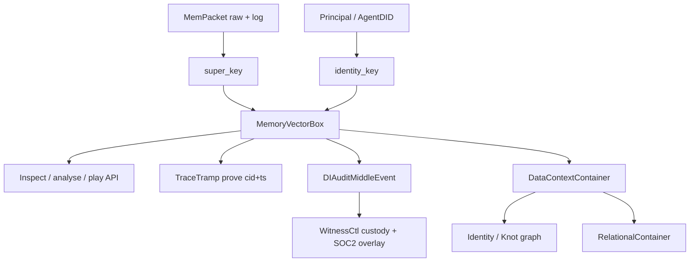

# Memory Vector Box, DI Audit Middle Format, and Data Context

## Developer vision (restated)

Connector already has an agent kernel, isolation, and content-addressed memory. The next product surface is not a new database. It is a **universal memory container** that developers can:

1. **Hold** instance memory as a addressable packet (log + raw + CID + timestamp — what TraceTramp already surfaces on prove).
2. **Key** that packet with a **super key** (stable content/address key for the box) and an **identity key** (who/what agent or principal owns it).
3. **Audit / analyse / play** with that memory in one standard shape — not vendor-specific dumps.
4. Emit a **middle-way audit output**: SOC2-shaped control language, but built for **distributed intelligence** (admission, agent, tool agency, causal lineage, custody) — rooted in WitnessCtl.
5. Scale to heavier and external-world data via **data context**, **identity graph**, and **relational containers** without abandoning the same keys and audit envelope.

## What already exists (do not rewrite)

| Vision term | Existing substrate |
|---|---|
| Memory packet | VAC `MemPacket` (3D Content / Provenance / Authority + Index) |
| CID + timestamp | `index.packet_cid`, `index.ts`; TraceTramp `/prove` receipt `{cid,timestamp}` |
| Identity | `PrincipalContextV2`, AgentDID (`did:connector:…`), ACB `agent_pid` |
| Stable key helper | `build_prolly_key` — auto-set on every `MemWrite` as `index.prolly_key` + `metadata.super_key` / `identity_key` |
| Entity / relational | KnotEngine, `MemoryType::Relational`, `graph_links` |
| Isolation | plugin-runtime cages + ACB namespace MAC |
| Custody / SOC2-ish | WitnessCtl HMAC receipts + compliance map; `CustodyReceiptV2`; `CausalEnvelopeV2` |

There is no type named `super_key` today. Closest: prolly key + packet CID + subject. This work **names and binds** those into a product-facing Vector Box.

## Why this matters

1. **Developer playground without chaos** — One inspectable box (keys + raw + log + CID) means builders can reason about agent memory the way they reason about files and commits, not opaque vendor traces.
2. **Universal interchange** — Same box format across TraceTramp (control evidence), WitnessCtl (custody), Engram (future product), and third-party workflows.
3. **SOC2 without lying to the AI world** — Classic SOC2 controls (access, auth, integrity, change, incident) stay, but the middle format also carries admission tickets, agent principals, tool effects, and causal envelopes — what auditors of distributed intelligence actually need.
4. **Heavier / external data without a second kernel** — Data context and relational containers are **projections** over MemPackets + Knot, not a parallel store that bypasses admission and custody.
5. **Identity-bound isolation** — Super key addresses the *thing*; identity key addresses the *who*. Together they prevent “orphan memory” that cannot be attributed or revoked.

## What it opens

- **Phase A — Vector Box:** lift MemPacket → `{super_key, identity_key, cid, ts, raw, log, embedding?}` with APIs to list/get/diff.
- **Phase B — DI Audit Middle:** one event stream mapping Capture + TraceTramp handoffs + CausalEnvelopeV2 + control IDs; WitnessCtl export `di_audit_middle.v1`.
- **Phase C — Data Context:** heavier/external refs as context containers pointing at Vector Boxes + Knot nodes — same keys, admission-bound.

## Design laws

- Evolve `MemPacket` / Knot / WitnessCtl — do not invent a fourth memory kernel.
- Super key is deterministic from type + subject + predicate + cid short (prolly-compatible).
- Identity key is DID or principal subject; never only a spoofable header.
- Audit middle never hardcodes integrity pass; status follows recompute.
- Heavier content lives as references (CIDs / external digests) inside the same box/context, not as unaudited blobs outside custody.

## Satisfaction gate

This vision is **satisfied by the substrate**: every named concept maps to live code. Remaining work is binding, naming, and product APIs — which this document authorizes.
