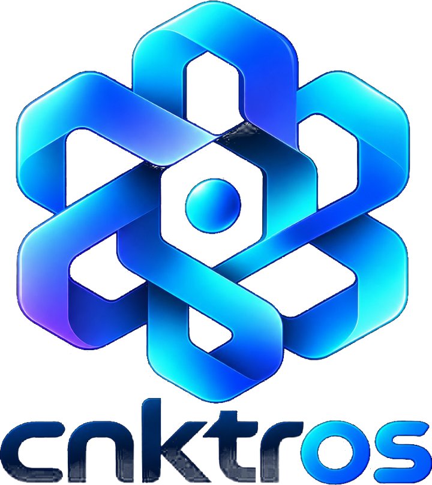
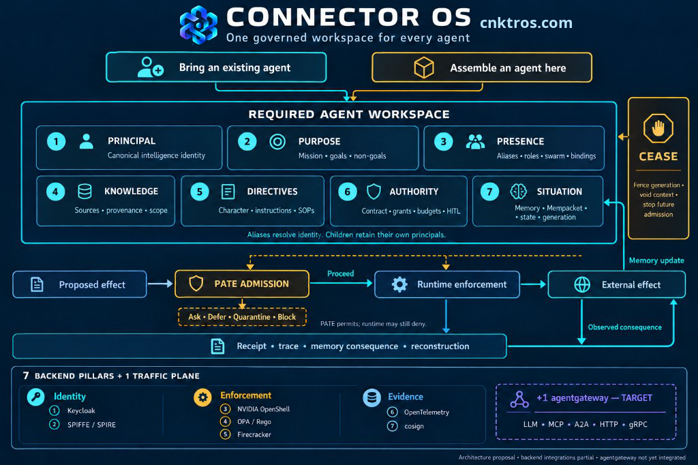

<p align="center">
  <a href="https://cnktros.com"></a>
</p>

<h1 align="center">Connector</h1>

<p align="center">
  <strong>Govern an agent before its intention becomes a consequence.</strong><br>
  <a href="https://cnktros.com">cnktros.com</a>
</p>

<p align="center">
  
</p>

## Start

The code is this repository: [github.com/GlobalSushrut/connector-oss](https://github.com/GlobalSushrut/connector-oss).

```bash
git clone https://github.com/GlobalSushrut/connector-oss.git
cd connector-oss
./up.sh
```

Open <http://127.0.0.1:9091/>. On that screen choose **Open on this machine**. That is the local dev-token, and it stays on your computer. A portal API key is for a hosted node, not this one.

On **Run**, open **Demo**. On **Bring your agent**, connect something you already use. When PATE says **Ask**, decide that digest on **Fix**. **Watch** shows the evidence.

Needs Linux, Rust, Docker, Node.js, and [Trunk](https://trunkrs.dev/) (`rustup target add wasm32-unknown-unknown`). A smaller library server, without the operator UI: [docs/quickstart.md](docs/quickstart.md).

**Here:** workspace, PATE, receipts, Cease. **Partial:** Keycloak, SPIRE, OpenShell, OPA, Firecracker, OpenTelemetry, cosign. **Target:** agentgateway and production coverage. `./up.sh` does not download Firecracker or OpenShell. This is not a claim of secure, correct, safe, compliant, or production-ready.

Libraries under `oss/` are [Apache License 2.0](LICENSE). The node under `platform/` is [Business Source License 1.1](../platform/LICENSE). Report exploitable findings privately through [SECURITY.md](SECURITY.md).
