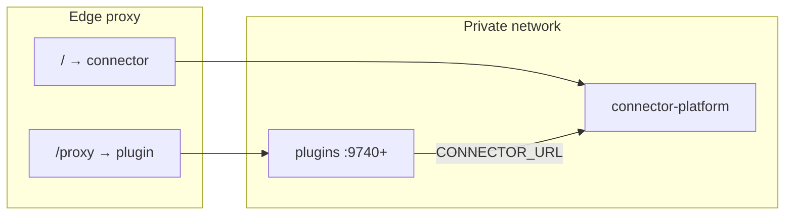

# Connector cage node, plugins, and operator experience

This document describes **today’s wiring** between `connector-platform` and first-party **plugins**, defines **cage** topology (kernel + satellites + `/proxy` ingress), and lays out operator UX: **twelve modes** (presets) as the **normal** path — **no YAML required** — plus an **optional** **`connector.yaml`** for custom / team / GitOps layouts. Industry patterns from **Vercel**, **Neon**, **Supabase**, and **Railway** inform the design.

---

## How you configure (two tiers)

| Tier | Who | What you do | YAML? |
|------|-----|-------------|--------|
| **Normal (default)** | Almost everyone | **Pick one of the [12 modes](#part-c--twelve-operator-presets-12-modes)** (`local`, `production`, `preview`, …). Set **`CONNECTOR_PRESET`** (implemented) or the **small env bundle** for that row (**`CONNECTOR_ENV`**, **`CONNECTOR_DEV_MODE`**, **`CONNECTOR_AIRGAP`**, …). Optional **`.env.local`** for secrets only. | **Not needed** |
| **Custom (advanced)** | Power users, SRE, GitOps | Same mode **or** overrides: ports, storage URIs, plugin matrix, proxy templates, multi-env reproducibility. | **`connector.yaml`** *(proposal — §D)* |

**Rule:** If you are not doing something special (non-default ports, extra plugins in one file, policy-as-code), **stop at choosing a mode** — that is the product default.

### Shipped today (this repository)

| Mechanism | How to use |
|-----------|------------|
| **`CONNECTOR_PRESET`** | Set to one of the **12 mode ids** before starting `connector-platform`. Only **unset** environment variables are filled (your exports always win). Implemented in `platform/server/src/connector_profile.rs`, invoked at boot **before** `PlatformConfig::from_env()`. |
| **Optional YAML** | Copy [`connector.yaml.example`](../../connector.yaml.example) → `connector.yaml` **or** set **`CONNECTOR_CONFIG_FILE`**. Search order: that env → `./connector.yaml` → `./.connector/connector.yaml`. **512 KiB max**; invalid `runtime_mode` values are rejected. |
| **Enterprise** | **`CONNECTOR_CONFIG_STRICT=1`**, **`CONNECTOR_ENFORCE_PRODUCTION_PRESETS=1`** — see [Enterprise / production packaging](#enterprise--production-packaging). |
| **One-command local (Makefile)** | From repo root: **`make run-local`** — runs `connector-platform` with **`CONNECTOR_PRESET=local`**, **`CONNECTOR_LLM_STUB=1`**, and **`CONNECTOR_PORT`** (default **9091**). No interactive key prompt. |

**Examples:**

```bash
# Fastest path — preset only (no YAML)
CONNECTOR_PRESET=local cargo run --manifest-path platform/server/Cargo.toml --bin connector-platform

# CI-style stub + no phone-home (when unset)
CONNECTOR_PRESET=ci cargo run --manifest-path platform/server/Cargo.toml --bin connector-platform

# Makefile (non-interactive)
make run-local
```

---

## Enterprise / production packaging

This path is for **SOC2-, ISO-, and regulated-style** deployments: **fail-closed** config, **no silent misconfiguration**, and **audit-friendly** boot behavior.

### Hardening flags (implemented)

| Variable | When to set | Behavior |
|----------|-------------|----------|
| **`CONNECTOR_CONFIG_STRICT=1`** | Staging / production config review | Boot **fails** if **`connector.yaml`** is invalid YAML, or **`CONNECTOR_PRESET`** is **unknown**. Removes “warn and continue” for typos. |
| **`CONNECTOR_ENFORCE_PRODUCTION_PRESETS=1`** | Production cells | If **`CONNECTOR_ENV`** is **`production`** / **`prod`**, boot **fails** when **`CONNECTOR_PRESET`** is a **dev-oriented** id (`local`, `ci`, `docker-local`, `plugin-workbench`, `local-live-llm`, …). Use **`production`**, **`staging`**, **`airgap`**, **`defense-strict`**, **`edge-satellite`**, **`preview`**, or **`multi-tenant`** as appropriate. |
| **`CONNECTOR_CONFIG_FILE`** | Immutable infra | Pin the config path (container image, systemd `EnvironmentFile`, K8s ConfigMap mount). |

### `connector.yaml` guardrails

| Rule | Detail |
|------|--------|
| **Size cap** | Files larger than **512 KiB** are **rejected** at boot (DoS / accident guard). |
| **`runtime_mode` whitelist** | Only **`development`**, **`dev`**, **`production`**, **`prod`**, **`pilots`**, **`pilot`** are accepted from YAML; other values **fail** parsing. |
| **Secrets** | Do **not** put API keys or JWT material in YAML in git. Use **Vault**, **cloud secret stores**, or **env** injected by the orchestrator. |
| **Observability** | Boot logs **`CONNECTOR: applied connector.yaml`** and **`CONNECTOR_PRESET applied`** with **no secret values** (safe for log aggregators). |

### Recommended production combo

```bash
export CONNECTOR_PRESET=production
export CONNECTOR_ENV=production
export CONNECTOR_CONFIG_STRICT=1
export CONNECTOR_ENFORCE_PRODUCTION_PRESETS=1
export CONNECTOR_DEFENSE_STRICT=1   # optional; also set by preset edge-satellite / defense-strict
# Plus: CONNECTOR_JWT_SECRET, API keys, CONNECTOR_PUBLIC_URL, TLS at ingress — see main platform env docs
```

### Audit / compliance posture (documentation)

- **Preset + env** provide a **reproducible** blast radius: reviewers know which flags a mode implies.
- **Strict + enforce** turn **configuration drift** into **immediate exit**, not runtime surprises.
- Pair with existing controls: **`CONNECTOR_AIRGAP`**, **`CONNECTOR_MULTI_TENANT`**, license / phone-home policy, and **`CONNECTOR_DEFENSE_STRICT`** per your security standard.

### Cage infra & ledger (kernel-first strategy)

For **where** cage + append-only / command-only behavior anchor first, how **TraceTramp** vs **WitnessCtl** vs **DevGuard** differ, and how **future custom plugins** stay inside the cage: **[`arch/CONNECTOR_KERNEL_CAGE_AND_LEDGER.md`](./arch/CONNECTOR_KERNEL_CAGE_AND_LEDGER.md)**.

---

## Part 0 — The experience: “start a plugin, the OS is already there”

### 0.1 Product promise (where we are headed)

| Goal | What it means for the user |
|------|----------------------------|
| **Connector starts by default** | Whether you run **any of the nine first-party plugins** or a **future** plugin, **the cage kernel (`connector-platform`) is brought up first** (or alongside via orchestration). You should not need a separate mental model for “step 1 kernel, step 2 plugin” except in advanced debugging. |
| **Default config is enough** | **Normal path:** pick **one of 12 modes** — no `connector.yaml`. Env defaults + optional **`.env.local`** for keys. **`connector.yaml`** is **only** for **custom** layouts (ports, many plugins, GitOps); it must never be required for first run. |
| **Supreme easy setup** | Target: **one command** (e.g. `connector up relay` or `docker compose --profile relay up`) that ensures **kernel health** before the plugin process accepts traffic — same idea as **Docker Compose `depends_on` + `service_healthy`** ([Docker startup order](https://docs.docker.com/compose/how-tos/startup-order/)). Today, repo **`make demo`** starts the kernel; plugin boot is the next layer to unify under that pattern. |
| **Proxy any API** | Users point **their** client — OpenAI SDK, Anthropic SDK, LangChain/LangGraph, CrewAI, n8n, custom HTTP agents, internal microservices — at **one URL**. The cage exposes **OpenAI- and Anthropic-compatible** surfaces on **`/v1/*`**; plugins (e.g. **Relay**) can **forward** invocations through the kernel so **audit, budget, admission, memory, identity, and multi-agent workflows** stay on **our** side while **their** logic stays in **their** HTTP handlers or existing infra. |

### 0.2 Nine first-party plugins + future plugins

These crates live under **`plugins/`** today:

| # | Plugin | Role (one line) |
|---|--------|-----------------|
| 1 | **relay** | Governed **function / invocation proxy** — point URLs at Relay; kernel adds LLM, memory, policy. |
| 2 | **engram** | Entropy / memory-adjacent **knowledge** service. |
| 3 | **agentpassport** | **DID / attestation** identity. |
| 4 | **ledgerlens** | **Cost / monitor** bridge to kernel dashboards. |
| 5 | **agentloop** | **Agent lifecycle** loop against kernel APIs. |
| 6 | **conductor** | **Multi-agent orchestration** (pipelines, HITL hooks). |
| 7 | **devguard** | **Governance** CLI/app on top of kernel (not always a long-running HTTP plugin). |
| 8 | **witnessctl** | **Audit / witness** session tooling. |
| 9 | **tracetramp** | **Trace / tool** execution gateway. |

**Future plugins** follow the same contract: declare **`depends_on: connector`** (or equivalent), read **`CONNECTOR_URL`** + **`CONNECTOR_API_KEY`**, expose **`/health`**, and optionally register behind **`/proxy/<name>`**. No change to the **golden path**: kernel first, then satellite.

### 0.3 What you bring vs what the cage handles

| You bring | Cage + plugins handle |
|-----------|------------------------|
| Your **HTTP API**, script, function, or existing **LLM app** | **Routing** via gateway **`/v1/*`** or plugin invoke paths |
| Your **provider keys** (or stub in dev) | **Admission**, **budget / metering**, **audit / action log** |
| Your **agentic workflow** (graphs, crews, tools) | **Memory kernel**, **MCP/A2A** protocol gateway, **multi-agent** orchestration where wired |
| Your **ingress** (optional) | **TLS**, path **`/proxy/...`**, **public URL** hints (`CONNECTOR_PUBLIC_URL`) |
| **Any** stack (K8s, VMs, serverless behind proxy) | **Same** HTTP contract — “user proxy any API” = **point base URL at us**; we normalize governance |

This is the same **mental model** as a **universal LLM / API gateway** (one entrypoint, many backends) — see e.g. community patterns like [LLM API gateway proxies](https://github.com/Mirrowel/LLM-API-Key-Proxy) — except the **Connector cage** also owns **agents, memory, compliance, and enterprise hooks**, not just chat completion.

### 0.4 Auto-start: recommended implementation (industry pattern)

**Do not** rely on each plugin binary silently `exec`’ing the kernel (duplicated logic, version skew). Prefer:

1. **`docker compose`** — `connector` service with **`healthcheck`**; each **`plugin`** service **`depends_on: connector: condition: service_healthy`** ([Compose docs](https://docs.docker.com/compose/how-tos/startup-order/)).
2. **`connector` CLI** *(planned)* — `connector up <plugin>` spawns kernel child process (or attaches to existing), waits for **`GET /health`**, then **`exec`**’s or starts plugin with **`CONNECTOR_URL`** injected.
3. **`make`** — e.g. `make plugin-relay` = `make demo` (if down) + export vars + `cargo run -p relay`.

**Status:** Compose / CLI unified entry is **documentation + roadmap** here; **`make demo`** already embodies “kernel up with sane defaults.”

---

## Part A — Industry patterns we align with (research summary)

| Platform | What operators expect | How we mirror it |
|----------|----------------------|------------------|
| **[Vercel](https://vercel.com/docs/deployments/environments)** | **Local / Preview / Production**; per-environment env; `vercel env pull` → `.env.local` | **Twelve modes** = our environment presets. **Default:** mode + **`.env.local`** for secrets — **no** YAML file required. |
| **[Vercel env](https://vercel.com/docs/environment-variables)** | Encrypted secrets in dashboard; build vs runtime scope | Document **secret env only in shell/CI/Vault**; YAML uses `env(VAR_NAME)` indirection (Supabase-style) for local overrides. |
| **[Neon + Vercel](https://neon.com/docs/guides/vercel-overview)** | **Branching**: preview DB per PR; isolated credentials | Conceptual **`preview`** preset: pilot keys, separate data dir or DB branch via `CONNECTOR_DATA_DIR` / storage URIs. |
| **[Neon branching](https://neon.com/blog/practical-guide-to-database-branching)** | Instant isolated DB per feature branch | Operators can point `CONNECTOR_ENGINE_STORAGE` / `CONNECTOR_KERNEL_STORAGE` at branch-specific SQLite/redb URIs for preview cells. |
| **[Supabase CLI](https://supabase.com/docs/guides/cli/config)** | **`config.toml`** as reproducible local stack; `env()` in config | **Optional** **`connector.yaml`** for teams who want that; **default** = mode only, like using Supabase with minimal flags before adopting full `config.toml`. |
| **[Supabase secrets](https://supabase.com/docs/guides/local-development/managing-config)** | Never commit `.env`; use `env(GITHUB_CLIENT_ID)` in toml | If you use YAML: **`connector.secrets.*` → environment variables only**. |
| **[Railway](https://docs.railway.com/builds/build-configuration)** | **`railway.toml`** for build/start; vars in dashboard | Custom deployments may use YAML + Compose; **normal** path = mode + dashboard/env vars. |

**Takeaway:** **Default:** **one of 12 modes** + env (and **`.env.local`** for secrets). **Optional:** **`connector.yaml`** when you need reproducible, versioned infra beyond the preset. Future **`connector` CLI** should apply a mode **without** requiring a file on disk.

---

## Part B — Mental model: advanced caged node

| Role | Responsibility |
|------|----------------|
| **Connector (cage kernel)** | Ring-0 kernel, `/api/v1/*` control plane, `/health`, `/v1/*` OpenAI-style **AI gateway**, optional **protocol gateway** (MCP/A2A, separate port), UI-RPC WebSocket. |
| **Plugin (cage satellite)** | Domain service (relay, conductor, passport, …). Talks to Connector **only over HTTP**. Own HTTP API for tools and callbacks. |
| **Edge / reverse proxy** | TLS + routing: e.g. `https://api.example.com/proxy/<plugin>/...` → plugin; `/` → Connector UI + API. |



**Cage** = Connector is the **trust anchor**; plugins are **not** in-process; governance-sensitive work goes through Connector or `/v1`.

---

## Part C — Twelve operator presets (“12 modes”)

**This is the primary configuration surface.** Pick **one** row; apply its env flags (or future **`CONNECTOR_PRESET=<id>`**). **Do not** create **`connector.yaml`** unless you need **Part D (custom)**.

These **product-level profiles** compose **environment variables** only for the normal path. They map to the three **runtime modes** in code (`RuntimeMode`: `dev` | `pilots` | `production` — see `platform/server/src/services/runtime_control.rs`).

| # | Preset | Typical stage | `RuntimeMode` / notes | Purpose |
|---|--------|---------------|------------------------|---------|
| 1 | **`local`** | Laptop | `dev` | Fastest start: `make demo` from repo root; optional LLM stub (`CONNECTOR_LLM_STUB=1`). |
| 2 | **`local-live-llm`** | Laptop | `dev` | Real provider keys; same as local but requires `CONNECTOR_LLM_API_KEY` (or provider-specific env). |
| 3 | **`docker-local`** | Container | `dev` | Compose/K8s manifest binds **9735** (target) / **9091** (today); volumes for `./data`. |
| 4 | **`ci`** | GitHub Actions / CI | `dev` | Stub LLM, `CONNECTOR_AIRGAP` or unlicensed path; no interactive prompts; health + unit tests. |
| 5 | **`preview`** | PR / feature env | `pilots` | **Vercel “Preview”** analogue: `cpk_pilot_*` keys, isolated storage URI per branch. |
| 6 | **`staging`** | Pre-prod | `pilots` or `production` | Parity with prod topology; pilot or strict keys per policy. |
| 7 | **`production`** | Prod | `production` | JWT + `cpk_live_*`; license / phone-home per org policy. |
| 8 | **`airgap`** | Regulated prod | `production` | `CONNECTOR_AIRGAP=true` — no outbound phone-home (see `main.rs` boot). |
| 9 | **`defense-strict`** | High-trust prod | `production` | `CONNECTOR_DEFENSE_STRICT` — dev auth bypass off (see router / env docs). |
| 10 | **`multi-tenant`** | SaaS | any | `CONNECTOR_MULTI_TENANT` — tenant headers / keys required on mutating paths (see middleware). |
| 11 | **`plugin-workbench`** | Plugin author | `dev` | Connector + **one** plugin (e.g. **9740**); `CONNECTOR_URL` points at cage kernel. |
| 12 | **`edge-satellite`** | Prod + plugins | `production` | Cage on private IP; public only via proxy; **`/proxy/<name>`** to plugins; **`CONNECTOR_PUBLIC_URL`** set. |

**Choosing a preset:** Set **`CONNECTOR_PRESET=<id>`** (implemented). Values: **`local`**, **`local-live-llm`**, **`docker-local`**, **`ci`**, **`preview`**, **`staging`**, **`production`**, **`airgap`**, **`defense-strict`**, **`multi-tenant`**, **`plugin-workbench`**, **`edge-satellite`**. Aliases: **`dev`**, **`development`** → `local`; underscores accepted (e.g. `defense_strict`). You can still set **`CONNECTOR_ENV`** / flags manually instead; preset only fills **missing** vars.

---

## Part D — Custom config: `connector.yaml` *(optional)*

**Use this only when** you need versioned, repeatable infra beyond a single mode: custom ports, many plugins in one definition, proxy snippets, or GitOps. **Normal operators skip Part D entirely.**

**Status:** *Proposed schema* — not all fields are loaded by the binary yet. Serves as the **contract** for `connector init --full`, codegen, and advanced `make` targets.

**Location (if you adopt it):** repo root `connector.yaml` or `.connector/connector.yaml` (optional gitignored `.connector/local.override.yaml`).

### D.1 Example file

```yaml
# connector.yaml — Connector cage + plugin mesh (config as code)
version: 1

preset: local   # one of the 12 presets in Part C

connector:
  host: "0.0.0.0"
  port: 9735                    # target convention; today default in code is 9091
  public_url: "http://localhost:9735"
  gateway_uri: "http://127.0.0.1:9735"   # OpenAI SDK base → {gateway_uri}/v1
  protocol_port: 9736           # MCP/A2A dedicated listener; 0 = same as main (future)
  ui_rpc_port: 9737
  data_dir: "./data"
  engine_storage: 'sqlite:./data/engine.db'      # or env("CONNECTOR_ENGINE_STORAGE")
  kernel_storage: 'redb:./data/kernel.redb'
  runtime_mode: development     # dev | pilots | production (maps to RuntimeMode)

secrets:
  # Never put real secrets in YAML in git — use env indirection:
  api_key: env("CONNECTOR_API_KEY")
  jwt_secret: env("CONNECTOR_JWT_SECRET")
  llm_api_key: env("CONNECTOR_LLM_API_KEY")

plugins:
  - name: relay
    enabled: true
    port: 9740
    public_path: /proxy/relay
    env:
      DATABASE_URL: env("RELAY_DATABASE_URL")
      CONNECTOR_URL: "http://127.0.0.1:9735"
      CONNECTOR_API_KEY: env("CONNECTOR_API_KEY")

proxy:
  # For nginx/traefik/Caddy templates — operator fills hostnames
  connector_upstream: "127.0.0.1:9735"
  plugin_routes:
    - path_prefix: /proxy/relay
      upstream: "127.0.0.1:9740"
```

### D.2 Rules (Supabase-style, advanced only)

1. **Commit** `connector.yaml` with **non-secret** defaults and structure (teams / GitOps).
2. **Do not commit** real API keys; use **`env("VAR")`** placeholders.
3. **Per-developer** secrets stay in **`.env.local`** (gitignored); **12-mode** users may use **only** `.env.local` + env, **no** YAML.
4. **Preview branches:** optional duplicate file with different `connector.data_dir` or storage URIs (Neon-style isolation).

### D.3 Mapping YAML → current env vars

| YAML path | Environment variable(s) |
|-----------|-------------------------|
| `connector.host` | `CONNECTOR_HOST` |
| `connector.port` | `CONNECTOR_PORT` |
| `connector.public_url` | `CONNECTOR_PUBLIC_URL` |
| `connector.protocol_port` | `CONNECTOR_PROTOCOL_PORT` |
| `connector.ui_rpc_port` | `CONNECTOR_UI_RPC_PORT` |
| `connector.data_dir` | `CONNECTOR_DATA_DIR` |
| `connector.engine_storage` | `CONNECTOR_ENGINE_STORAGE` |
| `connector.kernel_storage` | `CONNECTOR_KERNEL_STORAGE` |
| `connector.runtime_mode` | `CONNECTOR_ENV` / store-backed mode |
| `plugins[].port` | `PORT` (per plugin process) |
| `plugins[].env.CONNECTOR_URL` | `CONNECTOR_URL` / `CONNECTOR_BASE_URL` |

### D.4 Docker Compose sketch — kernel always before plugin *(recommended)*

This pattern matches **production-grade** dependency ordering: the plugin container **waits** until Connector passes **`/health`**.

```yaml
# docker-compose.cage.yml (illustrative — adapt image/build to your registry)
services:
  connector:
    build: { context: ., dockerfile: Dockerfile.connector }   # connector-platform
    ports: ["9735:9735", "9736:9736", "9737:9737"]
    environment:
      CONNECTOR_ENV: development
      CONNECTOR_DEV_MODE: "1"
      CONNECTOR_PORT: "9735"
    healthcheck:
      test: ["CMD", "curl", "-fsS", "http://127.0.0.1:9735/health"]
      interval: 5s
      retries: 12
      start_period: 40s

  relay:
    build: { context: ./plugins/relay, dockerfile: Dockerfile }
    ports: ["9740:9740"]
    environment:
      PORT: "9740"
      CONNECTOR_URL: "http://connector:9735"
      CONNECTOR_API_KEY: "${CONNECTOR_API_KEY:-dev-token}"
      DATABASE_URL: "${RELAY_DATABASE_URL}"
    depends_on:
      connector:
        condition: service_healthy
```

Any **future** plugin swaps the **`relay`** service block; **`connector`** stays the **single** kernel dependency.

---

## Part E — Golden paths: default-first, then customize

### E.1 Path A — “I want zero YAML” (most devs)

1. Run **`make demo`** from repo root → **`connector-platform`** with **defaults** (`Makefile`: port **9091**, dev token, optional LLM stub).
2. In another shell, export **`CONNECTOR_URL=http://localhost:9091`**, **`CONNECTOR_API_KEY=dev-token`**, **`PORT=9740`**, start your plugin binary.
3. Point your **OpenAI-compatible** app at **`http://localhost:9091/v1`** (not `/api/v1`).  
   **No `connector.yaml` required** for this path.

### E.2 Path B — “I want one stack command” (target parity with Vercel/Neon local)

1. Add or use **`docker-compose.cage.yml`** as in **§D.4** (kernel **healthy** before plugin).
2. **`docker compose -f docker-compose.cage.yml up relay`** — Connector comes up **automatically**; Relay starts only after health passes.

### E.3 Path C — “I want custom infra as code” *(optional)*

1. **`connector init --full`** *(planned)* → **`connector.yaml`** + **`.env.example`**.
2. **`.env.local`** for secrets; **`connector up relay`** *(planned)* or Compose reads the same env.  
   **Most users stay on Path A or B + a [12-mode](#part-c--twelve-operator-presets-12-modes) choice** and never create this file.

### E.4 After boot — health and LLM base URL

- **Kernel:** `curl $CONNECTOR_URL/health`
- **Plugin:** `curl http://127.0.0.1:$PLUGIN_PORT/health` (if exposed)
- **User / agent clients:** `base_url = $CONNECTOR_GATEWAY_URI/v1` for OpenAI-style calls; REST control plane remains **`/api/v1`**.

---

## Part F — Current state in this repository (technical)

### F.1 `connector-platform` (`platform/server`)

| Surface | Path / port | Env |
|--------|-------------|-----|
| Main HTTP | `CONNECTOR_HOST`:`CONNECTOR_PORT` (default **`0.0.0.0:9091`**) | `CONNECTOR_PORT`, `CONNECTOR_HOST` |
| REST | `/api/v1/*` | — |
| Health | `/health` | — |
| LLM gateway | **`/v1/chat/completions`**, `/v1/models`, **`/v1/messages`** | Same listener — base URL is **server root** |
| Protocol gateway | default **9092** | `CONNECTOR_PROTOCOL_PORT` |
| UI-RPC | default **9093** | `CONNECTOR_UI_RPC_PORT` |

Many tests still use **9090** as example URL; **Makefile** uses **9091** — prefer **9091** until a coordinated move to **9735**.

### F.2 First-party plugins (`plugins/*`)

| Crate | Plugin port env | Default port | Connector env | Default base (code) |
|-------|-----------------|-------------|---------------|---------------------|
| relay | `PORT` | 8087 | `CONNECTOR_BASE_URL` | `http://localhost:8080` |
| engram | `PORT` | **9092** ⚠️ | `CONNECTOR_BASE_URL` | `http://localhost:8080` |
| agentpassport | `PORT` | (see crate) | `CONNECTOR_URL` | `http://localhost:8080` |
| ledgerlens | `PORT` | 8085 | `CONNECTOR_URL` | `http://localhost:9091` |
| agentloop | `PORT` | 8084 | `CONNECTOR_URL` | `http://localhost:9091` |
| conductor | `PORT` | 8083 | `CONNECTOR_URL` | `http://localhost:9091` |
| devguard | CLI | — | `CONNECTOR_URL` | `http://localhost:9091` |
| witnessctl | `WITNESSCTL_PORT` | (see crate) | `CONNECTOR_BASE_URL` | `http://localhost:9091` |
| tracetramp | (see crate) | — | config | `http://localhost:9091` |

⚠️ Engram **9092** conflicts with Connector **protocol** port **9092** on one host.

Relay uses **root** paths (`/health`, `/auth/verify`, …) — validate against `connector-platform` or front with a path-mapping proxy.

### F.3 Python client

`platform/integrations/rest_client.py` defaults to `http://localhost:9090/api/v1` — align with your chosen cage port and `/api/v1` suffix.

---

## Part G — Target ports & export block (recommended convention)

| Service | Port | Notes |
|---------|------|--------|
| Connector cage | **9735** | Policy target; change with `CONNECTOR_PORT` |
| First plugin | **9740** | Then 9741, 9742, … |
| Protocol / UI-RPC | **9736 / 9737** | If kept separate from main |

```bash
export CONNECTOR_HOST=127.0.0.1
export CONNECTOR_PORT=9735
export CONNECTOR_PUBLIC_URL="https://api.example.com"
export CONNECTOR_GATEWAY_URI="http://${CONNECTOR_HOST}:${CONNECTOR_PORT}"
export CONNECTOR_URL="${CONNECTOR_GATEWAY_URI}"
export CONNECTOR_BASE_URL="${CONNECTOR_URL}"
export CONNECTOR_API_KEY="cpk_live_..."  # or dev-token in preset local

export PLUGIN_PORT=9740
export PORT="${PLUGIN_PORT}"   # many plugins read PORT
```

**`/proxy` ingress:** `https://api.example.com/proxy/<plugin>/...` → `http://127.0.0.1:9740/...`.

---

## Part H — New plugin checklist (including future plugins)

1. HTTP server on `PORT` (target **9740+** per-plugin offset).
2. Read **`CONNECTOR_URL`** + **`CONNECTOR_API_KEY`**; accept **`CONNECTOR_BASE_URL`** during migration.
3. Expose **`/health`**; document whether you call **`/api/v1/...`** or legacy root paths (Relay-style).
4. In Compose/K8s: **`depends_on` kernel with `condition: service_healthy`** (or init container / wait-for) so **Connector always starts first**.
5. **`connector.yaml`** `plugins[]` — **optional**; use for GitOps or multi-plugin docs. **Normal:** mode + env only.

---

## Part I — Related docs

- **Production:** registration, API keys, activation, plugin choice, reverse proxy: [`private/docs/PRODUCTION_SETUP_AND_PROXY.md`](../../private/docs/PRODUCTION_SETUP_AND_PROXY.md)
- Relay plan & portfolio: [`docs/94-relay-plan.md`](../../docs/94-relay-plan.md)
- Backlog: [`BUG_FIX_2.md`](./BUG_FIX_2.md)

---

## Part J — Summary

| Topic | State |
|-------|--------|
| **Plugin-first UX** | **Target:** starting **any** of the **nine** plugins (or a future plugin) **always** brings up **Connector first** via Compose **`depends_on` + healthcheck**, a future **`connector up`**, or **`make`** wrapper — not two unrelated processes. |
| **Default config** | **12 modes only** — **no YAML**. **`make demo`** / env bundle + optional **`.env.local`** for secrets. |
| **Proxy any API** | Users aim clients at **`/v1`** (LLM) and/or **plugin** HTTP; cage handles **governance, memory, protocols, cost**, not just passthrough. |
| **Runtime modes in code** | Three: **dev / pilots / production** (`RuntimeMode`). |
| **Twelve presets** | Product-level **compositions** (local, CI, preview, prod, …) on top of those three modes. |
| **Enterprise** | **`CONNECTOR_CONFIG_STRICT`**, **`CONNECTOR_ENFORCE_PRODUCTION_PRESETS`**, YAML size cap, **`runtime_mode`** whitelist; fail-closed boot for regulated deployments. |
| **Industry DX** | **Vercel** env layers, **Neon** branching, **Supabase** config + **`env()`**, **Railway** service files; **Docker Compose** startup order for auto-start. |
| **Config file** | **`connector.yaml`** = **optional** (custom / teams / GitOps). **`.env.local`** for secrets in any tier. |
| **Commands** | **`make run-local`** (preset **local** + stub LLM); **`CONNECTOR_PRESET=…`** with `cargo run`; **`make demo`** interactive; Compose in **§D.4**; **`connector up <plugin>`** still planned. |
| **Ports** | Today **9091** / scattered plugin ports; target **9735 / 9740** + **§G** export block. |
