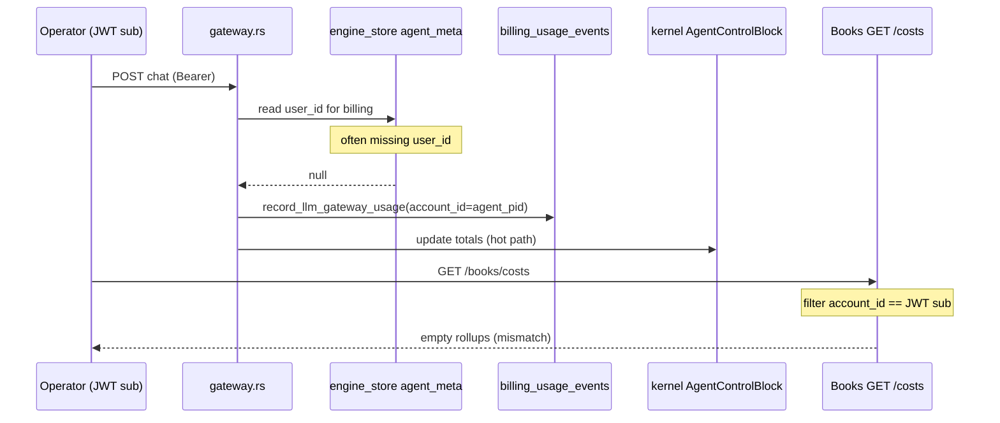

# AGOS control-plane UI — real data, cost truth, and sellable beta standard

This document is the **single remediation map** for the Leptos dashboard (`platform/ui-leptos/dashboard`) and its contract with `platform/server`. It is written for a **mid-market and above** product posture: no decorative mocks passed off as product, no duplicate “truths” without explanation, and a clear path to a **solid, industry-credible** operator shell.

**Audience:** engineers implementing fixes, solutions architects validating “is this real?”, and PMs scoping beta honesty.

---

## Table of contents

1. [Design philosophy (WordPress-shaped)](#design-philosophy-wordpress-shaped-not-wordpress-limited)  
2. [Deep dive — three ledgers and one broken identity join](#deep-dive--three-ledgers-and-one-broken-identity-join)  
3. [End-to-end sequence — who writes what](#end-to-end-sequence--who-writes-what)  
4. [Ten bug / debt categories (expanded)](#ten-bug--debt-categories-expanded)  
5. [Verification matrix (curl / acceptance)](#verification-matrix-curl--acceptance)  
6. [Prioritized fix order (P0–P3)](#prioritized-fix-order-p0p3)  
7. [Concrete bug register](#concrete-bug-register)  
8. [Definition of done](#definition-of-done--mid-above-control-beta)  
9. [Appendix — code anchors](#appendix--key-code-anchors)

---

## Design philosophy (WordPress-shaped, not WordPress-limited)

Treat the platform like a **core + extensions** system:

| WordPress idea | AGOS / Connector mapping |
|----------------|---------------------------|
| **Core** | `platform/server` canonical JSON APIs under `/api/v1/*`, auth, and durable stores (`engine_store`, kernel, billing folders). |
| **Plugins** | TraceTramp, WitnessCtl, DevGuard, etc. Each must expose a **small, versioned management API** and the UI either proxies through the platform or calls the plugin with explicit env + failure UI. |
| **Theme / presentation** | Surfaces (`/api/v1/surfaces/...`) and page layout. Surfaces are **summaries**, not a second database. If a surface field disagrees with the ledger, the ledger wins unless the surface is explicitly labeled as a projection. |
| **Hooks** | Gateway completion → **one** billing write path; DevGuard hooks → session stats **plus** must not bypass Books if finance views must reconcile. |

**Rule for “sellable beta”:** Any screen that shows numbers must declare **provenance** (which endpoint, which store, which tenant scope) or show **empty + why** (auth, missing integration, no data yet)—not invented sample rows.

---

## Deep dive — three ledgers and one broken identity join

### Three different “cost” stores (not interchangeable)

| Store | Where | Scoped by | What it means |
|-------|--------|-----------|----------------|
| **A — Kernel agent blocks** | In-memory `kernel.agents()[pid].total_cost_usd`, `total_tokens_consumed` | Process lifetime / all agents in that node | Runtime accounting updated on the dispatch hot path; **lost on restart** unless rebuilt from elsewhere. |
| **B — `billing_usage_events`** | `engine_store` folder namespace `billing_usage_events` | Event JSON field **`account_id`** (string) | Intended durable, **per-tenant billable** ledger; Books `GET /books/costs` and cost position rollups read **only** this. |
| **C — `agent_cost_ledger`** | `engine_store` per `agent_pid` | Agent id | Per-agent append-only call list written by **`gateway.rs`** after LLM completion; good for **agent drill-down**, not the same query shape as B. |

**`GET /api/v1/monitor/cost-dashboard`** reads **A only**. **Mitigated (code):** non–SuperAdmin responses are **tenant-filtered** by `agent_meta` billing tenant vs JWT **`claims.sub`**; JSON includes **`scope`**, **`tenant_sub`**, **`node_agent_count`**, **`cost_basis`**, and a **`note`** on the node-wide LLM counter. **Mitigated (UI):** `overview.rs` labels **kernel (A)** vs **Books `GET /books/costs` (B)** side by side with provenance copy (P0).

**Books** (authenticated) reads **B** filtered by **`verify_token` → `claims.sub`**.

**UI today:** Overview loads **A and B** together with explicit provenance; Books page remains the drill-down. Operators can still see **kernel non-zero** and **Books zero** if billing identity on events is wrong — see REG-001/002 mitigations on the write path.

### Root cause — `account_id` on events ≠ Books filter key in the default agent path

**Books filtering** (`books.rs`): each event must satisfy `billing_event_matches_account(v, account_id, allow_untagged)` where `account_id` is **`caller.0` = JWT `claims.sub`** (unless `CONNECTOR_DEV_MODE`, which forces caller `"dev"` for auth bypass—not the same as fixing production).

**Gateway billing** (`gateway.rs`): `account_id_for_billing` is resolved as:

```text
agent_meta[agent_pid].user_id  (string)
  OR if missing: agent_pid (string)
```

**Agent registration** (`agents.rs`, `register_agent` / metadata write): persists `created_by: user_id` in `agent_meta` but **does not set `user_id`** in that JSON document.

Therefore:

1. **`user_id` is absent** on typical `agent_meta` rows.  
2. Gateway falls back to **`account_id = agent_pid`** (e.g. `agent_a1b2c3…`) on **`billing_usage_events`**.  
3. Books filters events where **`account_id == claims.sub`** (e.g. `auth0|…`, email, internal UUID).  
4. **No row matches** → Costs tab and cost position show **zeros** even under heavy LLM use.

**Tools path is worse:** `tools.rs` uses the same `user_id` lookup but **`unwrap_or_default()`** — empty `account_id`. Then **`record_tool_call`** returns immediately when `account_id.is_empty()` → **no tool billing events at all** for typical agents.

This is deeper than “missing Stripe”; it is a **schema / join bug between auth identity and billing identity**.

### Stub and router paths (expected zeros vs bugs)

- **`CONNECTOR_LLM_STUB`**: gateway records tokens with **`cost_usd_estimated = 0`** by design (`gateway.rs` stub branch). UI should label **stub** runs, not present them as production spend.  
- **No `llm_router`**: pricing falls back to **`no_router_heuristic`** with **0 USD** — again, not “Books broken”, but **misleading** if the UI implies invoice-grade USD.

### `GET /books` System Position — additional honesty gaps

`get_system_position` (`books.rs`) mixes **real** kernel counts (agents, sessions, packet count) with:

- **`IntegrityPosition`**: `trust_score: 92`, `trust_grade: 'A'`, `reconciliation_status: "RECONCILED"` — **hardcoded literals**, not derived from proof or witness pipelines.  
- **`PendingObligations`**: all **zeros** — not wired to HITL queues / tool pending tables.  
- **`ResourcesHeld.active_memory_bytes`**: **0** with an inline **TODO** (no byte sum).

The Books **UI** faithfully renders these fields — so the **Position** tab can look “healthy and reconciled” **by decoration**, while cost and obligations are elsewhere wrong or empty. That is a **credibility** issue for auditors.

---

## End-to-end sequence — who writes what



**Target-state sequence (conceptual):** one canonical **`billing_tenant_id`** (always = `claims.sub` or org id) written into `agent_meta` at agent creation and **re-read** by gateway/tools; migration backfills `user_id` from `created_by` where missing; optional secondary index by `agent_pid` for support queries.

---

## Ten bug / debt categories (expanded)

### 1. Single source of truth — cost and tokens

**Symptoms:** Overview “total cost” ≠ Books “ledger total”; per-agent numbers disagree between Agents page and Books breakdown.

**Mechanisms:**

- **A vs B:** different subsystems, different lifetimes, different scoping (global kernel vs JWT-scoped ledger).  
- **B vs C:** same completion writes both, but Books UI does not surface **C**; support may grep `agent_cost_ledger` and see calls while Books Costs shows nothing (identity filter).

**Remediation (ranked):**

1. **Normalize identity** (see Deep dive) so **B** always uses the same string the Books filter uses.  


2. Either **scope `cost-dashboard` to the caller’s agents** (join `agent_meta.created_by` / `user_id` to `claims.sub`) or **label it** “Node kernel (all agents on this process)” and never place it next to “Your spend” on the same row.  
3. Long term: **derive** cost-dashboard totals from **B** with optional “since process start” kernel delta for live feel.

**Files:** `platform/server/src/services/monitor.rs` (`cost_dashboard`), `platform/server/src/services/books.rs`, `platform/server/src/services/gateway.rs`, `platform/server/src/services/agents.rs`.

---

### 2. Billing events incomplete, zero-USD, or dropped

**Sub-issues:**

| Issue | Effect |
|-------|--------|
| `user_id` missing on `agent_meta` | LLM events tagged with **`agent_pid`**; tools events **not written** (`account_id` empty). |
| `record_llm_gateway_usage` early return | Only when `account_id.is_empty()` OR `total==0` — rare for LLM if fallback to pid exists. |
| Tool JSON lacks `cost_usd_estimated` | `billing_event_cost_usd` reads that field → **$0** in Books for tools even when tokens > 0. |
| DevGuard `record_llm_call` | Session + audit only — **no B row**. |

**Remediation:** align `agent_meta` schema; add `cost_usd_estimated` (or explicit zero with basis) on tool events; decide whether DevGuard-sourced LLM calls are billable and call the same `record_llm_gateway_usage` with resolved model + pricing.

---

### 3. UI connected to API vs “chrome only”

**WitnessCtl** (`witnessctl_dashboard.rs`): **live** when `CONNECTOR_WITNESSCTL_MANAGEMENT_URL` + **`CONNECTOR_WITNESSCTL_ADMIN_TOKEN`** are set — dashboard calls **`GET /api/v1/plugins/witnessctl/*`** (server-side proxy). Left folder tree remains a **static layout metaphor** (labeled).

**DevGuard:** **Sessions** tab + footer read **`GET /api/v1/plugins/devguard/extension/status`** via proxy when **`CONNECTOR_DEVGUARD_MANAGEMENT_URL`** points at **`devguard status-api`**. Guardrails / network panes remain **reference patterns** (not repo-parsed).

**TraceTramp:** reference implementation — proxy + flash errors + real admin shapes.

**Product policy:** do **not** ship silent “demo grids” as tenant evidence. There is **no** `CONNECTOR_UI_DEMO_MODE` switch in code — use **proxied JSON** or **explicit empty/error** copy only.

---

### 4. Surfaces vs imperative APIs

Surfaces aggregate multiple concerns. If **`/surfaces/overview/system`** fails partially, imperative cards still render — good — but **numeric inconsistency** remains if surface bundle embeds stale cost summaries.

**Remediation:** surface generator should either **omit** cost numbers or inject **server-computed** same-query results as Books (`billing_ledger_totals` helper already exists server-side for reuse).

**Files:** `platform/ui-leptos/dashboard/src/pages/overview.rs`, `surface_client.rs`, server surface builders under `platform/server/src/services/surface_*`.

---

### 5. Authentication, tenancy, and empty states

**Production:** untagged legacy rows excluded unless `CONNECTOR_DEV_MODE`.

**Operator UX:** empty Books should run a **diagnostic panel**: JWT `sub`, sample event `account_id` keys seen in store (admin-only), and hint to fix **`agent_meta.user_id`**.

**Security note:** do not leak other tenants’ ids in non-admin responses; aggregate counts only.

---

### 6. Information architecture — “AGOS window” coherence

Reduce **surface area** until wired: group routes into **Operate / Finance / Compliance / Extensions / Labs**; hide Labs behind entitlement or env.

**Files:** `platform/ui-leptos/dashboard/src/pages/mod.rs`, `layout.rs` nav model.

---

### 7. Copy and promises vs engineering reality

Replace long in-page API dumps with **provenance chips**: `Source: billing_usage_events · Scope: sub:{id} · Est: price_table`.

Stripe meter (`billing.rs`): **placeholder customer mapping** — document “metering beta, not billing system of record”.

---

### 8. Persistence and multi-instance

`engine_store` layout is node-local unless you run a **single** supported deployment. **Horizontal scale** without shared storage **forks** ledgers.

**Remediation:** document supported topologies; plan Postgres tenant table for **B** with idempotent `event_id` and `UNIQUE(event_id)`.

---

### 9. Observability for the UI itself

Standardize **`ApiErrorBanner`** + **HTTP status** on every management page; optional support bundle export (redacted).

---

### 10. Plugin proxy and security posture

Admin tokens **never** in WASM. **`GET /api/v1/plugins/status`** is implemented (TraceTramp env readiness + optional DevGuard/WitnessCtl management URL flags); the **Plugins** hub consumes it for per-card **Ready / Check config** badges (extend with upstream health pings when needed).

---

## Verification matrix (curl / acceptance)

| Check | Command / action | Pass criteria |
|-------|------------------|---------------|
| Ledger identity | After one LLM call, inspect newest `billing_usage_events` row | `account_id` equals JWT `sub` used in UI login (not only `agent_pid`). |
| Tool billing | Invoke MCP tool once | New row with `event_type: tool_call` and non-empty `account_id`. |
| Books match | Same window: `GET /books/costs?period=month` vs sum of recent events | Totals consistent with displayed table modulo rounding. |
| Overview honesty | Load Overview with stub off | Spend strip names **kernel (A)** vs **Books (B)** and shows both totals; kernel card notes node-wide LLM counter where applicable. |
| Position integrity | `GET /books` | `data.integrity.reconciliation_status` is **`AUDIT_COUNTS_ALIGNED`** or **`AUDIT_COUNTS_MISMATCH`**; `meta.reconciliation_status` matches; trust grade **`?`** unless a future computed grade is wired. |
| WitnessCtl | Default env | No fake SOC2 rows without demo flag. |
| Auth on monitor | `GET /monitor/cost-dashboard` without token | Expect **401** (not public). With a normal user token, `agent_count` matches **tenant-owned** agents only. |
| Plugins status | `GET /api/v1/plugins/status` | Returns `plugins.tracetramp.configured` etc.; hub renders badges. |
| WitnessCtl proxy | With env set, `GET /api/v1/plugins/witnessctl/sessions` | **200** + JSON `sessions` array (or **503** if admin token missing); never returns fabricated SOC2 rows. |
| DevGuard proxy | With env set, `GET /api/v1/plugins/devguard/extension/status` | **200** + JSON body from workstation status API (or **503** if URL unset). |
| Control beta markers | `cargo test --test control_plane_beta_markers` (CI) | Passes: Books `ApiMeta` defaults stay **UNVERIFIED**; no `trust_at_close` fabrication. |

---

## Prioritized fix order (P0–P3)

| Priority | Scope | Outcome |
|----------|--------|---------|
| **P0** | **`agent_meta.user_id`** = billing tenant id (and backfill from `created_by`); tools use same | Books Costs and tool rows populate for real users. |
| **P0** | Relabel or unify **A vs B** on Overview | **Mitigated (UI):** Overview **Spend snapshot**, **Spend provenance** strip, and metric row show **kernel vs Books (month)** with accurate sublabels; link to Books. |
| **P1** | WitnessCtl / DevGuard: real status or demo-gated | **Done (proxy):** `GET /api/v1/plugins/witnessctl/*` and `.../devguard/extension/*` with env wiring; hub badges distinguish health-only vs API-ready. |
| **P1** | System Position: remove or label hardcoded integrity | **Done:** `ApiMeta` defaults `UNVERIFIED`; `/books` integrity uses `AUDIT_COUNTS_*`; neutral trust `?`; `close_session` does not invent trust scores. |
| **P2** | Nav + feature flags | AGOS window mental model. |
| **P2** | Surfaces consume same billing totals | Overview = Books for money. |
| **P3** | Durable store + Stripe customer map | Enterprise finance. |

---

## Concrete bug register

| ID | Severity | Summary |
|----|----------|---------|
| REG-001 | **Critical** | `agent_meta` written with **`created_by`** but gateway/tools read **`user_id`** → billing identity wrong; tools skip recording. **Mitigated (code):** `billing_tenant_id_from_agent_meta` reads **`user_id` then `created_by`**; new agents persist **`user_id`** alongside **`created_by`**; clones set both. |
| REG-002 | **Critical** | Books costs filter **`account_id == JWT sub`** while gateway stamps **`agent_pid`** when `user_id` missing → empty Costs for normal tenants. **Mitigated (code):** same helper + meta fields so events use **JWT scope** when meta was written via `POST /agents` or clone. |
| REG-003 | High | **Triple ledger** (kernel / `billing_usage_events` / `agent_cost_ledger`) without full UI or API reconciliation. **Partial (UI):** Overview pairs **kernel `cost-dashboard`** with **Books `costs` (month)** plus provenance copy; per-agent **C** still Books/grep only. |
| REG-004 | High | **`cost-dashboard`**: auth required but **no tenant filter** — returns fleet kernel totals; mismatches Books (JWT-scoped) and risks cross-tenant visibility on shared infrastructure. **Mitigated (code):** handler resolves caller (Bearer / `x-api-key`, plus `CONNECTOR_DEV_MODE` same as Books); **non–SuperAdmin** responses only include agents whose `agent_meta` billing tenant matches `sub`; JSON adds **`scope`**, **`tenant_sub`**, **`node_agent_count`**, **`cost_basis`**, and a note that **`total_requests`** remains node-wide. |
| REG-005 | High | System Position **integrity** and **pending** numbers are placeholders. **Mitigated (code):** integrity **`reconciliation_status`** is **`AUDIT_COUNTS_ALIGNED` / `AUDIT_COUNTS_MISMATCH`** (kernel audit length vs `engine_store` audit count); **trust_score** / **trust_grade** remain neutral **`0` / `'?'`**; response **`meta`** matches integrity (no blanket `RECONCILED`). **Pending** counts use **`pending_approvals`** folder keys where available; other obligation fields may still be **0**. |
| REG-006 | Medium | Tool events lack **`cost_usd_estimated`** → USD column flat zero. **Mitigated (code):** tool rows now include **`cost_usd_estimated`: 0** and **`total_tokens`** + explicit **`cost_basis`** (still not priced per tool; avoids silent null semantics). |
| REG-007 | Medium | Anthropic/DevGuard **`POST /v1/messages`** path did not write **`billing_usage_events`** / ledger (only session hooks). **Mitigated (code):** `billing::record_llm_completion_side_effects` shared with OpenAI-compat **non-stream and SSE stream** chat (`stream_token_source` preserves stub / no-router / provider / **error** semantics); Anthropic uses **`anthropic_api`** pricing. |
| REG-008 | Medium | WitnessCtl UI was **static** audit / live content. **Mitigated (code):** platform **`witnessctl_proxy`** forwards **`/health`** and authenticated **`/api/v1/*`**; Leptos dashboard consumes **`GET /api/v1/plugins/witnessctl/*`** (sessions, compliance, custody, pentest for first session). |
| REG-009 | Low | Leptos: confirm **`cost_period`** reactive dependency forces `LocalResource` refetch (`books.rs`). **Mitigated (doc+code):** `cost_period.get()` is the captured reactive key; comment added in `books.rs`. |
| REG-010 | Low | Stripe meter uses placeholder customer id — not invoice-grade. |

---

## Definition of done — “mid above control beta”

- **REG-001 / REG-002** resolved or explicitly documented workaround (single-tenant only) with UI warnings.  
- **No** hardcoded trust grade / reconciliation status on authenticated finance-adjacent endpoints without feature flag (Books **`ApiMeta`** defaults **`UNVERIFIED`**; system position uses explicit audit-count labels).  
- **No** fabricated audit/compliance **storyboard rows** in shipped plugin UIs — use **empty + why** or **live proxied JSON** (product policy: **`CONNECTOR_UI_DEMO_MODE` is not used**; do not reintroduce silent sample grids).  
- Every monetary widget: **source + scope + estimate vs invoice**.  
- **curl verification matrix** passes in CI smoke for one golden path (LLM + tool + Books) where a live stack is available; **plus** `cargo test --test control_plane_beta_markers` on every PR touching `platform/server` (Books honesty invariants).

---

## Appendix — key code anchors

| Concern | Location |
|---------|----------|
| Books cost API + filter | `platform/server/src/services/books.rs` — `get_costs`, `cost_position_from_ledger`, `billing_event_matches_account`, `caller` |
| System Position | `platform/server/src/services/books.rs` — `get_system_position` (reconciliation + `pending_approvals` from `pending_approvals` keys) |
| Plugins aggregate status | `platform/server/src/services/plugins_status.rs` — `get_plugins_status` |
| Plugins hub UI | `platform/ui-leptos/dashboard/src/pages/plugins/hub.rs` |
| Billing write | `platform/server/src/services/billing.rs` — `record_llm_gateway_usage`, `record_tool_call` |
| Gateway account resolution | `platform/server/src/services/gateway.rs` — `account_id_for_billing` blocks |
| Tool account resolution | `platform/server/src/services/tools.rs` — `mcp_invoke` billing |
| Agent meta creation | `platform/server/src/services/agents.rs` — `agent_meta` `folder_put` |
| Kernel cost dashboard | `platform/server/src/services/monitor.rs` — `cost_dashboard` |
| Per-agent cost ledger | `platform/server/src/services/gateway.rs` — `agent_cost_ledger` updates post-LLM |
| DevGuard LLM hook | `platform/server/src/services/devguard.rs` — `register_llm_call_recorder` |
| Books UI | `platform/ui-leptos/dashboard/src/pages/books.rs` |
| Overview UI | `platform/ui-leptos/dashboard/src/pages/overview.rs` |
| WitnessCtl dashboard + proxy | `witnessctl_dashboard.rs`, `platform/server/src/services/witnessctl_proxy.rs` |

---

*Maintainers: when closing items in this doc, prefer linking PRs to **REG-** IDs and category headings rather than duplicating long checklists in multiple markdown files.*
