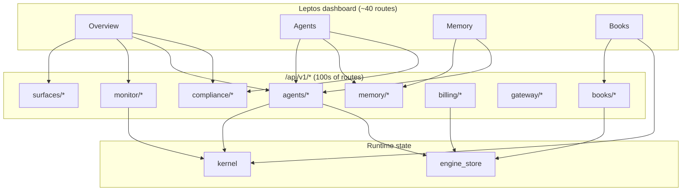

# AGOS UI — page-by-page backend atlas and complexity conclusion

This document is the result of a **full read** of every registered dashboard route in `platform/ui-leptos/dashboard/src/main.rs`, cross-referenced with `api::get_value` / `post_value` / `surface_client` usage in `src/pages/**` and the **platform server** surface (`platform/server/src/router.rs` and service modules). It answers: *what each screen actually talks to*, and *why the whole system behaves as extremely complex software*.

Companion doc: [`AGOS_UI_CONTROL_PLANE_REMEDIATION.md`](./AGOS_UI_CONTROL_PLANE_REMEDIATION.md) (cost identity, ledgers, REG-* bugs).

---

## 1. How to read the inventory

| Wiring | Meaning |
|--------|---------|
| **Deep** | Many parallel `LocalResource`s and/or writes across **multiple backend domains** (kernel, store, compliance, tools, …). |
| **Medium** | Several GETs or important POSTs; bounded scope. |
| **Light** | One to three GETs; mostly read-only. |
| **Chrome** | High-fidelity UI with **no** (or negligible) live platform API binding for the “main” story (demos, static rows). |

**Backend domains** (abbreviations used in the table):

| Abbr | Typical store / subsystem |
|------|---------------------------|
| **K** | VAC / connector **kernel** (agents, sessions, audit log, syscall outcomes). |
| **ES** | **engine_store** folders (agent_meta, billing_usage_events, mcp_bridges, vault, …). |
| **GW** | **AI gateway** (chat/stream, routing, billing hooks). |
| **MON** | **Monitor** service (health, **cost-dashboard** (tenant-scoped kernel totals for non–SuperAdmin), cgroups, SLOs, storage layout, …). |
| **CMP** | **Compliance** (scorecard, GDPR, EU AI Act, HIPAA scan, violations, briefs/PDF). |
| **MEM** | **Memory** + **memory2** / knowledge / semantic search / plane overview. |
| **ACT** | **Action log** (actions, denied, interactions, tool-audit, access-matrix). |
| **INF** | **Infra** (consensus, reputation, vault, quota, orchestrator DAGs). |
| **CLS** | **CLS** packages, compile, execution, contracts/templates. |
| **BIL** | **Billing** / **Books** / entitlements / Stripe hooks. |
| **AUTH** | **Auth** / **runtime** mode / pilots / API keys. |
| **PFX** | **Protocol** façade (CNP, MCP JSON-RPC bridge, A2A/ACP/ANP/AP2). |
| **SUR** | **Surfaces** (canonical JSON “documents” for overview-style UX). |
| **PLG** | **Plugin** HTTP services (TraceTramp proxy, …). |
| **SAF** | **Safety / formal** verification endpoints. |
| **DSP** | **Disputes**, **insights**, **economy**, **marketplace**, **grounding**, **webhooks**, **notifications**, **notebook**, **experiments**, **prompts**, **history**, **topology**, **report center**, **firewall**, **secrets**, **license**, **verify**, **pipeline**. |

---

## 2. Full page inventory (route → backend → wiring)

| Route | Page module | Primary domains | Approx. distinct API families | Wiring | Notes |
|-------|-------------|-----------------|----------------------------------|--------|-------|
| `/login` | `login.rs` | AUTH | 0 in-page `api::`; uses `login_with_api_key` / `dev_bypass` | Light | Identity boundary; not generic REST. |
| `/` | `overview.rs` | SUR, MON, K, ACT, GW, CMP, BIL (reports), **Books** | **13+** parallel loads | **Deep** | Adds **`GET /books/costs?period=month`** next to **`/monitor/cost-dashboard`** for kernel-vs-ledger spend honesty. |
| `/agents` | `agents.rs` | K, ES, CMP, ACT, MEM, TOOLS, GW (lifecycle) | **10+** resources + POST create/start | **Deep** | List + per-agent tabs hit agents, history, compliance, memory, tools card, cost, activity, POST actions. |
| `/memory` | `memory.rs` | K, MEM, reports | **15+** GET/POST paths | **Deep** | Plane overview, graph, sessions, namespaces, stale analysis, knowledge spec/ingest/query, recall, write, per-agent tree, semantic search (×2). |
| `/monitor` | `monitor.rs` | MON | **9** GETs | **Deep** | Health, anomalies, budget-alerts, **cost-dashboard**, tools health, signals, SLOs, storage layout, forecast — different subsystems. |
| `/compliance` | `compliance.rs` | CMP | **10+** GETs + POST/PDF | **Deep** | Scorecard, findings, GDPR, EU AI Act, HIPAA, violations, data-boundary, brief print/pdf, report flows. |
| `/debug` | `debug.rs` | K, debug svc | **5+** | Medium | Sessions, agents, failure-clusters, session detail, diff. |
| `/tools` | `tools.rs` | ES, TOOLS, MON (cgroups) | **5** + invoke POST | Medium | Bridges, approvals, signals, cgroups; MCP invoke. |
| `/protocols` | `protocols.rs` | PFX, CNP | **3** GETs + **5** POST protocol shapes | Medium | CNP overview, MCP tools list, A2A card; tabbed JSON-RPC/A2A/ACP/ANP/AP2 probes. |
| `/safety` | `safety.rs` | SAF | 1 GET + 2 POSTs | Medium | Formal verify + claim verify + grounding lookup. |
| `/infra` | `infra.rs` | INF | **5** GETs + vault POST | Medium | Consensus, reputation, vault, quota, orchestrator index. |
| `/actionlog` | `actionlog.rs` | ACT | **5** GETs | Medium | Full audit plane surface in one page. |
| `/history` | `history.rs` | ACT | 1 GET | Light | `/history/audit`. |
| `/pipeline` | `pipeline.rs` | DSP (pipeline) | **5** GETs (parametric by id) | Medium | Gate, steps, integrity, cid-chain, definitions. |
| `/trust` | `trust.rs` | MON, reports, proof | **4** + parametric merkle | Medium | Trust live, report center, proof list, merkle-proof by CID. |
| `/disputes` | `disputes.rs` | DSP | 1 GET + POST record | Medium | Decisions list + record dispute. |
| `/insights` | `insights.rs` | DSP | 1 GET | Light | `/insights/fleet`. |
| `/experiments` | `experiments.rs` | DSP | 2 GETs + 2 POSTs | Medium | List, datasets, create, run. |
| `/prompts` | `prompts.rs` | DSP | 1 GET | Light | `/prompts`. |
| `/notebook` | `notebook.rs` | DSP | 2 GETs + execute POST | Medium | Kernel env + snippets + execute. |
| `/multiagent` | `multiagent.rs` | MEM / multiagent | **3** GETs + grant POST | Medium | Mesh knowledge-plane, map, ports. |
| `/notifications` | `notifications.rs` | DSP | 2 GETs + schedule POST | Medium | Active + history + schedule. |
| `/webhooks` | `webhooks.rs` | DSP | 2 GETs | Light | Hooks + events. |
| `/grounding` | `grounding.rs` | MEM / grounding | 2 GETs (parallel) | Light | Stats + tables. |
| `/economy` | `economy.rs` | DSP | 2 GETs (merged resource) | Medium | Settlements + negotiate; explicit empty-state copy. |
| `/marketplace` | `marketplace.rs` | DSP | **3** GETs + discover POST | Medium | Index, rankings, contracts. |
| `/runtime-enforcement` | `runtime_enforcement.rs` | K, MON | **2–3** GETs (list + optional detail) | Medium | Enforcement list + cgroups + per-sandbox detail. |
| `/topology-center` | `topology_center.rs` | CNP / topology | 1 GET | Light | `/topology/center`. |
| `/report-center` | `report_center.rs` | reports | **1–2** GETs | Medium | Center + optional receipt by id. |
| `/cls-catalog` | `cls_catalog.rs` | CLS | templates list + detail | Medium | Contracts templates + optional id. |
| `/cls-builder` | `cls_builder.rs` | CLS | templates + **compile** POST | Medium | Template-driven compile posts. |
| `/cls-packages` | `cls_packages.rs` | CLS | packages CRUD + lifecycle | **Deep** | List, detail, create, install, bind, activate/deprecate/archive. |
| `/cls-execution` | `cls_execution.rs` | CLS | execution + export + run | Medium | Package execution views. |
| `/context` | `context.rs` | MEM / context | 1 parametric GET | Light | `/context/{pid}/snapshots` — requires agent selection. |
| `/command-center` | `operator_shell.rs` | SUR, K, CMP, ACT, CNP, CC | **7** parallel | **Deep** | Same “command” idea as Overview: surface + agents + incidents + approvals + actionlog + topology + command-center snapshot. |
| `/firewall` | `firewall.rs` | policy / firewall svc | **3** GET families | Medium | Baselines, adjustments, false-positives per agent. |
| `/orchestrator` | `orchestrator.rs` | INF | DAGs + sagas + detail + rollback POST | Medium | Orchestrator saga control. |
| `/verify` | `verify.rs` | SAF | **5** parallel GETs | Medium | Formal verify, invariants, report, violations, snapshot. |
| `/secrets` | `secrets.rs` | INF, secrets | 2 GETs | Light | Vault status + secrets audit. |
| `/billing` | `billing.rs` | BIL | **3** GETs | Medium | Usage, entitlements, invoices. |
| `/license` | `license.rs` | license svc | **3** GETs | Light | Status, machine, heartbeat. |
| `/settings` | `settings.rs` | AUTH, runtime | mode + pilots + several POST/DELETE | Medium | Runtime mode and pilot admin. |
| `/books` | `books.rs` | BIL, K, ES | **5** resources (position, journal, costs, usage, balance) | **Deep** | Crosses **kernel journal** and **billing ledger**; cost tab + reconcile; known identity/ledger issues (see remediation doc). |
| `/plugins` | `hub.rs` | PLG | **1** GET (`/plugins/status`) | **Medium** | Cards: TraceTramp token + upstream probe; WitnessCtl/DevGuard optional URL + **GET /health** or **/devguard/status** probe. |
| `/plugins/devguard` | `devguard_dashboard.rs` | PLG | **2+** GET (`/plugins/status`, `/plugins/devguard/extension/status`) | **Medium** | Hub probe + **server proxy** to workstation `devguard status-api` (`/devguard/status` JSON). |
| `/plugins/tracetramp` | `tracetramp_dashboard.rs` | PLG | **9+** GET + many POSTs | **Deep** | **Reference** plugin: proxy + hub probe strip (`/plugins/status` in pack). |
| `/plugins/witnessctl` | `witnessctl_dashboard.rs` | PLG | **6+** GET (`/plugins/status`, `/plugins/witnessctl/*` pack) | **Medium** | Hub probe + **server proxy** to WitnessCtl `/health` and `/api/v1/*` (admin bearer never in browser). |

**Unique `GET /api/v1/...` families touched from UI (order of magnitude):** **80+** distinct path prefixes across pages, before counting parameterized ids. That is already larger than many mid-market **entire products**.

---

## 3. Server-side mirror (why each page is “heavy”)

The UI is not calling a thin BaaS. Each family maps to **Rust modules** under `platform/server/src/services/` that themselves coordinate:

- **Kernel locks** (agent lifecycle, audit log, syscalls).  
- **engine_store** folders (metadata, billing, bridges, compliance artifacts).  
- **Optional external providers** (LLM routers, Stripe, OTLP).  
- **Cross-cutting auth** (`auth_middleware`, pilot scopes, dev bypass rules).  
- **Prometheus metrics** and sometimes **background threads** (e.g. billing side effects).

So **one** Overview load is not “one microservice”; it is a **coordinated slice** of a **monolithic control plane** with many subsystems, each with its own failure mode and caching story.

---

## 4. Dependency graph (conceptual)

**Edges multiply:** Agents and Books both touch **K** and **ES** but with **different keys** (`claims.sub` vs `agent_pid` vs `user_id` in meta), which is exactly where **semantic bugs** (empty Books, full Overview) hide.

---

## 5. Conclusion — this *is* supreme-complexity software

Treat the AGOS / Connector stack as **supremely complex** not because the UI has many buttons, but because of **all of the following at once**:

1. **Multiple concurrent models of truth** for the same concepts (tokens, USD, trust, “reconciliation”) across kernel fields, billing folders, per-agent ledgers, monitor aggregates, and surface documents — **without a single enforced invariant** visible to the operator.  
2. **A very wide API surface** (hundreds of routes) exposed through **dozens of screens**, many of which **compose 5–15 independent fetches** — classic **distributed system UX** on top of a **single process** (fan-out latency, partial failures, ordering).  
3. **Cross-domain coupling** on hot paths: gateway ↔ billing ↔ agent_meta ↔ JWT ↔ tools ↔ kernel counters; **identity join** mistakes look like “UI bugs” but are **platform contract** bugs.  
4. **Regulatory and narrative layers** (compliance, disputes, proofs, report center, WitnessCtl **story**) sitting beside **operational layers** (cgroups, enforcement, MCP) — **different epistemic standards** (evidence vs metrics vs demo chrome) on one nav tree.  
5. **Extension model** (plugins, proxies, env-based backends) **without** a uniform “plugin health + data contract” in the hub — so complexity **grows super-linearly** with each new extension unless disciplined.

**Product implication:** Selling or operating this as a “simple dashboard” will fail reviews. The credible story is: **this is a control plane for a heterogeneous AI runtime** — complexity is **intrinsic**; the engineering task is to **bound**, **label**, and **reconcile** that complexity (provenance, single ledger for money, kill demo-defaults, plugin status), not pretend it away.

**Engineering implication:** Prioritize **contract tests** and **smoke paths** that cut across domains (one user, one agent, one LLM, one tool, Books + Billing + Monitor agree within defined tolerance), not just per-endpoint unit tests.

---

## 6. Suggested references

| Doc / area | Purpose |
|------------|---------|
| [`AGOS_UI_CONTROL_PLANE_REMEDIATION.md`](./AGOS_UI_CONTROL_PLANE_REMEDIATION.md) | Cost ledgers, REG-001–010, P0–P3. |
| `platform/server/src/router.rs` | Canonical route list. |
| `platform/ui-leptos/dashboard/src/main.rs` | Canonical UI route list. |
| `platform/docs/arch/CONNECTOR_KERNEL_CAGE_AND_LEDGER.md` | Kernel / cage mental model. |

---

*This atlas is descriptive. Update the table when adding routes or when a page moves from Chrome to wired.*
