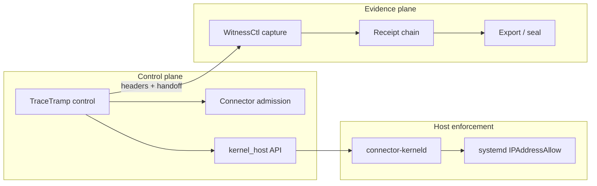

# WitnessCtl + TraceTramp — military-grade control & compliance plane

**Status:** execution roadmap (not a certification claim).  
**Audience:** engineering + security architecture.  
**Companion docs:** `CONNECTOR_OS_AGENTIC_ENTROPY_FIREWALL_RESEARCH.md`, `CONNECTOR_KERNEL_RUNBOOK.md`, `plugins/witnessctl/plugin.yaml`, `plugins/witnessctl/workflows/*`, `plugins/tracetramp` control/view pipelines.

---

## 1. Purpose

Unify **TraceTramp** (runtime **control** — policy, risk, approvals, trace checkpoints) and **WitnessCtl** (runtime **evidence** — capture, receipts, seal, export, compliance mapping) into a single **compliance plane** that satisfies high-assurance expectations:

- **Deny-by-default** where required, with **explainable** decisions.
- **Tamper-evident** records and **reproducible** verification.
- **Tenant isolation**, **least privilege**, and **operable** rollback.
- **Traceability** from host/kernel posture → gateway decision → stored evidence.

This document is the **plan of record** for prioritizing issues and PRs across both plugins and the Connector platform APIs they depend on.

---

## 2. Planes (terminology)

| Plane | Primary owner | Responsibility |
|-------|----------------|----------------|
| **Control** | TraceTramp + Connector admission | Block/allow/hold, tool/memory egress, HITL, kernel gate signals |
| **Evidence** | WitnessCtl | Per-call capture, hashes, PII handling, receipt chain, seal/export |
| **Compliance mapping** | WitnessCtl (`compliance.rs`, `internal/compliance_map.yaml`) | Map evidence to framework clauses; export bundles |
| **Host enforcement** | `connector-kerneld` + systemd + (optional) nft/eBPF | Non-bypassable egress for scoped workloads |

Military-grade operation requires **all four** to agree on **identity**, **policy revision**, and **time ordering** of events.

---

## 3. Current inventory (baseline)

**TraceTramp (as of this plan)**

- Control pipeline: operation blocks, quarantine, default HITL holds, PII inspect, tool gates, budget/trust hooks, `record_event` → `trace_events` (Postgres).
- Gateway: tenant resolution, optional `kernel_host_snapshot` merged into trace metadata (`plugins/tracetramp/src/gateway.rs`, `control.rs`).
- View pipeline: observe path; weaker parity with control evidence (see Section 7.2).

**WitnessCtl (as of this plan)**

- Ingest: policy check + firewall inspect (strict vs async), schema drift, PII hits, previews, custody queue, receipts (`plugins/witnessctl/src/capture.rs`).
- Connector client: `firewall_inspect`, `policy_check`, **`get_kernel_agent_status`** → `witness_captures.kernel_host` + receipt payload (`migrations/20260502000015_kernel_host_capture.sql`).
- Workflows: capture, seal, report, verify (`plugins/witnessctl/workflows/*.yaml`); compliance map templates.

**Gaps (drivers for this plan)**

- **View vs control parity** — View mode must not become an unlogged bypass for sensitive calls.
- **Cryptographic governance** — HMAC secrets, key rotation, separation of duties for seal/export.
- **Immutability & WORM** — DB is trusted until append-only / external vault / object-lock path exists.
- **Cross-service correlation** — stable `trace_id` / `request_id` / `session_id` across WitnessCtl + TraceTramp + platform runtime payloads.
- **Operational proof** — automated verify workflows in CI; kernel lab scripts wired to release gates.
- **Fast PDF / reports in browsers** — TraceTramp `format=pdf` is still a stub; WitnessCtl has server renderers but lacks a **first-class browser print** contract for “any browser, no install”.
- **Decision surface** — `block_flags`, ordered **action trace**, and **Block space** (list / revoke / delete policy blocks) are not yet first-class UX + API; **git-level** policy provenance (commit/digest + non-erasable audit) not wired end-to-end.
- **TUI parity** — `plugins/tracetramp/src/tui.rs` has rich panels; **approve/block/revoke** flows must stay simple and match HTTP semantics (see sections 9–10).

---

## 4. Target architecture (logical)

---

## 5. Control family mapping (implementation anchor)

Use as a **backlog tagging scheme** (not a claim of FedRAMP/IL4 authorization).

| Family | Intent | TraceTramp | WitnessCtl | Platform / host |
|--------|--------|------------|------------|-----------------|
| **AC** | Access control | Tenant/mode/RBAC; tool approvals | Session + tenant columns; proxy auth | API keys, mTLS, agent registry |
| **AU** | Audit & accountability | `trace_events` checkpoints | Receipts, captures, export | Audit API, metrics |
| **CM** | Configuration management | Policy bundles, operation blocks | Compliance map versioning | Kernel profile revision |
| **SC** | System & comms protection | TLS to upstream; redaction | Previews only; hashes | Firewall inspect, kernel egress |
| **SI** | System & info integrity | Step reasons | HMAC chain, bundle verify | `intent_hash`, policy revision |
| **CP** | Contingency planning | Degraded modes documented | Seal + offline verify | Rollback runbook |

---

## 6. Phased roadmap (execute in order)

### Phase 0 — Instrumentation & contracts (2–4 weeks)

**Goal:** every sensitive path emits **correlatable** structured fields.

| ID | Deliverable | Acceptance |
|----|-------------|------------|
| P0-1 | **Correlation contract** doc + headers | `x-trace-id`, `x-request-id`, `x-witness-session` documented; gateway sets consistently |
| P0-2 | TraceTramp metadata **schema version** | `metadata.schema_version` on new `trace_events` rows |
| P0-3 | WitnessCtl capture row **decision digest** | Single JSON column or view: `{ admission, firewall, kernel_host.policy_revision }` for export |
| P0-4 | Metrics | Prometheus counters: block/hold/allow by reason (TT); ingest latency + firewall outcome (WC) |
| P0-5 | **PDF/HTML reports** | Shared HTML report template + **browser print** doc; TraceTramp `pdf` uses same stack as WitnessCtl server renderer where installed |
| P0-6 | **`metadata.decision` contract** | `block_flags[]`, `action_trace[]`, `approval_ids[]` on every control-path `trace_events` row (schema versioned) |
| P0-7 | **Block space API** | List/revoke/delete operation blocks + audit events; idempotent HTTP routes |
| P0-8 | **TUI Block space panel** | Single-screen list + revoke + jump to trace; matches Section 10.3 checklist |

### Phase 1 — Fail-closed & parity (4–8 weeks)

**Goal:** no silent high-risk path through **View** or **async firewall**.

| ID | Deliverable | Acceptance |
|----|-------------|------------|
| P1-1 | **View mode policy** matrix | Document + code: which classes of call require Control or Witness proxy |
| P1-2 | **Strict firewall default** for prod profile | Config flag: `strict_mode` default on for `environment=prod` |
| P1-3 | **Kernel gate alignment** | TraceTramp blocks egress-class ops if platform says not Active when enforce flag set (reuse Connector admission semantics) |
| P1-4 | **Witness handoff** on all block paths in TT | Every deny emits structured payload to WitnessCtl (already partial for PII) — extend to tool deny, op block, quarantine |

### Phase 2 — Cryptography & keys (4–8 weeks)

**Goal:** keys are **managed**, **rotated**, and **scoped** per tenant/session.

| ID | Deliverable | Acceptance |
|----|-------------|------------|
| P2-1 | **HMAC key hierarchy** design | Separate chain keys per session; doc rotation procedure |
| P2-2 | **Envelope encryption** for sealed bundles (optional) | KMS integration interface; local dev uses file key |
| P2-3 | **Signed export manifest** | Export includes manifest + signature verify step in `workflows/verify.yaml` |
| P2-4 | **SoD** | Role separation: who can seal vs who can delete sessions (DB RLS or app RBAC) |

### Phase 3 — Immutability & DR (8–12 weeks)

**Goal:** evidence survives **operator mistakes** and **region loss** within agreed RPO/RTO.

| ID | Deliverable | Acceptance |
|----|-------------|------------|
| P3-1 | **Append-only** captures table strategy | Migration + triggers or move hot path to WORM object store with DB index |
| P3-2 | **Replication** | Postgres read replicas + documented lag for compliance reads |
| P3-3 | **Backup/restore drill** | Quarterly runbook: restore DB → `verify` workflow passes on sample bundle |
| P3-4 | **Legal hold** | Flag sessions exempt from TTL deletion |

### Phase 4 — Continuous attestation (ongoing)

**Goal:** automated proof the plane is healthy.

| ID | Deliverable | Acceptance |
|----|-------------|------------|
| P4-1 | CI job: **chain verify** on synthetic session | `cargo test` + workflow script in `plugins/witnessctl/tests` |
| P4-2 | CI job: **kernel e2e** (conditional) | `connector-kernel-e2e-smoke.sh` + `connector-kerneld print-snapshot` |
| P4-3 | **Compliance map** regression | `internal/compliance_map.yaml` changes require architecture review + snapshot test |

---

## 7. Workstreams

### 7.1 WitnessCtl

| Priority | Item | Notes |
|----------|------|--------|
| P1 | **Receipt payload completeness** | Include normalized decision object (admission + firewall + kernel_host) on every `api.call` receipt |
| P1 | **Async firewall completion** | Worker fills `firewall_checked` + final reason; no indefinite `pending_async` in prod |
| P2 | **Export bundle** | Tamper-evident tarball layout + `verify` workflow parity with `workflows/verify.yaml` |
| P2 | **Tenant RLS** | Postgres RLS on `witness_captures` / sessions keyed by `tenant_id` |
| P3 | **Webhook / SIEM** | Signed outbound events (already sketched in migrations); rate limit + retry DLQ |
| P3 | **PII minimization audit** | Field-level retention policy; purge job with receipt-preserving hashes |

### 7.2 TraceTramp

| Priority | Item | Notes |
|----------|------|--------|
| P0 | **Control path event completeness** | Ensure every return path logs `record_event` with `duration_ms` + reason |
| P1 | **View path** | Either enforce “observe-only” upstream + same evidence to WitnessCtl, or hard-disable tools/egress in View |
| P1 | **Approvals** | HITL queue durability; timeout + escalation; audit who approved |
| P2 | **Policy bundle provenance** | Bind `policy_bundle` + Connector `policy_revision` in metadata |
| P2 | **Streaming** | If streaming responses: chunk-level hash strategy or document “non-repudiation limited to final summary” |
| P3 | **Multi-region** | Read-only trace replay API; no cross-region writer without split-brain design |

### 7.3 Cross-cutting (both plugins + platform)

- **Clock skew:** NTP requirement + `created_at` vs receipt timestamp tolerance in verify.
- **Identity:** stable `actor_id` == Connector agent PID contract documented end-to-end.
- **Version pinning:** image digests + migration version in export manifest.

---

## 8. Verification matrix (field acceptance)

| Scenario | Steps | Pass criteria |
|----------|-------|----------------|
| **V1 Deny path** | Blocked tool call | Trace event + Witness handoff + HTTP deny aligned on `trace_id` |
| **V2 Kernel enforce** | `CONNECTOR_KERNEL_ENFORCE=1` | Egress-class op denied without Active attachment; metadata shows kernel state |
| **V3 Seal** | Seal session | No new captures; chain head stable; export verifies |
| **V4 Tamper** | Mutate one row hash in DB copy | `verify` fails with actionable error |
| **V5 DR** | Restore backup | Same as V4 on restored data |
| **V6 PDF parity** | Same trace/session → server PDF + browser-print HTML | Row counts + `trace_id` match; tables readable |
| **V7 Block space** | Create op block → TUI lists → revoke → call succeeds | Audit chain shows block + retract |

---

## 9. Operator experience — outcomes this plan must close

### 9.1 Fast compliance reports + PDF (any browser)

**Gap today:** TraceTramp `compliance_export` returns a JSON stub for `format=pdf` (`plugins/tracetramp/src/gateway.rs` ~L880). WitnessCtl already implements HTML → PDF via headless Chrome/Chromium or `wkhtmltopdf` (`plugins/witnessctl/src/export.rs` — `render_pdf`, `wrap_html_document`).

**Target (dual channel)**

| Channel | Speed | “Any browser” | Engineering |
|---------|-------|----------------|-------------|
| **A — Browser-native** | Instant | Yes | Serve **inline HTML** report (`text/html`) with `@media print`; operator uses **Print → Save as PDF** (Chrome / Firefox / Safari). No server binaries required. |
| **B — Server PDF** | Fast batch (target &lt;2s for typical tenant export) | Download works in any browser | **Factor shared crate** from WitnessCtl: `wrap_html_document` + `render_pdf_inner` → e.g. `platform/crates/connector-report-pdf` (or under `oss/connector/crates/`); TraceTramp + WitnessCtl both call it. |
| **C — Regulatory** | Deterministic | Same as B | Template `report_template_version` + content hash in footer; ties to Phase P2-3 signed manifest. |

**Acceptance:** one report looks correct in three browsers; automated CI runs **B** when Chromium is available; **A** documented in README with a stable URL pattern.

### 9.2 Decision tree, `block_flags`, and action trace

**Gap today:** `GET …/decision-tree` aggregates DB rows (`gateway.rs`) but is not the **single** operator source of truth; not every deny path emits a structured, machine-readable flag set.

**Target model (TraceTramp `trace_events.metadata`)**

- `schema_version` (integer).
- `decision.block_flags: string[]` — stable codes, e.g. `tool_not_allowed`, `operation_blocked`, `pii_violation`, `quarantine`, `kernel_host_not_ready`, `budget_exhausted`, `hitl_pending`, `firewall_blocked`, `admission_denied`.
- `decision.action_trace: { step: string, result: string, reason?: string }[]` — ordered walk of control pipeline branches (aligns with `ExecutionStep` / internal graph).
- `decision.approval_ids: string[]` when HITL holds apply.

**Acceptance:** PDF/JSON/TUI all read from the **same** projection query; no 403/202 without at least `block_flags` **or** explicit `allow` with `action_trace` terminal `allow`.

### 9.3 “Block space” — revoke, delete, git-level control

**Definitions**

| Operator action | Meaning | Audit |
|-----------------|--------|--------|
| **Revoke block** | Stops enforcing a specific **operation block** row; traffic may proceed if no other block | Append `trace_events` + optional Witness receipt event |
| **Delete policy rule** | Removes definition from **active** policy store | **Never** deletes historical evidence; append-only ledger entry |
| **Git-level control** | Policy bundle = **versioned artifact** (git commit/tag or OCI digest) | TUI shows `commit` / `digest` / `policy_revision`; **revert** = new forward commit restoring prior state (same semantics as git revert) |

**Implementation direction:** platform or TraceTramp exposes **versioned** policy bundles; DevGuard / `connectorctl` may push git-backed bundles; TraceTramp TUI only calls **authenticated** APIs that bump revision — no silent file edits on disk without audit.

### 9.4 TraceTramp TUI — simplicity contract

1. **Three primary surfaces:** *Live traces* · *Block space & approvals* · *Reports (HTML/PDF preview link)*.  
2. **Dangerous actions:** typed confirmation (existing patterns in `tui.rs`); **revoke** is one keystroke only after panel focus + highlight.  
3. **Footer truth:** Connector base URL, tenant, **`policy_revision`**, kernel snapshot age.  
4. **1:1 with HTTP:** every TUI mutation maps to a documented REST route for automation and SOAR.

---

## 10. Coding checklist (execute in order)

Copy rows into issues; title prefix **`[TT]`** TraceTramp, **`[WC]`** WitnessCtl, **`[X]`** cross-cutting.

### 10.1 PDF & fast reports

- [x] **[WC]** Inline **`format=html`** session export (print CSS shell via `connector-report-pdf::html_report_document`) — `plugins/witnessctl/src/export.rs`.
- [x] **[TT]** **`GET /v1/compliance/export`** — `format=html` + `format=pdf` (shared renderer), real PDF bytes; `plugins/tracetramp/src/gateway.rs`.
- [x] **[X]** Crate **`oss/connector/crates/connector-report-pdf`** (`html_report_document`, `render_pdf`, unit tests); depended by WitnessCtl + TraceTramp.
- [x] **[X]** README: one-page **“Reports in any browser”** (print vs download) — WitnessCtl `README.md` session formats; TraceTramp `README.md` **`/v1/compliance/export`** (`html` vs `pdf`).
- [x] **[X]** CI: `tracetramp-sqlx` workflow runs **`cargo test -p connector-report-pdf`** (no Chromium) + **`cargo test decision_envelope`** on tracetramp PRs; full PDF bytes still require Chromium/wkhtmltopdf on the runner or operator print from `html`.

### 10.2 `block_flags` + `action_trace` + decision API

- [x] **`decision_envelope`** — `plugins/tracetramp/src/decision_envelope.rs`: `schema_version`, `block_flags`, `step_snapshot`; unit tests; merged in `record_event` (`control.rs`).
- [x] **[TT]** Full **`action_trace`** joined timeline: `trace_projection` + `action_trace_cumulative` / `block_flags_cumulative` on **`GET /decision/:trace_id`**, **`GET /enforcement/:trace_id`**, **`GET /admin/traces/:trace_id/decision`**; schema: `plugins/tracetramp/schemas/metadata.decision.schema.json`.
- [x] **[TT]** **`control.rs`:** provider-chain exhaustion now **`record_event`** before 503; architecture test asserts pattern. (Other early returns were already traced.)
- [x] **[TT]** **`view.rs`:** emit same **`decision_envelope`** shape with `pipeline=view`, `view_exempt=true`, merged into View `log_interaction` payloads (parity with Control `metadata.decision`).
- [x] **[TT]** **`gateway.rs` / admin:** shared **`trace_projection`** module for cumulative **`action_trace`** / **`block_flags`** (same source as enforcement packet).
- [x] **[WC]** Migration `witness_captures.decision_digest` JSONB + ingest writes normalized snapshot (admission, firewall, kernel_host, TraceTramp risk/policy hints); receipt payload includes **`decision_digest`**. Exports (json/csv/md/html/pdf) include digest where selected. *(TraceTramp `block_flags` in digest when proxied from TT headers — future header parse / handoff.)*

### 10.3 Block space + approve / reject / quarantine

- [x] **[TT]** REST: **`GET/POST /admin/operation-blocks`** + **`POST …/release`** (revoke); documented in TraceTramp README. *(DELETE-by-id optional — release covers revoke.)*
- [ ] **[TT]** **`tui.rs`:** **Block space** panel — table of active blocks + `r` revoke + `o` open trace; errors show Connector body.
- [ ] **[TT]** Approvals list refresh after approve/reject/quarantine; show **`approval_id`** + **`block_flags`** in footer when pending.
- [x] **[WC]** Witness **`/integrations/tracetramp/handoff`** documents **`operation_block_released`**; TraceTramp **`POST /admin/operation-blocks/release`** posts async handoff when rows updated.

### 10.4 Git-level policy provenance

- [ ] **[X]** ADR: policy source = git **tag** + **commit** or OCI **digest**; how `policy_revision` maps.
- [ ] **[TT]** TUI header: show `policy_bundle` + revision from `runtime_req` / Connector kernel snapshot.
- [ ] **[DG]** If DevGuard is source of truth: issue cross-link — push triggers platform profile upsert + TraceTramp cache bust (document only if not implemented).

### 10.5 Release gate (add to Section 8)

- [ ] **V6** and **V7** in CI or manual release checklist before tag (see Section 8).

---

## 11. Out of scope (explicit)

- Formal **FedRAMP / IL4 / ITAR** authorization (requires program office, 3PAO, scoping).
- **Cilium/Tetragon** as mandatory stack — optional; host path remains systemd + `connector-kerneld` + nft/eBPF.
- **Customer SOC2 report** — evidence supports artifacts; formal attestation is customer GRC.

---

## 12. Document control

| Version | Date | Summary |
|---------|------|---------|
| 1.0 | 2026-05-02 | Initial roadmap: phases, workstreams, verification matrix. |
| 1.1 | 2026-05-02 | Operator outcomes (PDF browser + server), decision flags / action trace / Block space, git-level policy, TUI contract, **Section 10 coding checklist**, V6–V7. |

**Next action:** file issues from **Section 10** checkboxes (group by milestone); link PRs to `P0-*` / `P1-*` rows and to Section 10 line items.
