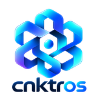

# Connector — explaining brief

**Audience:** design partners, early operators, anyone who needs to understand the problem and the software without a pitch script  
**Companion PDF:** generated from [`CONNECTOR_EXPLAINING_BRIEF.html`](./CONNECTOR_EXPLAINING_BRIEF.html)  
**Live:** https://try.cnktros.com · [CONNECTOR_PLAYGROUND_REACHED.md](./CONNECTOR_PLAYGROUND_REACHED.md)

This document **explains**. It is not a spoken script and not slide copy alone. Timing notes (~20s / ~40s / ~20s) describe how long a careful reader might spend on each part when the brief is used next to a live demo.

---

## 1. The problem — seven points (world we are evolving toward)

Organizations are putting language models next to real systems: money, tickets, machines, customer data, internal tools. The model can talk. The hard part is when talk becomes **action** — when an agent can change the world.

1. **Agents are becoming effectors, not just chat windows.** Teams want agents that score wires, file tickets, call APIs, move money, open holds. A reply is cheap. An effect is irreversible and billable.

2. **“Stop” in the UI often does not stop spend or side effects.** Providers may keep streaming. Workers may keep hopping. The model still “wants” to finish the task. Soft cancel is not mechanical refusal.

3. **Capability is confused with authority.** Listing tools or pasting an API key looks like permission. Real permission is who may touch which address, under which policy, after which human or kernel admit.

4. **Operators cannot see live posture.** Is this agent active, ceased, quarantined, cut from egress? What world grants does it hold? Is the LLM stubbed or linked? Without one place to look, demos and audits fail.

5. **There is no reconstructible loop.** After something goes wrong, people need: what was proposed, what was admitted, what ran, what was denied, and why — not a chat scroll that mixed opinion with effect.

6. **Security theatre and lab grades get sold as production.** Soft playground modes, HMAC lab seals, and “demo ledgers” get confused with court-grade or core-banking truth. Honesty itself is part of the product.

7. **The continuum from explore → harden is missing as one spine.** Labs need soft fail. Production needs fail-closed. Most stacks fork into two products or two stories. Engineers need one runtime where posture is dialable and visible.

**In one sentence:** the world is evolving toward agents that can change production systems, while the industry still ships chat UX, soft cancels, and opaque tool loops — without admit-as-law, exposure meters, or reconstructible evidence.

---

## 2. What the software is

**Connector** is operational software for hosting *dynamic agents under engineer-chosen constraints*. It is not “another chatbot.” It is the layer where intelligence may propose, and where **Admit** (through identity, DAL, PATE, ToolDispatch) is the only path for world-changing effects.

On the hosted playground today that spine appears as: **Workbench** (Talk → Orders → Admit), **Expometer** (live cease / quarantine / world / LLM exposure), **Action Trail** (full-page loop timeline + manage), and **SpendCease** (fence a generation so further admits refuse). The flagship story is **BankOps** — score / hold / decide / ledger on a tenant book — not a cinematic reel.

---

## 3. What it does — how it solves the problem

| Problem pressure | What Connector does |
|------------------|---------------------|
| Effects sneak out of chat | Ring-1 proposals never auto-dispatch; Admit is required |
| Stop does not stop | SpendCease fences generation, voids context tokens, reaps; next admit refuses |
| Opaque “what can it do?” | Expometer shows verdict, grants, LLM mode, burn / inflight |
| No loop history | Action Trail stitches journal + watch + activity; Orders / Evidence / Standing |
| Overclaiming grades | Playground honesty: tenant ledger ≠ FedWire; grade stays `playground_demo` |
| Explore vs harden fork | Same spine; posture differs — soft lab vs fail-closed harden |

We guarantee **honesty and reconstructibility of consequence** — what was admitted and what ran — not absolute security, not model truth, not “we made the AI compliant.” See [CONNECTOR_PRODUCT_PROMISE.md](../arch/CONNECTOR_PRODUCT_PROMISE.md).

---

## 4. Vision

Engineers compose how dynamic and how constrained each agent is: tools, world grants, budgets, isolation tiers, HITL, cease. The same product serves a 90‑minute playground tenant and a hardened node. Marketing language never outruns the control plane. Partners use Connector to put agents next to real ops — wires, tickets, machines — with admit, visibility, stop, and proof as first-class product, not afterthought.

---

## 5. Why it matters *(skim ≈ 20 seconds for sections 1–5)*

If agents become default operators of software, then *who admits effects*, *who can see exposure*, *who can hard-stop spend*, and *who can prove the loop* become as important as the model. Connector exists so those questions have a runnable answer — not a slide narrative. That is why a short demo must show propose → admit → control → report on a real surface (try.cnktros.com), not a video of pretend automation.

---

## 6. The demo — how it should look, what it shows, what it must explain *(≈ 40 seconds of attention)*

### How it should look

Dark operator UI, not a marketing landing page. One principal (BankOps) in Workbench. Expometer visible (verdict, admit line, world, LLM). Tool cards with Admit / Reject — pending, never auto-run. After Cease, a clear refuse reason (popup), Expometer flipped to ceased. Then a **dedicated** Action Trail page (URL changes to `/run/trail/…`) — not a sidebar that feels like the same screen.

### What the forty seconds should show

| Beat | What you see | What it explains |
|------|--------------|------------------|
| **Whoami** | BankOps identity; Expometer `active` | Governed principal, not a free chat bot |
| **Capabilities** | Tools chips; world / LLM on Expometer | Capability listed before authority is used |
| **Tool exec** | Score $47.5k wire → Admit → receipt / ledger | Effects only after Admit → PATE → ToolDispatch |
| **Control** | Cease → continue refuses; Expometer `CEASED` | Hard stop is mechanical; model desire does not matter |
| **Report** | Action Trail · Evidence focus | The loop is reconstructible for operators and partners |

### What the demo must not pretend

- It must not look like FedWire or court attestation.
- It must not hide that the ledger is a playground tenant store.
- It must not imply tools ran without Admit.
- It must not leave refuse as a silent disabled button — reason must be visible.

Supporting materials: [`power-demo-45s.html`](./power-demo-45s.html), [POWER_DEMO_45S.md](./POWER_DEMO_45S.md), [BANK_OPS_PLAYGROUND.md](./BANK_OPS_PLAYGROUND.md).

---

## 7. Solo founder — what I am trying, why it matters, paid early design partners *(≈ 20 seconds of attention)*

I am building Connector as a solo founder: one spine from playground to harden, with BankOps as the first honest ops story. The goal is not “more AI features.” The goal is a control plane partners can trust enough to put next to real workflows — with admit, cease, exposure, and trail as product, not slideware.

That matters because early design partners who **pay** are not buying hype. They buy time with a founder who will encode their constraints into the runtime, and they buy a surface they can critique: Workbench, Expometer, Trail, Cease. Paid early design partners fund focus. They force honesty about what is playground vs production. They turn seven industry pressures into a weekly backlog instead of a manifesto.

**Ask:** paid early design partners — operators or platform engineers who will run the hosted trial (or a pilot node), walk the BankOps loop, and sit with the founder on posture, grants, and proof. Not free “advisor” seats. Not logo trades. Working sessions against the live software.

**Try:** https://try.cnktros.com

---

---

## Connector

**Admit is law · Exposure is visible · Consequence is reconstructible**
